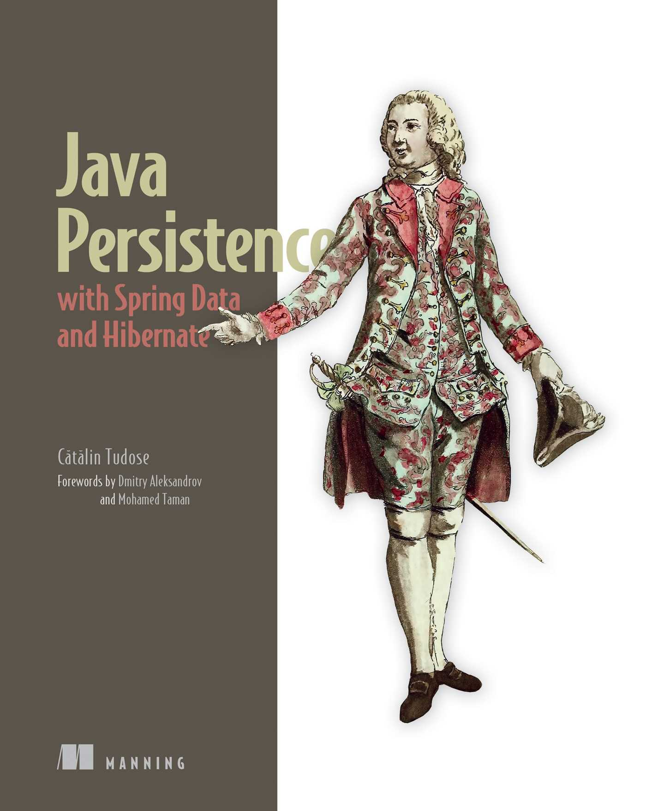

## Java Persistence with Spring Data and Hibernate - Notes

These notes have been compiled from the book [Java Persistence with Spring Data and Hibernate](https://www.manning.com/books/java-persistence-with-spring-data-and-hibernate) written by Cătălin Tudose. The purpose of these notes is to provide a concise and organized summary of key concepts, tips, and insights covered in the book. If you're looking to quickly grasp essential information about Java Persistence with Spring Data and its fundamentals, this compilation aims to serve as a helpful resource.

### Table of Contents
- [Chapter 1 Understanding object/relational persistence](ch1%20-%20Understanding%20object-relational%20persistence)
- [Chapter 2 Starting a project](ch2%20-%20Starting%20a%20project)
- [Chapter 3 Domain models and metadata](ch3%20-%20Domain%20models%20and%20metadata)

For more in-depth understanding and detailed explanations, refer to the [Java Persistence with Spring Data and Hibernate](https://www.manning.com/books/java-persistence-with-spring-data-and-hibernate) book by Cătălin Tudose. This compilation is meant to complement the book and should be used in conjunction with it for a comprehensive learning experience.

**Note**: These notes are a summary and should not replace the detailed content provided in the original book. It is recommended to refer to the book for a complete understanding of the topics discussed.