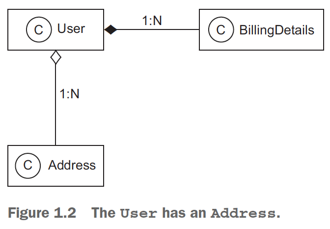
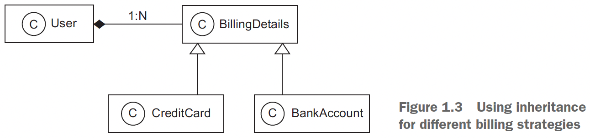
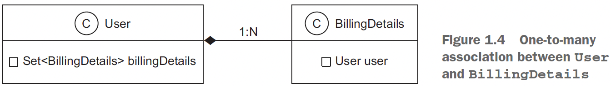
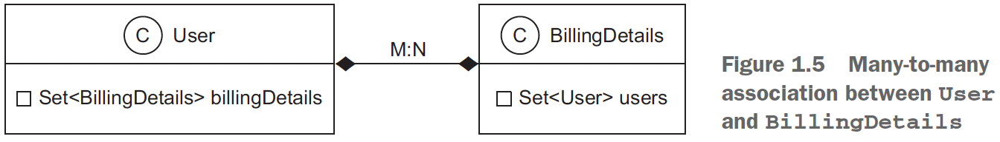

## Chapter 1 Understanding object/relational persistence

### Table of contents
- [What is persistence?](#11-what-is-persistence)
  - [Understanding SQL](#112-understanding-sql)
  - [Using SQL in Java](#113-using-sql-in-java)
- [The paradigm mismatch](#12-the-paradigm-mismatch)
  - [The problem of granularity](#121-the-problem-of-granularity)
  - [The problem of inheritance](#122-the-problem-of-inheritance)
  - [The problem of identity](#123-the-problem-of-identity)
  - [The problem of associations](#124-the-problem-of-associations)
  - [The problem of data navigation](#125-the-problem-of-data-navigation)
- [ORM, JPA, Hibernate, and Spring Data](#13-orm-jpa-hibernate-and-spring-data)

### 1.1 What is persistence?

_Object persistence_ means individual objects can outlive the application process; they can be saved to a data store
and be re-created at a later point in time. When we talk about persistence in Java, we’re
generally talking about mapping and storing object instances in a database using SQL.

### 1.1.2 Understanding SQL

SQL is used as a _data definition language_ (DDL), with syntax for
_creating, altering_, and _dropping_ artifacts such as tables and constraints in the catalog of
the DBMS. When this _schema_ is ready, you can use SQL as a _data manipulation language_
(DML) to perform operations on data, including _insertions, updates_, and _deletions_. You
can retrieve data by executing _data query language_ (DQL) statements with _restrictions_,
_projections_, and _Cartesian products_. For efficient reporting, you can use SQL to _join,
aggregate, and group_ data as necessary. You can even nest SQL statements inside each
other—a technique that uses _subselects_. When your business requirements change,
you’ll have to modify the database schema again with DDL statements after data has
been stored; this is known as _schema evolution_. You may also use SQL as a _data control
language_ (DCL) to _grant and revoke_ access to the database or parts of it.

### 1.1.3 Using SQL in Java

When you work with an SQL database in a Java application, you issue SQL statements
to the database via the Java Database Connectivity (JDBC) API.

NOTE: _CAP theorem_: according to this rule, a distributed system cannot be _consistent_,
_available_, and _tolerant against partition failures_ all at the same time.

A system may guarantee that all nodes will see the same data at the same time and
that data read and write requests are always answered. But when a part of the system
fails due to a host, network, or data center problem, you must either give up
strong consistency or 100% availability. In practice, this means you need a strategy
that detects partition failures and restores either consistency or availability to a certain
degree (for example, by making some part of the system temporarily unavailable
so data synchronization can occur in the background). Often, the data, the user, or
the operation will determine whether strong consistency is necessary.

### 1.2 The paradigm mismatch

The object/relational paradigm mismatch can be broken into several parts, which
we’ll examine one at a time.

### 1.2.1 The problem of granularity

\
(Credits: [Java Persistence with Spring Data and Hibernate](https://www.manning.com/books/java-persistence-with-spring-data-and-hibernate))

Should we also add an ADDRESS table? Not necessarily; it’s common to keep address information in the
USERS table, in individual columns. This design is likely to perform better because a
table join isn’t needed if you want to retrieve the user and address in a single
query. The nicest solution may be to create a new SQL data type to represent addresses and to add a single column of that new
type in the USERS table, instead of adding several new columns.

This choice of adding either several columns or a single column of a new SQL data
type is a problem of _granularity_. Broadly speaking, granularity refers to the relative size
of the types you’re working with.

Problems with new user defined types in SQL: 
- You’ll find various problems if you check on the support for user-defined
data types (UDTs) in today’s SQL database management systems.
- UDT support is a somewhat obscure feature of most SQL DBMSs, and it certainly isn’t portable
  between different products.
- The SQL standard supports user-defined data types, but poorly.

For these and whatever other reasons, the use of UDTs or Java types in an SQL
database isn’t common practice at this time, and it’s unlikely that you’ll encounter a
legacy schema that makes extensive use of UDTs. We therefore can’t and won’t store
instances of our new Address class in a single new column that has the same data type
as the Java layer.
The pragmatic solution for this problem has several columns of built-in vendor-defined
SQL types (such as Boolean, numeric, and string data types).

In contrast with the Java domain model, just two levels of type granularity are visible in the SQL
database: relation types created by you, like USERS and BILLINGDETAILS, and built-in
data types such as VARCHAR, BIGINT, and TIMESTAMP.

### 1.2.2 The problem of inheritance

\
(Credits: [Java Persistence with Spring Data and Hibernate](https://www.manning.com/books/java-persistence-with-spring-data-and-hibernate))

What changes should be done to support this updated Java class structure? Can we
create a CREDITCARD table that extends BILLINGDETAILS? SQL database products don’t
generally implement table inheritance (or even data type inheritance), and if they do
implement it, they don’t follow a standard syntax.

As soon as we introduce inheritance into the
model, we have the possibility of _polymorphism_. The User class has a _polymorphic association_
with the BillingDetails superclass. At runtime, a User instance may reference
an instance of the subclasses of BillingDetails. Similarly, we want to be able
to write _polymorphic queries_ that refer to the BillingDetails class and have the query
return instances of its subclasses.\
SQL databases lack an obvious way (or at least a standardized way) to represent a
polymorphic association. A foreign key constraint refers to exactly one target table; it
isn’t straightforward to define a foreign key that refers to multiple tables.

The result of this mismatch of subtypes is that the inheritance structure in a model
must be persisted in an SQL database that doesn’t offer an inheritance mechanism.

### 1.2.3 The problem of identity

Java defines two different notions of sameness:
- Instance identity (roughly equivalent to a memory location, checked with a == b)
- Instance equality, as determined by the implementation of the equals()
method (also called equality by value)

On the other hand, the identity of a database row is expressed as a comparison of primary
key values. It’s common for several non-identical
instances in Java to simultaneously represent the same row of a database, such as in
concurrently running application threads.
---

```jql
CREATE TABLE USERS (
  USERNAME VARCHAR(15) NOT NULL PRIMARY KEY,
  ADDRESS_STREET VARCHAR(255) NOT NULL,
  ADDRESS_ZIPCODE VARCHAR(5) NOT NULL,
  ADDRESS_CITY VARCHAR(255) NOT NULL
);
```

Let’s use an example to discuss another problem related to database identity. In
the table definition for USERS, USERNAME is the primary key. Unfortunately, this decision
makes it difficult to change a user’s name; you need to update not only the row in
USERS but also the foreign key values in (many) rows of BILLINGDETAILS. To solve this
problem, later in this book we’ll recommend that you use _surrogate keys_ whenever you
can’t find a _good natural key_. We’ll also discuss what makes a good primary key. A surrogate
key column is a primary key column with no meaning to the application user —
in other words, a key that isn’t presented to the application user. Its only purpose is to
identify data inside the application.

Changed table definition:
```jql
CREATE TABLE USERS (
  ID BIGINT NOT NULL PRIMARY KEY,
  USERNAME VARCHAR(15) NOT NULL UNIQUE,
  . . .
);
```
The ID columns contain system-generated values.\
In the context of persistence, identity is closely related to how the system handles
caching and transactions.

### 1.2.4 The problem of associations

In the domain model, associations represent the relationships between entities.

Object-oriented languages represent associations using _object references_, but in the
relational world, a _foreign key–constrained column_ represents an association with copies
of key values. The constraint is a rule that guarantees the integrity of the association.
There are substantial differences between the two mechanisms.

Object references are inherently directional; the association is from one instance to
the other. They’re pointers. If an association between instances should be navigable in
both directions, you must define the association twice, once in each of the associated
classes.

\
(Credits: [Java Persistence with Spring Data and Hibernate](https://www.manning.com/books/java-persistence-with-spring-data-and-hibernate))

Navigation in a particular direction has no meaning for a relational data model
because you can create data associations with _join_ and _projection_ operators. The challenge
is to map a completely open data model that is independent of the application
that works with the data to an application-dependent navigational model — a constrained
view of the associations needed by this particular application.

\
(Credits: [Java Persistence with Spring Data and Hibernate](https://www.manning.com/books/java-persistence-with-spring-data-and-hibernate))

```jql
CREATE TABLE BILLINGDETAILS (
  ID BIGINT NOT NULL PRIMARY KEY,
  ACCOUNT VARCHAR(15) NOT NULL,
  BANKNAME VARCHAR(255) NOT NULL,
  USER_ID BIGINT NOT NULL,
  FOREIGN KEY (USER_ID) REFERENCES USERS(ID)
);
```
However, the foreign key declaration on the BILLINGDETAILS table is a many-to-one
association: each bank account is linked to a particular user, but each user may have
multiple linked bank accounts.\
If you wish to represent a _many-to-many_ association in an SQL database, you must
introduce a new table, usually called a _link table_. In most cases, this table doesn’t
appear anywhere in the domain model.

```jql
CREATE TABLE USER_BILLINGDETAILS (
  USER_ID BIGINT,
  BILLINGDETAILS_ID BIGINT,
  PRIMARY KEY (USER_ID, BILLINGDETAILS_ID),
  FOREIGN KEY (USER_ID) REFERENCES USERS(ID),
  FOREIGN KEY (BILLINGDETAILS_ID) REFERENCES BILLINGDETAILS(ID)
);
```

### 1.2.5 The problem of data navigation

There is a fundamental difference between how you access data in Java code and within
a relational database.

Java e.g. (_walking the object network_):
```java
someUser.getBillingDetails().stream().filter(someCondition).map(someMapping).forEach(billingDetails-> {doSomething
(billingDetails)})
```
You navigate from one instance to another, even iterating collections, following prepared pointers between classes.
Unfortunately, this isn’t an efficient way to retrieve data from an SQL database.

The single most important thing you can do to improve the performance of data
access code is to minimize the number of requests to the database. The most obvious way to
do this is to minimize the number of SQL queries.\
Therefore, efficient access to relational data with SQL usually requires _joins_
between the tables of interest. The number of tables included in the join when retrieving
data determines the depth of the object network you can navigate in memory.

! To use joins efficiently you need to know what portion of the object
network you plan to access _before_ you start navigating the object network! Careful,
though: if you retrieve too much data (probably more than you might need), you’re
wasting memory in the application tier. **You may also overwhelm the SQL database
with huge Cartesian product result sets**.

Any object persistence solution permits you to fetch the data of associated instances
only when the association is first accessed in the Java code. This is known as _lazy loading_:
retrieving data only on demand. This piecemeal style of data access is fundamentally
inefficient in the context of an SQL database, because it requires executing one statement
for each node or collection of the object network that is accessed. **This is the
dreaded _n+1 selects_ problem**.

Avoiding the Cartesian product and n+1 selects problems is still a
problem for many Java programmers.

### 1.3 ORM, JPA, Hibernate, and Spring Data

Object/relational mapping (ORM) is the automated (and transparent)
persistence of objects in a Java application to the tables in an RDBMS (relational database
management system), using metadata that describes the mapping between the
classes of the application and the schema of the SQL database. In essence, ORM works
by transforming (reversibly) data from one representation to another.

JPA (Jakarta Persistence API, formerly Java Persistence API) is a specification defining
an API that manages the persistence of objects and object/relational mappings.
Hibernate is the most popular implementation of this specification. So, JPA will specify
what must be done to persist objects, while Hibernate will determine how to do it.

Spring Data JPA, a project from the Spring Data family, is an additional layer on top of JPA implementations
(such as Hibernate). Not only can Spring Data JPA use all the capabilities of JPA,
but it adds its own capabilities, such as generating database queries from method
names.

The JPA specification defines the following:
- _A facility for specifying mapping metadata_ — how persistent classes and their
properties relate to the database schema. JPA relies heavily on Java annotations
in domain model classes, but you can also write mappings in XML files.
- _APIs for performing basic CRUD operations_ on instances of persistent classes,
most prominently _javax.persistence.EntityManager_ for storing and loading
data.
- _A language and APIs for specifying queries_ that refer to classes and properties
of classes. This language is the Jakarta Persistence Query Language (JPQL) and
it looks similar to SQL. The standardized API allows for the programmatic creation
of _criteria queries_ without string manipulation.
- _How the persistence engine interacts with transactional instances_ to perform
dirty checking, association fetching, and other optimization functions. The JPA
specification covers some basic caching strategies.

Hibernate implements JPA and supports all the standardized mappings, queries, and
programming interfaces. Let’s look at some of the benefits of Hibernate:
- _Productivity_: significantly reduced development time.
- _Maintainability_: less code => the system is more understandable and easier to refactor.
- _Performance_: e.g. efficient and easily tunable caching in the application tier. This means developers
can spend more energy hand-optimizing the few remaining real bottlenecks
instead of prematurely optimizing everything.
- _Vendor independence_: portability since you are not tight to a specific DBMS. Also, DBMS independence helps in development scenarios where engineers
use a lightweight local database but deploy for testing and production on
a different system.

Spring Data makes the implementation of the persistence layer even more efficient.
Spring Data JPA, one of the projects of the family, sits on top of the JPA layer. Spring
Data JDBC, another project of the family, sits on top of JDBC. Let’s look at some of the
benefits of Spring Data:
- _Shared infrastructure_: with Spring Data Commons - which provides a metadata model for
persisting Java classes and technology neutral repository interfaces.
- _Removes DAO implementations_: JPA implementations use the data access object
(DAO) pattern. This pattern starts with the idea of an abstract interface to a
database and maps application calls to the persistence layer while hiding the
details of the database. Spring Data JPA makes it possible to fully remove DAO
implementations, so the code will be shorter.
- _Automatic class creation_: Using Spring Data JPA, a DAO interface needs to
extend the JPA-specific Repository interface—JpaRepository. Spring Data
JPA will automatically create an implementation for this interface—the programmer
will not have to take care of this.
- _Default implementations for methods_: Spring Data JPA will generate default implementations
for each method defined by its repository interfaces. Basic CRUD
operations do not need to be implemented any longer. This reduces the boilerplate
code, speeds up development, and removes the possibility of introducing bugs.
- _Generated queries_: You may define a method on your repository interface following
a naming pattern. There’s no need to write your queries by hand; Spring
Data JPA will parse the method name and create a query for it.
- _Close to the database if needed_: Spring Data JDBC can communicate directly with
the database and avoid the “magic” of Spring Data JPA. It allows you to interact
with the database through JDBC, but it removes the boilerplate code by using
the Spring framework facilities.