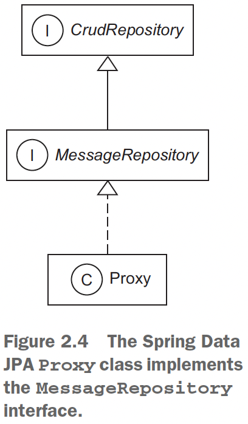
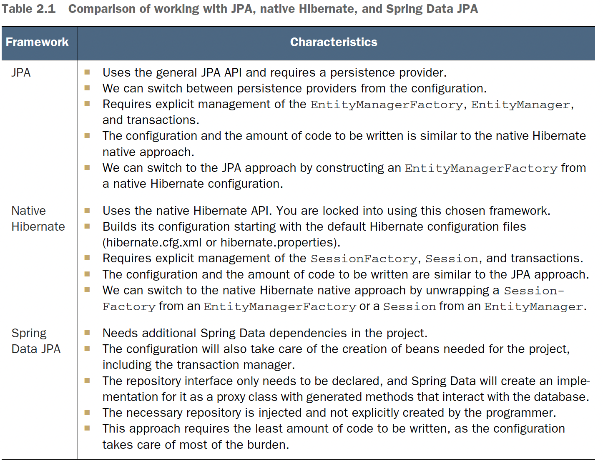
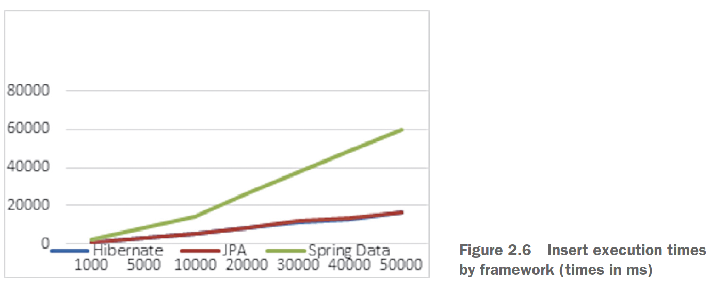
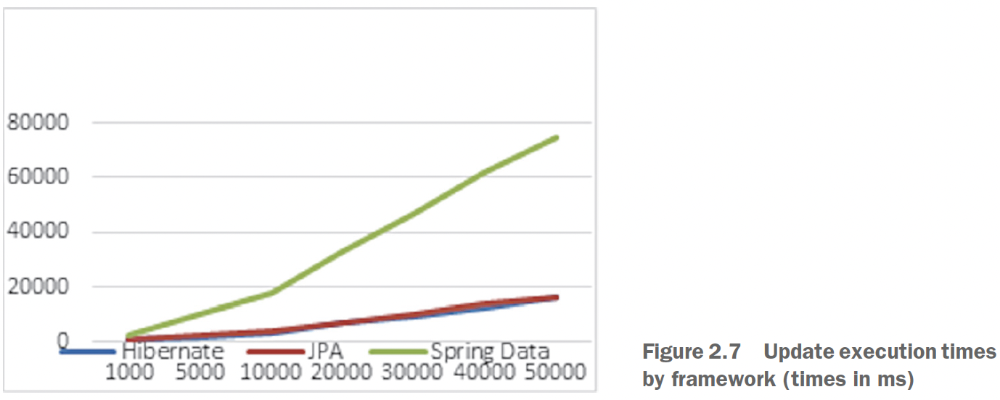
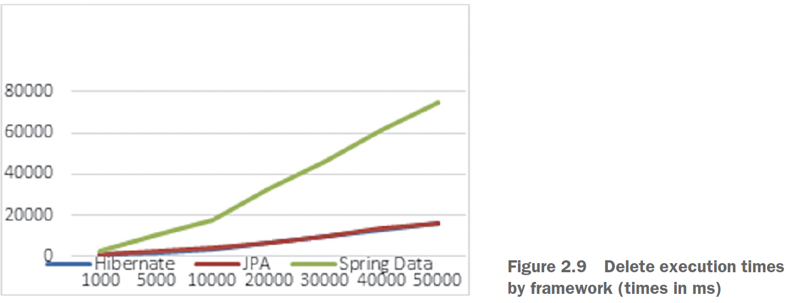

## Chapter 2 - Starting a project

### Table of contents
- [Introducing Hibernate](#21-introducing-hibernate)
- [Introducing Spring Data](#22-introducing-spring-data)
- ["Hello World" with JPA](#23-hello-world-with-jpa)
  - [Configuring a persistence unit](#231-configuring-a-persistence-unit)
  - [Writing a persistent class](#232-writing-a-persistent-class)
  - [Storing and loading messages](#233-storing-and-loading-messages)
- [Native Hibernate configuration](#24-native-hibernate-configuration)
- [Switching between JPA and Hibernate](#25-switching-between-jpa-and-hibernate)
- ["Hello World" with Spring Data JPA](#26-hello-world-with-spring-data-jpa)
- [Comparing the approaches of persisting entities](#27-comparing-the-approaches-of-persisting-entities)

### 2.1 Introducing Hibernate

The Hibernate project suite includes:
- _Hibernate ORM_: \
This consists of:
  - a core
  - a base service for persistence with SQL databases
  - a native proprietary API. 
  
  Is the foundation for several of the other projects in the suite, and 
it's the oldest Hibernate project (you can use it on its own).


- _Hibernate Entity Manager_: \
Hibernate's implementation of the Jakarta Pesistence API.
  - optional module you can stack on top of Hibernate ORM
  - Hibernate's native features are a superset of the JPA persistence features.


- _Hibernate Validator_: \
This project provides the reference implementation of the Bean Validation (JSR 303)
specification.


- _Hibernate Envers_: \
Envers is dedicated to audit logging and keeping multiple
versions of data in the SQL database.


- _Hibernate Search_: \
Hibernate Search keeps an index of the domain model data
up to date in an Apache Lucene database. It lets you query this database with a
powerful and naturally integrated API.\
Recommended reading: [Hibernate Search in Action by Emmanuel Bernard
  (Bernard, 2008)](https://www.manning.com/books/hibernate-search-in-action).


- _Hibernate OGM_: \
This Hibernate project is an object/grid mapper. It provides
JPA support for NoSQL solutions, reusing the Hibernate core engine but persisting
mapped entities into key/value-, document-, or graph-oriented data
stores.


- _Hibernate Reactive_: \
Hibernate Reactive is a reactive API for Hibernate ORM,
interacting with a database in a non-blocking manner. It supports non-blocking
database drivers.

### 2.2 Introducing Spring Data

Spring Data is a family of projects belonging to the Spring framework whose purpose
is to simplify access to both relational and NoSQL databases:

- _Spring Data Commons_: \
Spring Data Commons, part of the umbrella Spring Data
project, provides a metadata model for persisting Java classes and technologyneutral
repository interfaces.


- _Spring Data JPA_: \
Spring Data JPA deals with the implementation of JPA-based
  repositories.


- _Spring Data JDBC_: \
Spring Data JDBC deals with the implementation of JDBCbased
repositories. It provides improved support for JDBC-based data access layers.
It does not offer a series of JPA capabilities, such as caching or lazy loading,
resulting in a simpler and limited ORM.


- _Spring Data REST_: \
Spring Data REST deals with exporting Spring Data repositories
as RESTful resources.


- _Spring Data MongoDB_: \
Spring Data MongoDB deals with access to the MongoDB
document database. It relies on the repository-style data access layer and the
POJO programming model.


- _Spring Data Redis_: \
Spring Data Redis deals with access to the Redis key/value
database. It relies on freeing the developer from managing the infrastructure
and providing high- and low-level abstractions for access to the data store.

### 2.3 "Hello World" with JPA

- Database used: Mysql Release 8.0 (configure the database locally with _user=root_ and no password)
- First run [Ch02.sql](ex1-JPAExample/src/main/resources/Ch02.sql)  
- In the “Hello World” application, we want to store messages in the database and
  load them from the database.
- Check the [pom.xml](ex1-JPAExample/pom.xml) for dependencies.

Our starting point in JPA is the _persistence unit_. **A persistence unit is a pairing of our
domain model class mappings with a database connection, plus some other configuration
settings.** Every application has at least one persistence unit; some applications
have several if they’re talking to several (logical or physical) databases. Hence, our
first step is setting up a persistence unit in our application’s configuration.

### 2.3.1 Configuring a persistence unit

Check the [persistence.xml](ex1-JPAExample/src/main/resources/META-INF/persistence.xml) 

### 2.3.2 Writing a persistent class

Check the [Message.java](ex1-JPAExample/src/main/java/com/ro/chapter2/Message.java)

The identifier attribute of a persistent class allows the application to access the database
identity—the primary key value—of a persistent instance. If two instances of _Message_
have the same identifier value, they represent the same row in the database. This
example uses Long for the type of identifier attribute, but this isn’t a requirement.
Hibernate allows you to use virtually anything for the identifier type.

Instances of the _Message_ class can be managed (made persistent) by Hibernate,
but they don’t have to be. Because the _Message_ object doesn’t implement any
persistence-specific classes or interfaces, we can use it just like any other Java class.

### 2.3.3 Storing and loading messages

Check the [HelloWorldJPATest.java](ex1-JPAExample/src/test/java/HelloWorldJPATest.java) for running the example.

### 2.4 Native Hibernate configuration

Although basic (and extensive) configuration is standardized in JPA, we can’t access
all the configuration features of Hibernate with properties in _persistence.xml_.

When using native Hibernate we’ll use the Hibernate dependencies and API
directly, rather than the JPA dependencies and classes. JPA is a specification, and it
can use different implementations (Hibernate is one example, but EclipseLink is
another alternative) through the same API. Hibernate, as an implementation, provides
its own dependencies and classes. While using JPA provides more flexibility,
you’ll see throughout the book that accessing the Hibernate implementation directly
allows you to use features that are not covered by the JPA standard (we’ll point this out
where it’s relevant).

The native equivalent of the standard JPA _EntityManagerFactory_ is the
_org.hibernate.SessionFactory_. We have usually one per application, and it involves
the same pairing of class mappings with database connection configuration.

Check [hibernate.cfg.xml](ex2-HibernateExample/src/test/resources/hibernate.cfg.xml)

Check [HelloWorldHibernateTest.java](ex2-HibernateExample/src/test/java/HelloWorldHibernateTest.java) for running the example.

### 2.5 Switching between JPA and Hibernate

- (1) JPA to Hibernate\
To obtain a _SessionFactory_ from an _EntityManagerFactory_, you’ll have to unwrap the first one from the second one.

```java
private static SessionFactory getSessionFactory(EntityManagerFactory entityManagerFactory) {
  return entityManagerFactory.unwrap(SessionFactory.class);
}
```

NOTE: Starting with JPA version 2.0, you can get access to the APIs of the underlying implementations.

- (2) Hibernate to JPA
Creating an _EntityManagerFactory_ from an initial Hibernate configuration.

```java
private static EntityManagerFactory createEntityManagerFactory() {
    
  Configuration configuration = new Configuration();
  configuration.configure().addAnnotatedClass(Message.class);
  
  Map<String, String> properties = new HashMap<>();
  
  Enumeration<?> propertyNames = configuration.getProperties().propertyNames();
  
  while (propertyNames.hasMoreElements()) {
    String element = (String) propertyNames.nextElement();
    properties.put(element, configuration.getProperties().getProperty(element));
  }
  
  /*
       Return a new EntityManagerFactory, providing to it the ch02 persistence   
       unit name and the previously created map of properties.
   */
  return Persistence.createEntityManagerFactory("ch02", properties);
}
```

### 2.6 "Hello World" with Spring Data JPA

Check the last two dependencies added in [pom.xml](ex3-SpringDataJPAExample/pom.xml).

Check [SpringDataConfiguration.java](ex3-SpringDataJPAExample/src/main/java/com/ro/chapter2/configuration/SpringDataConfiguration.java).

Spring Data JPA provides support for JPA-based data access layers by reducing the
boilerplate code and creating implementations for the repository interfaces. We only
need to define our own repository interface to extend one of the Spring Data
interfaces.

Check [MessageRepository.java](ex3-SpringDataJPAExample/src/main/java/com/ro/chapter2/repositories/MessageRepository.java).

Spring Data JPA will create a proxy class implementing the _MessageRepository_
interface and implement its methods.

\
(Credits: [Java Persistence with Spring Data and Hibernate](https://www.manning.com/books/java-persistence-with-spring-data-and-hibernate))

Check the [HelloWorldSpringDataJPATest.java](ex3-SpringDataJPAExample/src/test/java/HelloWorldSpringDataJPATest.java) for running the example.

### 2.7 Comparing the approaches of persisting entities

\
(Credits: [Java Persistence with Spring Data and Hibernate](https://www.manning.com/books/java-persistence-with-spring-data-and-hibernate))

For more information on the performance of each approach, see the article “_Object-
Relational Mapping Using JPA, Hibernate and Spring Data JPA,_” by Cătălin Tudose
and Carmen Odubășteanu (Tudose, 2021).

A batch of insert, update, select and delete operations were executed using the three approaches
, with an increased number of records: 10000 -> 50000.

Results (y-axis is the time in ms, x-axis is the number of records)

\
(Credits: [Java Persistence with Spring Data and Hibernate](https://www.manning.com/books/java-persistence-with-spring-data-and-hibernate))

\
(Credits: [Java Persistence with Spring Data and Hibernate](https://www.manning.com/books/java-persistence-with-spring-data-and-hibernate))

\
(Credits: [Java Persistence with Spring Data and Hibernate](https://www.manning.com/books/java-persistence-with-spring-data-and-hibernate))

\
(Credits: [Java Persistence with Spring Data and Hibernate](https://www.manning.com/books/java-persistence-with-spring-data-and-hibernate))

The three approaches provide different performances. Hibernate and JPA go head to
head — the graphics of their times almost overlap for all four operations (insert,
update, select, and delete). Even though JPA comes with its own API on top of Hibernate,
this additional layer introduces no overhead.\
The execution times of Spring Data JPA insertions start at about 2 times those of
Hibernate and JPA for 1,000 records and go to about 3.5 times more for 50,000
records. The overhead of the Spring Data JPA framework is considerable.