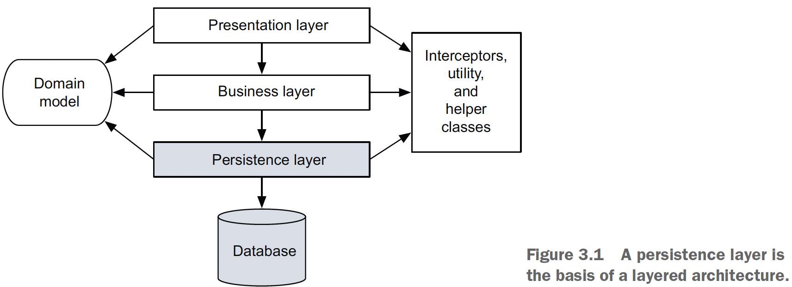
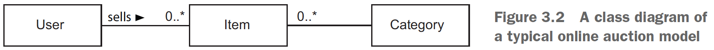
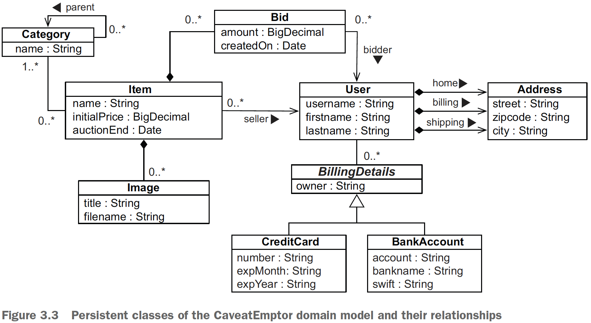
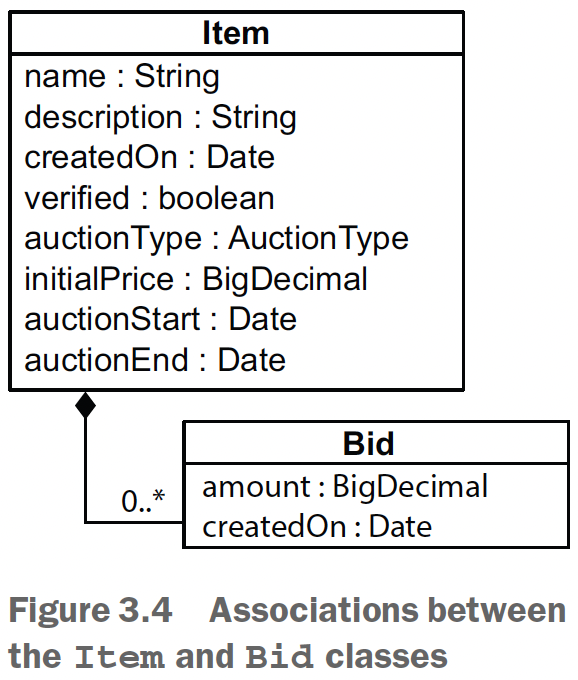

## Chapter 3 - Domain models and metadata

### Table of contents
- [The example CaveatEmptor application](#31-the-example-caveatemptor-application)
  - [A layered architecture](#311-a-layered-architecture)
  - [Analyzing the business domain](#312-analyzing-the-business-domain)
  - [The CaveatEmptor domain model](#313-the-caveatemptor-domain-model)
- [Implementing the domain model](#32-implementing-the-domain-model)
  - [Addressing leakage of concerns](#321-addressing-leakage-of-concerns)
  - [Transparent and automated persistence](#322-transparent-and-automated-persistence)
  - [Writing persistence-capable classes](#323-writing-persistence-capable-classes)
  - [Implementing POJO associations](#324-implementing-pojo-associations)
- [Domain model metadata](#33-domain-model-metadata) 
  - [Annotation-based metadata](#331-annotation-based-metadata)
  - [Applying constraints to Java objects](#332-applying-constraints-to-java-objects)
  - [Externalizing metadata with XML files](#333-externalizing-metadata-with-xml-files)
  - [Accessing metadata at runtime](#334-accessing-metadata-at-runtime)

### 3.1 The example CaveatEmptor application

### 3.1.1 A layered architecture

It usually makes sense to organize classes by concern: persistence, presentation, workflow and business logic.

NOTE: There are also so-called cross-cutting concerns, which may be implemented generically,
such as by framework code. Typical cross-cutting concerns include logging,
authorization, and transaction demarcation.

\
(Credits: [Java Persistence with Spring Data and Hibernate](https://www.manning.com/books/java-persistence-with-spring-data-and-hibernate))

### 3.1.2 Analyzing the business domain

_Entities_ are usually notions understood by users of the system: payment, customer,
order, item, bid, and so forth. Some entities may be abstractions of less concrete
things the user thinks about, such as a pricing algorithm, but even these are usually
understandable to the user. You can find all these entities in the conceptual view of
the business, sometimes called an _information model_.

From this business model, engineers and architects of object-oriented software create
an object-oriented model, still at the conceptual level (no Java code).

\
(Credits: [Java Persistence with Spring Data and Hibernate](https://www.manning.com/books/java-persistence-with-spring-data-and-hibernate))

This model contains entities that you’re bound to find in any typical e-commerce system:
category, item, and user. This domain model represents all the entities and their
relationships (and perhaps their attributes). This kind of object-oriented model of
entities from the problem domain, encompassing only those entities that are of interest
to the user, is called a _domain model_.

Instead of using an object-oriented model, engineers and architects may start the
application design with a _data model_. This can be expressed with an entity-relationship
diagram, and it will contain the CATEGORY, ITEM, and USER entities, together with the
relationships between them.

### 3.1.3 The CaveatEmptor domain model

\
(Credits: [Java Persistence with Spring Data and Hibernate](https://www.manning.com/books/java-persistence-with-spring-data-and-hibernate))

### 3.2 Implementing the domain model

### 3.2.1 Addressing leakage of concerns

When concerns such as persistence, transaction management, or authorization start
to appear in the domain model classes, this is an example of _leakage of concerns_. The
domain model implementation is important code that shouldn’t depend on orthogonal
APIs. For example, code in the domain model shouldn’t call the database directly
or through an intermediate abstraction. This will allow you to reuse the domain
model classes virtually anywhere.

Preventing the leakage of concerns makes it easy to unit test the domain model without
the need for a particular runtime environment or container or for mocking any
service dependencies. You can write unit tests that verify the correct behavior of your
domain model classes without any special test harness. (Here we’re talking about unit
tests such as “calculate the shipping cost and tax,” not performance and integration
tests such as “load from the database” and “store in the database.”)

The Jakarta EE standard solves the problem of leaky concerns with metadata such
as annotations within your code or external XML descriptors. This approach allows the
runtime container to implement some predefined cross-cutting concerns—security,
concurrency, persistence, transactions, and remoteness—in a generic way by intercepting
calls to application components.

JPA defines the _entity class_ as the primary programming artifact. This programming
model enables transparent persistence, and a JPA provider such as Hibernate also
offers automated persistence. Hibernate isn’t a Jakarta EE runtime environment, and
it’s not an application server. It’s an implementation of the ORM technique.

### 3.2.2 Transparent and automated persistence

_Transparent_ persistence: 
- a complete separation of concerns between the
persistent classes of the domain model and the persistence layer. The persistent
classes are unaware of — and have no dependency on — the persistence mechanism.
From inside the persistent classes, there is no reference to the outside persistence
mechanism.
- The _Item_ class of the CaveatEmptor domain model shouldn’t have any runtime
dependency on any Jakarta Persistence or Hibernate API. Furthermore, JPA doesn’t
require that any special superclasses or interfaces be inherited or implemented by
persistent classes. Nor are any special classes used to implement attributes and associations.
You can reuse persistent classes outside the context of persistence, such as in
unit tests or in the presentation layer. You can create instances in any runtime environment
with the regular Java _new_ operator, preserving testability and reusability.
- JPA externalizes persistence concerns to a generic persistence manager API.

_Automatic_ persistence: 
- a persistence solution (your annotated domain, the layer, and the mechanism) 
that relieves you of handling low-level mechanical details, such as writing 
most SQL statements and working with the JDBC API. 
- no automated persistence solution is completely transparent: every automated
persistence layer, including JPA and Hibernate, imposes some requirements on
the persistent classes. For example, JPA requires that collection-valued attributes be
typed to an interface such as _java.util.Set_ or _java.util.List_ and not to an actual
implementation such as _java.util.HashSet_ (this is good practice anyway). Similarly,
a JPA entity class has to have a special attribute, called the _database identifier_ (which is
also less of a restriction but is usually convenient).

### 3.2.3 Writing persistence-capable classes

A persistence-capable plain old Java class declares attributes, which represent state,
and business methods, which define behavior. Some attributes represent associations
to other persistence-capable classes.

Check [User.java class](ex01/src/main/java/com/ro/model/User.java)

- This class can be abstract and, if needed, extend a non-persistent class or implement an interface.
- It must be a top-level class, not be nested within another class.
- The persistence-capable class and any of its methods shouldn't be final (this is a requirement
of the JPA specification). Hibernate is not so strict, and it will allow you to declare final classes as entities
or as entities with final methods that access persistent fields. However, **this is not a good practice, as this 
will prevent Hibernate from using the proxy pattern for performance improvement.** In general, **you should follow the JPA requirements if 
you would like your application to remain portable between different JPA providers.**
- Hibernate and JPA require a constructor with no arguments for every persistent class. Alternatively, if you do not write a constructor at all, Hibernate will use the
default Java constructor. Hibernate calls classes using the Java Reflection API on such
no-argument constructors to create instances. The constructor need not be public,
but it has to be at least package-visible for Hibernate to use runtime-generated proxies
for performance optimization.

NOTE: Hibernate doesn’t require accessor methods. You can choose how the state of an
instance of your persistent classes should be persisted. Hibernate will either directly
access fields or call accessor methods. Your class design isn’t disturbed much by these
considerations. **You can make some accessor methods non-public or completely
remove them and then configure Hibernate to rely on field access for these properties.**

Although trivial accessor methods are common, one of the reasons we like to use
JavaBeans-style accessor methods is that they provide encapsulation: you can change the
hidden internal implementation of an attribute without making any changes to the
public interface. **If you configure Hibernate to access attributes through methods, you
abstract the internal data structure of the class—the instance variables—from the design
of the database.**

For example, if your database stores the name of a user as a single NAME column,
but your User class has firstname and lastname fields, you can add the following persistent
name property to the class: [User1.java class](ex01/src/main/java/com/ro/model/User1.java). 
Later you’ll see that a custom type converter in the persistence service is a better way
to handle many of these kinds of situations. It helps to have several options.

Another issue to consider is _**dirty checking**_.
- Hibernate automatically detects state
  changes so that it can synchronize the updated state with the database.

Hibernate compares instances by value — not by object identity —
to determine whether the attribute’s persistent state needs to be updated. For example,
the following getter method doesn’t result in unnecessary SQL _UPDATEs_:

```java
public String getFirstname() {
    return new String(firstname);
}
```
There is an important point to note about dirty checking when persisting collections. If
you have an Item entity with a _Set<Bid>_ field that’s accessed through the _setBids_ setter,
this code will result in an unnecessary SQL _UPDATE_:

```java
item.setBids(bids);
em.persist(item);
item.setBids(bids);
```
This happens because Hibernate has its own collection implementations: _PersistentSet_,
_PersistentList_, or _PersistentMap_. Providing setters for an entire collection
is not good practice anyway.

How does Hibernate handle exceptions when your accessor methods throw them?
- If Hibernate uses accessor methods when loading and storing instances, and a _RuntimeException_ (unchecked) is thrown, the current transaction is rolled back, and the exception
is yours to handle in the code that called the Jakarta Persistence (or native
Hibernate) API. 
- **If you throw a checked application exception**, Hibernate wraps the
exception into a _RuntimeException_.

### 3.2.4 Implementing POJO associations

\
(Credits: [Java Persistence with Spring Data and Hibernate](https://www.manning.com/books/java-persistence-with-spring-data-and-hibernate))

We left the association-related attributes, _Item#bids_ and _Bid#item_, out of figure
3.4. These properties and the methods that manipulate their values are called _scaffolding_
_code_. This is what the scaffolding code for the _Bid_ class looks like:

Check [Bid.java class](ex01/src/main/java/com/ro/model/Bid.java) & [Item.java class](ex01/src/main/java/com/ro/model/Item.java)

NOTE: The JPA provider is also required to set a non-empty
value on any mapped collection-valued property (_like our new HashSet<>()_), such as when an _Item_ without
bids is loaded from the database. (It doesn’t have to use a _HashSet_; the implementation
is up to the provider. Hibernate has its own collection implementations with additional
capabilities, such as _dirty checking_.)

The basic procedure for linking a _Bid_ with an _Item_ looks like this:\
Check [Item.java class](ex01/src/main/java/com/ro/model/Item.java).
```java
public void addBid(Bid bid) {
  if (bid == null)
    throw new NullPointerException("Can't add null Bid");
  if (bid.getItem() != null)
    throw new IllegalStateException("Bid is already assigned to an Item");
  
  bids.add(bid);
  bid.setItem(this);
}
```

Linking an _Item_ with a _Bid_:
```java
//enforce integrity by requiring an Item argument in the constructor of Bid
public Bid(Item item) {
    this.item = item;
    item.bids.add(this); // Bidirectional
}
```

### 3.3 Domain model metadata

JPA standardizes two metadata options: annotations in Java code and externalized
XML descriptor files. Hibernate has some extensions for native functionality, also
available as annotations or XML descriptors. We usually prefer annotations as the primary
source of mapping metadata.

### 3.3.1 Annotation-based metadata

The big advantage of annotations is that they put metadata, such as _@Entity_, next to
the information it describes, instead of separating it in a different file.

```java
import javax.persistence.Entity;

@Entity
public class Item {
}
```

You can find the standard JPA mapping annotations in the _javax.persistence_ package. This example declares the _Item_ class as a persistent entity using the _@javax
.persistence.Entity_ annotation. **All of its attributes are now automatically made
persistent with a default strategy.** That means you can load and store instances of Item,
and all the properties of the class are part of the managed state.

Annotations are type-safe, and the JPA metadata is included in the compiled class
files. The annotations are still accessible at runtime, and Hibernate reads the classes
and metadata with Java reflection when the application starts.

#### USING VENDOR EXTENSIONS
When the standardized Jakarta Persistence annotations are insufficient, a JPA provider
may offer additional annotations. For example, some performance-tuning options you’d expect to be available
in high-quality persistence software are only available as Hibernate-specific annotations.

```java
import javax.persistence.Entity;

@Entity
@org.hibernate.annotations.Cache(
    usage = org.hibernate.annotations.CacheConcurrencyStrategy.READ_WRITE
)
public class Item {
}
```

Annotations on classes only cover metadata that applies to that particular class.
You’ll often also need metadata at a higher level for an entire package or even the
whole application.

#### GLOBAL ANNOTATION METADATA

E.g. _@NamedQuery_ has a global scope; you don’t
apply it to a particular class. Where should you place this annotation?

Although it’s possible to place such global annotations in the source file of a class
(at the top of any class), we prefer to keep global metadata in a separate file. Package level
annotations are a good choice; they’re in a file called package-info.java in a particular
package directory. You will be able to look for them in a single place instead of
browsing through several files.

Check [package-info.java](ex02/src/main/java/com/ro/domain/package-info.java) as an example.

### 3.3.2 Applying constraints to Java objects

Check [Item](validation/src/main/java/com/ro/domain/Item.java) from validation module.

The validation engine will access the fields directly if you annotate the fields. If you
prefer to use calls through accessor methods, annotate the getter method with validation
constraints, not the setter (annotations on setters are not supported). Then the
constraints will be part of the class’s API and will be included in its Javadoc, making the
domain model implementation easier to understand. 

NOTE that constraints being part
of the class’s API is independent of access by the JPA provider; for example, **Hibernate
Validator** may call accessor methods, whereas **Hibernate ORM** may call fields directly.

!!! Bean Validation isn’t limited to built-in annotations; you can create your own constraints
and annotations. With a custom constraint, you can even use class-level annotations
and validate several attribute values at the same time on an instance of a class.

[TestModelValidation class](validation/src/test/java/com/ro/TestModelViolation.java) checks the integrity of an _Item_ instance.

You’ll rarely write this kind of validation code; usually this validation is automatically handled
by your user interface and persistence framework.

Hibernate, as required from any JPA provider, also automatically integrates with
Hibernate Validator if the libraries are available on the classpath, and it offers the following
features:
- You don’t have to manually validate instances before passing them to Hibernate
for storage.
- Hibernate recognizes constraints on persistent domain model classes and triggers
validation before database insert or update operations. When validation
fails, Hibernate throws a _ConstraintViolationException_ containing the failure
details to the code calling persistence-management operations.
- The Hibernate toolset for automatic SQL schema generation understands
many constraints and generates SQL DDL-equivalent constraints for you. For
example, a _@NotNull_ annotation translates into an SQL _NOT NULL_ constraint,
and a _@Size(n)_ rule defines the number of characters in a _VARCHAR(n)_-typed
column.

You can control this behavior of Hibernate with the _<validation-mode>_ element in
your _persistence.xml_ configuration file. The default mode is **AUTO**, so **Hibernate will
only validate if it finds a Bean Validation provider** (such as Hibernate Validator) on
the classpath of the running application. With the **CALLBACK** mode, **validation will
always occur, and you’ll get a deployment error if you forget to bundle a Bean Validation
provider.** The **NONE** mode **disables automatic validation** by the JPA provider.

### 3.3.3 Externalizing metadata with XML files

Keeping the mapping metadata separate has the benefit of not
cluttering the JPA annotations with Java code and of making your Java classes more
reusable, though you lose the type-safety.

Check [orm.xml](metadataxmljpa/src/test/resources/META-INF/orm.xml) for an example.

### 3.3.4 Accessing metadata at runtime

The JPA specification provides programming interfaces for accessing the metamodel
(information about the model) of persistent classes.

#### THE DYNAMIC METAMODEL API IN JAKARTA PERSISTENCE

Sometimes you’ll want to get programmatic access to the persistent attributes of an
entity, such as when you want to write custom validation or generic UI code. You’d like
to know dynamically what persistent classes and attributes your domain model has.

Check [MetamodelTest.java](validation/src/test/java/com/ro/MetamodelTest.java) for an example.

#### USING A STATIC METAMODEL

Check [StaticMetamodelTest.java](validation/src/test/java/com/ro/StaticMetamodelTest.java) for an example.
