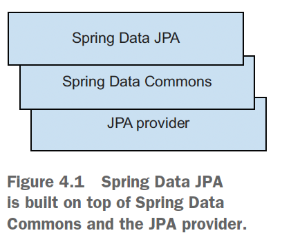
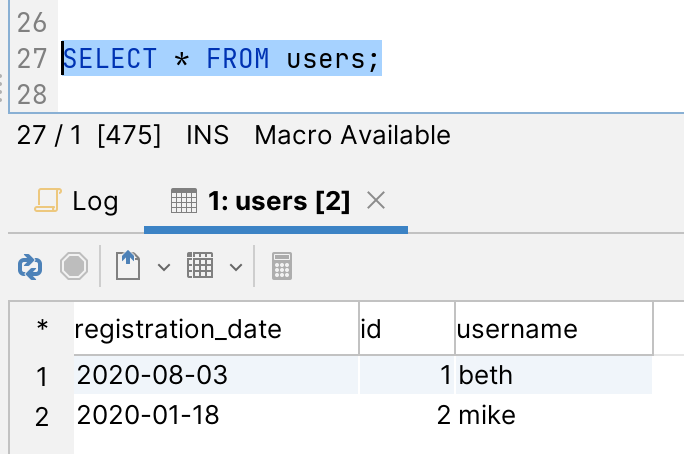
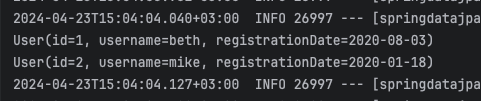
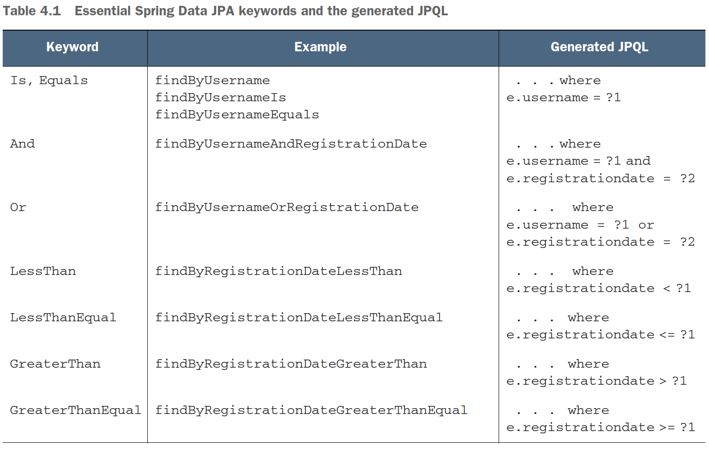
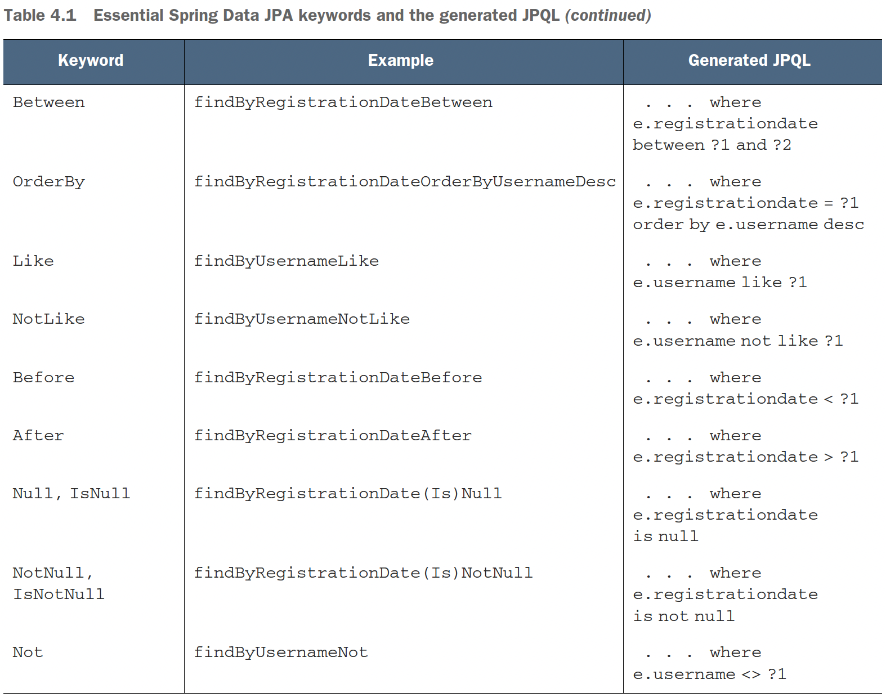

## Chapter 4 - Working with Spring Data JPA

### Table of contents

- [Introducing Spring Data JPA](#41-introducing-spring-data-jpa)
- [Defining query methods with Spring Data JPA](#44-defining-query-methods-with-spring-data-jpa)
- [Limiting query results, sorting and paging](#45-limiting-query-results-sorting-and-paging)
- [Streaming results](#46-streaming-results)
- [The _@Query_ annotation](#47-the-_query_-annotation)
- [Projections](#48-projections)
- [Modifying queries](#49-modifying-queries)
- [Query by Example](#410-query-by-example)

### 4.1 Introducing Spring Data JPA

Spring Data JPA provides support for interacting with
JPA repositories. As you can see in figure 4.1, it is built
on top of the functionality offered by the Spring Data
Commons project and the JPA provider (Hibernate in
our case).

\
(Credits: [Java Persistence with Spring Data and Hibernate](https://www.manning.com/books/java-persistence-with-spring-data-and-hibernate))

For the following examples we are using the CaveatEmptor model from chapter 3.

Check [springdatajpa app](springdatajpa) for following the first example.

NOTE: _CrudRepository_ is a generic technology-agnostic
persistence interface that we can use not only for JPA/relational databases but also for
NoSQL databases. For example, we can easily change the database from MySQL to
MongoDB without touching the implementation by changing the dependency from the
original spring-boot-starter-data-jpa to spring-boot-starter-data-mongodb.

Run [CH04.sql](springdatajpa/src/main/resources/CH04.sql) before running first example.\
Configure the mysql db as in [application.yml](springdatajpa/src/main/resources/application.yml).

First examples creates 2 users and saves them to the db and then retrieves them.\
Check [SpringDataJpaApplication.java](springdatajpa/src/main/java/com/ro/springdatajpa/SpringDataJpaApplication.java)
```java
@Bean
public ApplicationRunner configure(UserRepository userRepository) {
    return env -> {
        User user1 = new User("beth", LocalDate.of(2020, Month.AUGUST, 3));
        User user2 = new User("mike", LocalDate.of(2020, Month.JANUARY, 18));

        userRepository.save(user1);
        userRepository.save(user2);

        userRepository.findAll().forEach(System.out::println);
    };
}
```

Results:
- in db:\
  
- in logs:\
  

### 4.4 Defining query methods with Spring Data JPA

Check [springdatajpa2 app](springdatajpa2) for following the second example.

We’ll extend the _User_ class by adding the fields _email_, _level_, and _active_.
A user may have different levels, which will allow them to execute particular actions (such as bidding
above some amount). A user may be active or may be retired (previously active in
the CaveatEmptor auction system, but not anymore). This is important information
that the CaveatEmptor application needs to keep about its users.

We’ll change the _UserRepository_ interface to extend _JpaRepository_ instead of _CrudRepository_. _JpaRepository_ extends _PagingAndSortingRepository_, 
which, in turn, extends _CrudRepository_.
_CrudRepository_ provides basic CRUD functionality, whereas _PagingAndSortingRepository_ offers convenient methods that sort and paginate the records. _JpaRepository_ offers JPA-related methods, such as **flushing
the persistence context and deleting records in a batch**. Additionally, _JpaRepository_
overwrites a few methods from _CrudRepository_, such as _findAll_, _findAllById_,
and _saveAll_ to return _List_ instead of _Iterable_.

A series of query methods were added to the [UserRepository](springdatajpa2/src/main/java/com/ro/springdatajpa/repositories/UserRepository.java) interface.
The purpose of these query methods is to retrieve information from the database.
Spring Data JPA provides a query builder mechanism that will create behavior for the
repository methods based on their names.

\
(Credits: [Java Persistence with Spring Data and Hibernate](https://www.manning.com/books/java-persistence-with-spring-data-and-hibernate))

\
(Credits: [Java Persistence with Spring Data and Hibernate](https://www.manning.com/books/java-persistence-with-spring-data-and-hibernate))

To test the methods that now belong to [UserRepository](springdatajpa2/src/main/java/com/ro/springdatajpa/repositories/UserRepository.java), 
we’ll create the [FindUsersUsingQueriesTest](springdatajpa2/src/test/java/com/ro/springdatajpa/FindUsersUsingQueriesTest.java) 
class and follow the same recipe for writing tests: call the repository
method and verify its results. We used the local db configuration [application.yml](springdatajpa2/src/main/resources/application.yml).

### 4.5 Limiting query results, sorting and paging

_Pageable_ is an interface for pagination information, but in practice we use the
_PageRequest_ class that implements it. This one can specify the page number, the page
size, and the sorting criterion.

We added the following methods on the [UserRepository](springdatajpa2/src/main/java/com/ro/springdatajpa/repositories/UserRepository.java).

```java
Page<User> findAll(Pageable pageable);
List<User> findFirst2ByLevel(int level, Sort sort);
List<User> findByLevel(int level, Sort sort);
List<User> findByActive(boolean active, Pageable pageable);
```

Check the related tests on [FindUsersSortingAndPagingTest](springdatajpa2/src/test/java/com/ro/springdatajpa/FindUsersSortingAndPagingTest.java).

### 4.6 Streaming results

Query methods returning more than one result can use standard Java interfaces such
as _Iterable_, _List_, _Set_. Additionally, Spring Data supports _Streamable_, which can be
used as an alternative to _Iterable_ or any collection type. You can concatenate
*Streamable*s and directly filter and map over the elements.

We added the following methods on the [UserRepository](springdatajpa2/src/main/java/com/ro/springdatajpa/repositories/UserRepository.java).

```java
Streamable<User> findByEmailContaining(String text);
Streamable<User> findByLevel(int level);
```

Check the related test on [QueryResultsTest](springdatajpa2/src/test/java/com/ro/springdatajpa/QueryResultsTest.java).

### 4.7 The _@Query_ annotation

With the _@Query_ annotation, you can create a method and then write a custom query
on it. The _@Query_ annotation can generate native queries with the
_nativeQuery_ flag set to true. You should be aware, however, that native queries can
affect the portability of the application. To sort the results, you can use a _Sort_ object.
The properties you order by must resolve to a query property or a query alias.

Spring Data JPA supports Spring Expression Language (SpEL) expressions in queries
defined using the _@Query_ annotation, and Spring Data JPA supports the _entityName_ variable. 
In a query such as _select e from #{#entityName} e_, entityName is
resolved based on the _@Entity_ annotation. In our case, in _UserRepository_ extends
_JpaRepository<User, Long>_, entityName will resolve to _User_.

We added the following methods on the [UserRepository](springdatajpa2/src/main/java/com/ro/springdatajpa/repositories/UserRepository.java).
```java
@Query("select count(u) from User u where u.active = ?1")
int findNumberOfUsersByActivity(boolean active);

@Query("select u from User u where u.level = :level and u.active = :active")
List<User> findByLevelAndActive(@Param("level") int level, @Param("active") boolean active);

@Query(value = "SELECT COUNT(*) FROM USERS WHERE ACTIVE = ?1", nativeQuery = true)
int findNumberOfUsersByActivityNative(boolean active);

@Query("select u.username, LENGTH(u.email) as email_length from #{#entityName} u where u.username like %?1%")
List<Object[]> findByAsArrayAndSort(String text, Sort sort);
```

NOTE: If the method naming is wrong for any of the previous methods that follow the Spring
Data JPA naming conventions (for example, the entity property does not match in the
query method), you will get an error when the application context is loaded. If you
are using the _@Query_ annotation and the query you wrote is wrong, you will get an
error at runtime when executing that method. Thus, the _@Query_ annotated methods
are more flexible, but they also provide less safety.

Check the related test on [QueryResultsTest](springdatajpa2/src/test/java/com/ro/springdatajpa/QueryResultsTest.java).

### 4.8 Projections

Not all attributes of an entity are always needed, so we may sometimes access only
some of them. For example, the frontend may reduce I/O and display only the information
that will be of interest to the end user. Consequently, instead of returning
instances of the root entity managed by the repository, you may want to create projections
based on certain attributes of those entities. Spring Data JPA can shape return
types to selectively return attributes of entities.

An interface-based projection requires the creation of an interface that declares
getter methods for the properties to be included in the projection. Such an interface
can also compute specific values using the @Value annotation and SpEL expressions.
**By executing queries at runtime, the execution engine creates proxy instances of the
interface for each returned element and forwards the calls to the exposed methods to
the target object.**

In general, you should use projections when you need to provide limited information
and not expose the full entity. For performance reasons, you should prefer closed
projections (definition on [Projection](springdatajpa2/src/main/java/com/ro/springdatajpa/model/Projection.java)) whenever you know from the beginning which information you want to
return. If you have a query that returns the full object, and you have a similar query
that only returns a projection, you can use alternate naming conventions, such as
naming one method _find...By_ and the other method _get...By_.

A class-based projection requires the creation of a data transfer object (DTO) class
that declares the properties to be included in the projection and the getter methods.
Using a class-based projection is similar to using interface-based projections. However,
Spring Data JPA doesn’t need to create proxy classes for managing projections. Spring
Data JPA will instantiate the class that declares the projection, and the properties to be
included are determined by the parameter names of the constructor of the class.

Check [Projection](springdatajpa2/src/main/java/com/ro/springdatajpa/model/Projection.java).

We added the following methods on the [UserRepository](springdatajpa2/src/main/java/com/ro/springdatajpa/repositories/UserRepository.java).
```java
List<Projection.UserSummary> findByRegistrationDateAfter(LocalDate date);
List<Projection.UsernameOnly> findByEmail(String email);
<T> List<T> findByEmail(String email, Class<T> type);
```
Check tests on [ProjectionTest](springdatajpa2/src/test/java/com/ro/springdatajpa/ProjectionTest.java)

### 4.9 Modifying queries

You can define modifying methods with the @Modifying annotation. For example,
INSERT, UPDATE, and DELETE queries, or DDL statements, modify the content of the
database. Such a method must also be annotated with @Transactional
or be run from a programmatically managed transaction. Modifying queries
have the advantage of clearly emphasizing which column they address, and they may
include conditions, so they can make the code clearer, compared to persisting or
deleting the whole object. Also, changing a limited number of columns in the database
will execute more quickly.

Spring Data JPA can also generate delete queries based on method names. The
mechanism works much like the examples in table 4.1, but replacing the _find_ keyword
with _delete_.

We added the following methods on the [UserRepository](springdatajpa2/src/main/java/com/ro/springdatajpa/repositories/UserRepository.java).
```java
@Modifying
@Transactional
@Query("update User u set u.level = ?2 where u.level = ?1")
int updateLevel(int oldLevel, int newLevel);

@Transactional
int deleteByLevel(int level);

@Transactional
@Modifying
@Query("delete from User u where u.level = ?1")
int deleteBulkByLevel(int level);
```

What is the difference between the deleteByLevel and deleteBulkByLevel methods?
The first one runs a query, and it will then remove the returned instances one by one.
If there are callback methods that control the lifecycle of each instance (for example,
a method to be run when a user is removed), they will be executed. The second
method will remove the users in bulk, executing a single JPQL query. No User
instance (not even the ones that are already loaded in memory) will execute lifecycle
callback methods.

Check tests on [ModifyQueryTest](springdatajpa2/src/test/java/com/ro/springdatajpa/ModifyQueryTest.java).

### 4.10 Query by Example

Query by Example (QBE) is a querying technique that does not require you to write
classical queries to include entities and properties. It allows dynamic query creation
and consists of three pieces: a _probe_, an _ExampleMatcher_, and an _Example_.

The _probe_ is a domain object with already-set properties. The _ExampleMatcher_
provides the rules for matching particular properties. An _Example_ puts the probe and
the _ExampleMatcher_ together and generates the query. Multiple *Example*s may reuse a
single _ExampleMatcher_.

These are the most appropriate use cases for QBE:
- When you are decoupling the code from the underlying data store API.
- When there are frequent changes to the internal structure of the domain
objects, and they aren’t propagated to the existing queries.
- When you are building a set of static or dynamic constraints to query the
repository.

QBE has a couple of limitations:
- It only supports starting/ending/containing regex matching for String properties,
and exact matching for other types.
- It does not support nested or grouped property constraints, such as _username =
?0 or (username = ?1 and email = ?2)_.

Check the tests on [QueryByExampleTest](springdatajpa2/src/test/java/com/ro/springdatajpa/QueryByExampleTest.java).

To emphasize the importance of ignoring the default primitive properties, we’ll compare
the generated queries with and without the calls to the _withIgnorePaths
("level", "active")_ methods. For the first test, this is the query generated with the
call to the _withIgnorePaths("level", "active")_ method:
```jql
select user0_.id as id1_0_, user0_.active as active2_0_, user0_.email as
➥ email3_0_, user0_.level as level4_0_, user0_.registration_date as
➥ registra5_0_, user0_.username as username6_0_ from users user0_ where
➥ user0_.email like ? escape ?
```
This is the query generated without the call to the _withIgnorePaths("level",
"active")_ method:
```jql
select user0_.id as id1_0_, user0_.active as active2_0_, user0_.email as
➥ email3_0_, user0_.level as level4_0_, user0_.registration_date as
➥ registra5_0_, user0_.username as username6_0_ from users user0_ where
➥ user0_.active=? and (user0_.email like ? escape ?) and user0_.level=0

```
For the second test, this is the query generated with the call to the _withIgnorePaths("level", "active")_ method:

```jql
select user0_.id as id1_0_, user0_.active as active2_0_, user0_.email as
➥ email3_0_, user0_.level as level4_0_, user0_.registration_date as
➥ registra5_0_, user0_.username as username6_0_ from users user0_ where
➥ lower(user0_.username) like ? escape ?
```
This is the query generated without the call to the _withIgnorePaths("level",
"active")_ method:

```jql
select user0_.id as id1_0_, user0_.active as active2_0_, user0_.email as
➥ email3_0_, user0_.level as level4_0_, user0_.registration_date as
➥ registra5_0_, user0_.username as username6_0_ from users user0_ where
➥ user0_.active=? and user0_.level=0 and (lower(user0_.username) like ?
➥ escape ?)
```

Note the conditions added on primitive properties when the withIgnore-
Paths("level", "active") method was removed:
```jql
user0_.active=? and user0_.level=0
```
This will change the query result.