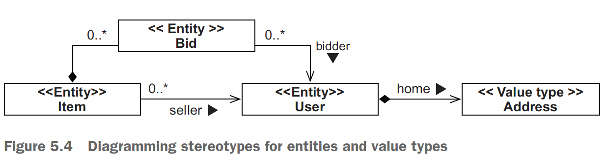
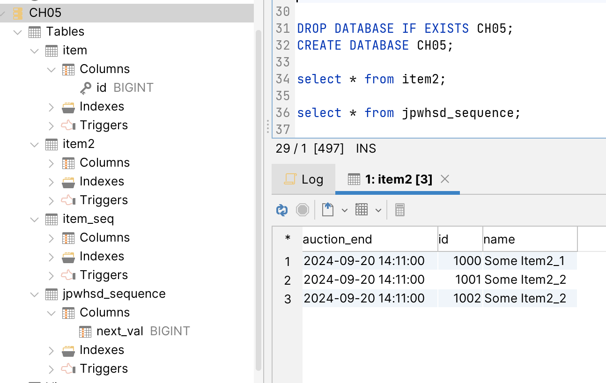

## Chapter 5 - Mapping persistent classes

### Table of contents

- [Understanding entities and value types](#51-understanding-entities-and-value-types)
  - [Fine-grained domain models](#511-fine-grained-domain-models)
  - [Defining application concepts](#512-defining-application-concepts)
  - [Distinguishing entities and value types](#513-distinguishing-entities-and-value-types)
- [Mapping entities with identity](#52-mapping-entities-with-identity)
  - [Understanding Java identity and equality](#521-understanding-java-identity-and-equality)
  - [A first entity class and mapping](#522-a-first-entity-class-and-mapping)
  - [Selecting a primary key](#523-selecting-a-primary-key)
  - [Configuring key generators](#524-configuring-key-generators)
  - [Identifier generator strategies](#525-identifier-generator-strategies)

### 5.1 Understanding entities and value types

### 5.1.1 Fine-grained domain models

In crude terms, _fine-grained_ means having more classes than tables.

For example, a user may have a home address in your domain model. In the database,
you may have a single USERS table with the columns HOME_STREET, HOME_CITY,
and HOME_ZIPCODE. In the domain model, you could use the same approach, representing the
address as three string-valued properties of the User class. But it’s much better to
model this using an _Address_ class, where _User_ has a _homeAddress_ property. This
domain model achieves improved cohesion and greater code reuse, and it’s more
understandable than SQL with inflexible type systems.

**We are referencing the domain model from Figure 3.3.**

### 5.1.2 Defining application concepts

- _Entity type_: You can retrieve an instance of an _entity type_ using its persistent identity;
for example, a _User_, _Item_, or _Category_ instance. A reference to an entity
instance (a pointer in the JVM) is persisted as a reference in the database (a foreign
key–constrained value). An entity instance has its own lifecycle; it can exist
independently of any other entity. You map selected classes of your domain
model as entity types.

- _Value type_: An instance of a _value type_ has no persistent identifier property; it
belongs to an entity instance, and its lifespan is bound to the owning entity
instance. A value-type instance doesn’t support shared references. You can map
your own domain model classes as value types; for example, _Address_ and
_MonetaryAmount_.

If you read the JPA specification, you’ll find the same concepts, but value types are
called _basic property types_ or _embeddable classes_ in JPA.

### 5.1.3 Distinguishing entities and value types

\
(Credits: [Java Persistence with Spring Data and Hibernate](https://www.manning.com/books/java-persistence-with-spring-data-and-hibernate))

The _Bid_ class could be a problem. In object-oriented modeling, this is marked as a
composition (the association between Item and Bid with the full diamond). Composition
is a type of association where an object can only exist as part of a container. If the
container is destroyed, then the included object is also destroyed. Thus, an _Item_ is the
owner of its _Bid_ instances and holds a collection of references. The _Bid_ instances cannot
exist without the _Item_. At first, this seems reasonable, because bids in an auction
system are useless when the item they were made for disappears.

But what if a future extension of the domain model requires a _User#bids_ collection
containing all bids made by a particular _User_? Right now, the association between _Bid_
and _User_ is unidirectional; a _Bid_ has a bidder reference. What if this was bidirectional?

In that case, you would have to deal with possible shared references to _Bid_
instances, so the _Bid_ class would need to be an entity. It has a dependent lifecycle, but
it must have its own identity to support (future) shared references.

You’ll often find this kind of mixed behavior, but your first reaction should be to
make everything a value-typed class and promote it to an entity only when absolutely
necessary. _Bid_ is a value type because its identity is defined by _Item_ and _User_. **This
does not necessarily mean that it won’t live in its own table.** Try to simplify your associations;
persistent collections, for example, frequently add complexity without offering
any advantages. Instead of mapping the _Item#bids_ and _User#bids_ collections, you
can write queries to obtain all the bids for an _Item_ and those made by a particular
_User_. The associations in the UML diagram will point from the _Bid_ to the _Item_ and
_User_, unidirectionally, and not the other way. The stereotype on the _Bid_ class would
then be _<<Value type>>_.

Next, you can take your domain model diagram and implement POJOs for all entities
and value types. You’ll have to take care of three things:

- _Shared references_: Avoid shared references to value type instances when you
write your POJO classes. For example, make sure only one _User_ can reference
an _Address_. You can make _Address_ immutable with no _public setUser()_
method and enforce the relationship with a public constructor that has a _User_
argument. Of course, you’ll still need a no-argument, probably protected constructor,
so Hibernate or Spring Data JPA can also create an instance.

- _Lifecycle dependencies_: If a _User_ is deleted, its _Address_ dependency will have to
be deleted as well. Persistence metadata will include cascading rules for all such
dependencies, so Hibernate, Spring Data JPA, or the database can take care of
removing the obsolete _Address_. You must design your application procedures
and user interface to respect and expect such dependencies — write your
domain model POJOs accordingly.

- _Identity_: Entity classes need an identifier property in almost all cases. Value
type classes (and, of course, JDK classes such as String and Integer) don’t
have an identifier property because instances are identified through the owning
entity.

### 5.2 Mapping entities with identity

### 5.2.1 Understanding Java identity and equality

With object/relational persistence, a persistent
instance is an in-memory representation of a particular row (or rows) of a database
table (or tables). Along with Java identity and equality, we define _database identity_.

- _Object identify_: Objects are identical if they occupy the same memory location
in the JVM. This can be checked with the a == b operator. This concept is
known as object identity.

- _Object equality_: Objects are equal if they have the same state, as defined by the
a.equals(Object b) method. Classes that don’t explicitly override this method
inherit the implementation defined by java.lang.Object, which compares
object identity with ==. This concept is known as object equality. As you’ll probably
recall, the properties of object equality are reflexivity, symmetry, and transitivity.
One thing they imply is that if a == b, then both a.equals(b) and
b.equals(a) should be true.

- _Database identity_: Objects stored in a relational database are identical if they
share the same table and primary key value. This concept, mapped into the Java
space, is known as database identity.

### 5.2.2 A first entity class and mapping

The _@Entity_ annotation isn’t enough to map a persistent class. You’ll also need an
_@Id_ annotation.

- Every entity class has to have an _@Id_ property; it’s how JPA exposes database identity
  to the application.
- Hibernate and Spring Data JPA will use the field to access the identifier property
  value when loading and storing items, not getter or setter methods. Because _@Id_ is on
  a field, Hibernate or Spring Data JPA will enable every field of the class as a persistent
  property by default. The rule in JPA is this: if _@Id_ is on a field, the JPA provider will
  access fields of the class directly and consider all fields to be part of the persistent state
  by default. In our experience, **field access is often a better choice than using an accessor,
  because it gives you more freedom for accessor method design**.

Check the code on: [Item class](example-1/src/main/java/com/ro/example1/model/Item.java)

### 5.2.3 Selecting a primary key

To become the primary key, a candidate key must satisfy the following
requirements:
- The value of any candidate key column is never null. You can’t identify something
with data that is unknown, and there are no nulls in the relational model.
Some SQL products allow you to define (composite) primary keys with nullable
columns, so you must be careful.
- The value of the candidate key column (or columns) is a unique value for any
row.
- The value of the candidate key column (or columns) never changes; it’s
immutable.

NOTE: Hibernate and Spring
Data JPA expect a candidate key to be immutable when it’s used as the primary key.
Hibernate and Spring Data JPA with Hibernate as a provider don’t support updating
primary key values with an API; if you try to work around this requirement, you’ll run
into problems with Hibernate’s caching and dirty-checking engine. If your database
schema relies on updatable primary keys (and maybe uses ON UPDATE CASCADE foreign
key constraints), you must change the schema before it will work with Hibernate
or Spring Data JPA using Hibernate as provider.

If a table has only one identifying attribute, it becomes, by definition, the primary key.
But several columns or combinations of columns may satisfy these properties for a particular
table; you can choose between candidate keys to decide on the best primary
key for the table. You should declare candidate keys that are not chosen as the primary
key as unique keys in the database if their values are indeed unique (but maybe
not immutable).

Definitions:

A _natural key_ is a key with
business meaning: an attribute or combination of attributes that is unique by virtue of
its business semantics. Examples of natural keys are the US Social Security Number
and Australian Tax File Number.

_Surrogate keys_ have no business meaning—they have unique values
generated by the database or application. Application users ideally won’t see or
refer to these key values; they’re part of the system’s internals. Introducing a surrogate
key column is also appropriate in the common situation where there are no candidate
keys. In other words, almost every table in your schema should have a dedicated surrogate
primary key column with only this purpose.

### 5.2.4 Configuring key generators

- **GenerationType.AUTO**—Hibernate picks an appropriate strategy, asking the SQL dialect of
your configured database what is best. This is equivalent to @GeneratedValue()
without any settings.
- **GenerationType.SEQUENCE**—Hibernate expects (and creates, if you use the tools) a sequence
named HIBERNATE_SEQUENCE in your database. The sequence will be called separately
before every INSERT, producing sequential numeric values.
- **GenerationType.IDENTITY**—Hibernate expects (and creates in table DDL) a special auto-incremented
primary key column that automatically generates a numeric value
on INSERT in the database.
- **GenerationType.TABLE**—Hibernate will use an extra table in your database schema that holds
  the next numeric primary key value, with one row for each entity class. This
  table will be read and updated before INSERTs. The default table name is
  HIBERNATE_SEQUENCES with the columns SEQUENCE_NAME and NEXT_VALUE.

Most applications work with database sequences, but you may want to
customize the name and other settings of the database sequence. Therefore, instead of
picking one of the JPA strategies, you can map the identifier with @GeneratedValue
(generator = "ID_GENERATOR"). This is a named identifier
generator; you are now free to set up the ID_GENERATOR configuration independently
of your entity classes.

JPA has two built-in annotations you can use to configure named generators: 
_@javax.persistence.SequenceGenerator_ and _@javax.persistence.TableGenerator_. With
these annotations, you can create a named generator with your own sequence and table
names. As usual with JPA annotations, you can unfortunately only use them at the top
of a (maybe otherwise empty) class and not in a package-info.java file.

For this reason, and because the JPA annotations don’t give you access to the full
Hibernate feature set, we prefer the native _@org.hibernate.annotations.GenericGenerator_ annotation as an alternative. It supports all Hibernate identifier generator
strategies and their configuration details. Unlike the rather limited JPA annotations,
you can use the Hibernate annotation in a package-info.java file, typically in the same
package as your domain model classes.

Check the annotation on: [package-info.java](example-1/src/main/java/com/ro/package-info.java)

Run [CH05.sql](example-1/src/main/resources/CH05.sql)

Check [Item2 class](example-1/src/main/java/com/ro/example2/Item2.java) to see how the generator is used.

Check [SpringDataJpaApplication class](example-1/src/main/java/com/ro/SpringDataJpaApplication.java) to see how items are saved.

Here you can see the result:

### 5.2.5 Identifier generator strategies

_Generating identifiers before or after INSERT: what’s the difference?_\
An ORM service tries to optimize SQL INSERTs, such as by batching several at the
JDBC level. Hence, SQL execution occurs as late as possible during a unit of work,
and not when you call entityManager.persist(someItem). This merely queues the
insertion for later execution and, if possible, assigns the identifier value. However, if
you now call someItem.getId(), you might get null back if the engine wasn’t able
to generate an identifier before the INSERT.
In general, we prefer pre-insert generation strategies that produce identifier values
independently before INSERT. A common choice is to use a shared and concurrently
accessible database sequence. Auto-incremented columns, column default values,
and trigger-generated keys are available only after the INSERT.

Before we discuss the full list of identifier generator strategies, the recommendations
for these strategies are as follows:
- In general, prefer pre-insert generation strategies that produce identifier values
independently before INSERT.
- Use enhanced-sequence, which uses a native database sequence when that’s
supported and otherwise falls back to using an extra database table with a single
column and row, emulating a sequence.

Hibernate has been growing
organically, so there are now two sets of mappings between standard and native strategies;
we refer to them as old and new in the list. You can switch this mapping with the _hibernate.id.new_generator_mappings_ setting in your persistence.xml file. 
The default is true, which means the new mapping is used.

- **native**—This option automatically selects a strategy, such as sequence or identity,
depending on the configured SQL dialect. You have to look at the Javadoc
(or even the source) of the SQL dialect you configured in _persistence.xml_ to
determine which strategy will be selected. This is equivalent to JPA _Generation-Type.AUTO_ with the old mapping.
- **sequence**—This strategy uses a native database sequence named _HIBERNATE_SEQUENCE_. 
The sequence is called before each INSERT of a new row. You can
customize the sequence name and provide additional DDL settings; see the
Javadoc for the _org.hibernate.id.SequenceGenerator_ class.
- **enhanced-sequence**—This strategy uses a native database sequence when it’s
supported; otherwise it falls back to using an extra database table with a single column
and row, emulating a sequence (the default table name is _HIBERNATE_SEQUENCE_). 
Using this strategy always calls the database “sequence” before an
INSERT, providing the same behavior independently of whether the DBMS supports
real sequences. This strategy also supports an _org.hibernate.id.enhanced.Optimizer_ 
to avoid hitting the database before each INSERT, and it defaults to
no optimization and fetching a new value for each INSERT. This is equivalent
to JPA _GenerationType.SEQUENCE_ and _GenerationType.AUTO_ with the new
mapping enabled, and it’s probably your best option of the built-in strategies.
For all the parameters, see the Javadoc for the _org.hibernate.id.enhanced.SequenceStyleGenerator_ class.
- **enhanced-table**—This strategy uses an extra table named _HIBERNATE_SEQUENCES_, 
with one row by default representing the sequence and storing the
next value. This value is selected and updated when an identifier value has to be
generated. You can configure this generator to use multiple rows instead: one
for each generator (see the Javadoc for _org.hibernate.id.enhanced.TableGenerator_). 
This is equivalent to JPA _GenerationType.TABLE_ with the
new mapping enabled. It replaces the outdated but similar _org.hibernate.id.MultipleHiLoPerTableGenerator_, 
which was the old mapping for JPA _GenerationType.TABLE_.
- **identity**—This strategy supports IDENTITY and auto-increment columns in
DB2, MySQL, MS SQL Server, and Sybase. The identifier value for the primary
key column will be generated on the INSERT of a row. It has no options. Unfortunately,
due to a quirk in Hibernate’s code, you cannot configure this strategy
in @GenericGenerator. The DDL generation will not include the identity or
auto-increment option for the primary key column. The only way to use it is
with JPA _GenerationType.IDENTITY_ and the old or new mapping, making it the
default for _GenerationType.IDENTITY_.
- **increment**—At Hibernate startup, this strategy reads the maximum (numeric)
primary key column value of each entity’s table and increments the value by one
each time a new row is inserted. This is especially efficient if a non-clustered
Hibernate application has exclusive access to the database, but don’t use it in any
other scenario.
- **select**—With this strategy, Hibernate won’t generate a key value or include the
primary key column in an INSERT statement. Hibernate expects the DBMS to
assign a value to the column on insertion (the default value in the schema or
the value given by a trigger). Hibernate then retrieves the primary key column
with a SELECT query after insertion. The required parameter is key, naming the
database identifier property (such as id) for the SELECT. This strategy isn’t very
efficient and should only be used with old JDBC drivers that can’t return generated
keys directly.
- **uuid2**—This strategy produces a unique 128-bit UUID in the application layer.
This is useful when you need globally unique identifiers across databases (such as
if you merge data from several distinct production databases in batch runs every
night into an archive). The UUID can be encoded either as a java.lang.String,
a byte[16], or a java.util.UUID property in your entity class. This replaces the
legacy uuid and uuid.hex strategies. You configure it with an _org.hibernate.id.UUIDGenerationStrategy_; 
see the Javadoc for the _org.hibernate.id.UUIDGenerator_ class for more details.
- **guid**—This strategy uses a globally unique identifier produced by the database,
with an SQL function available on Oracle, Ingres, MS SQL Server, and MySQL.
Hibernate calls the database function before an INSERT. The value maps to a
java.lang.String identifier property. If you need full control over identifier
generation, configure the strategy of @GenericGenerator with the fully qualified
name of a class that implements the _org.hibernate.id.IdentityGenerator_
interface.

