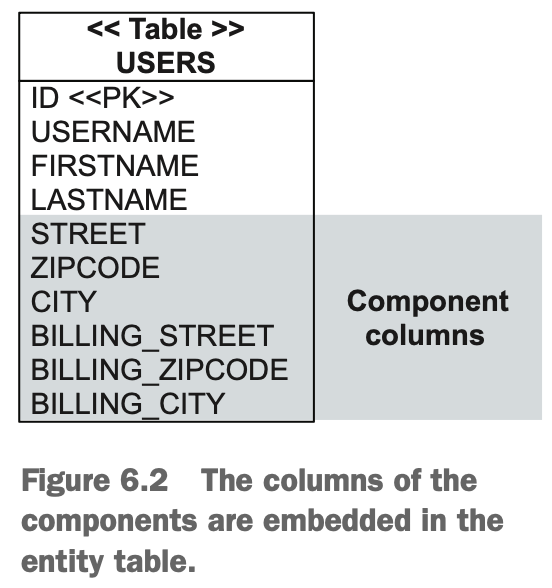
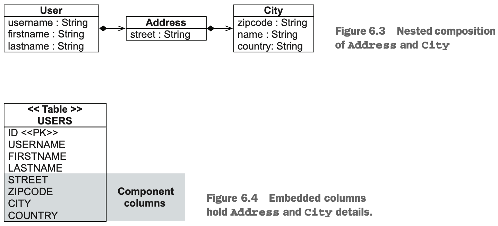
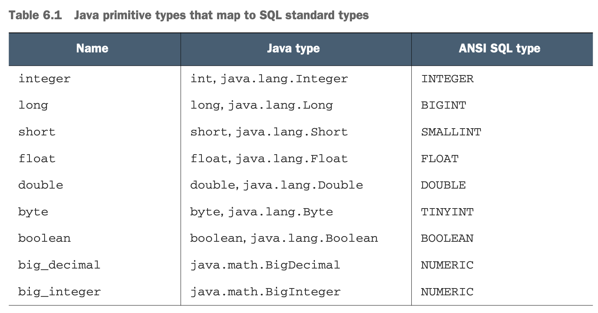
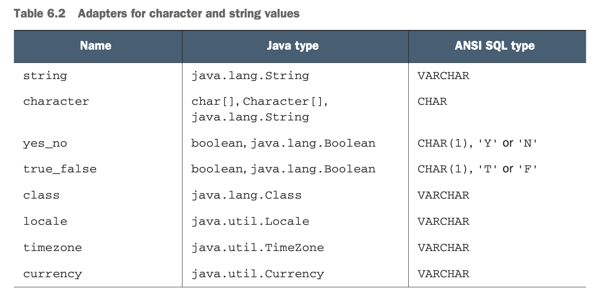
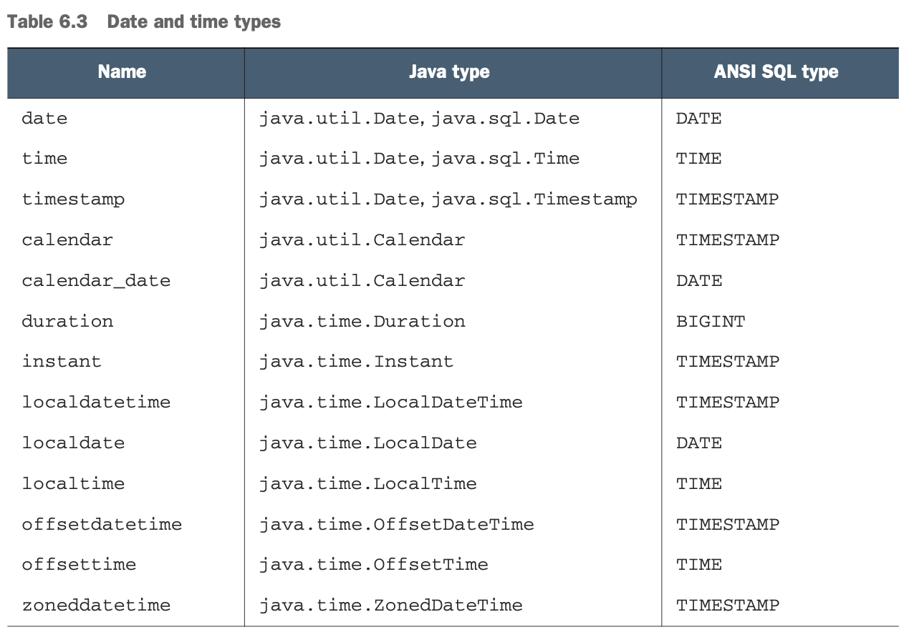
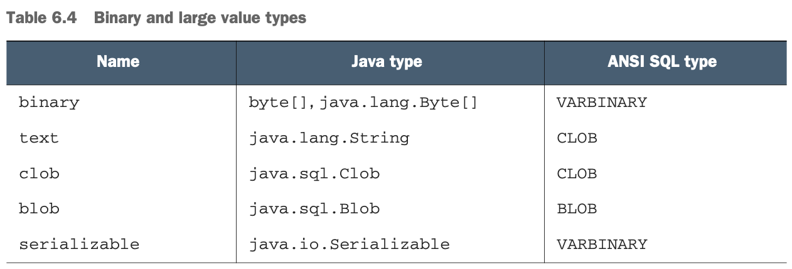

## Chapter 6 - Mapping value types

### Table of contents

### 6.1 Basic properties

Rules:
- If the property is a primitive or a primitive wrapper, or of type _String, 
BigInteger, BigDecimal, java.time.LocalDateTime, java.time.LocalDate, 
java.time.LocalDate, java.util.Date, java.util.Calendar, java.sql.Date,
java.sql.Time, java.sql.Timestamp, byte[], Byte[], char[], or Character[]_, 
it’s automatically persistent. Hibernate or Spring Data JPA using Hibernate 
loads and stores the value of the property in a column with an appropriate SQL 
type and the same name as the property.
- Otherwise, if we annotate the class of the property as @Embeddable, 
or we map the property itself as @Embedded, the property is mapped as an embedded component of the owning class.
- Otherwise, if the type of the property is java.io.Serializable, its value is stored in its serialized form. 
This may raise compatibility problems (we might have stored the information using one class format and would 
like to retrieve it later using another class format) and performance problems (the serialization/ deserialization operations are costly). 
We should always map Java classes instead of storing a series of bytes in the database. Maintaining a database with this binary information
when the application may be gone in a few years will mean that the classes that the serialized version maps to are no longer available.
- Otherwise, an exception will be thrown on startup, complaining that the type of the property isn’t understood.

### 6.1.1 Overriding basic property defaults

- To exclude a property, mark the field or the getter method of the property with the annotation @javax.persistence.Transient 
or use the Java transient keyword. The transient keyword excludes fields both 
for Java serialization and for persistence, as it is also recognized by JPA providers. 
The @javax.persistence.Transient annotation will only exclude the field from being persisted.

-
```java
@Basic(optional = false)
BigDecimal initialPrice;

The option shown here, optional, marks the property as not optional at the Java object level.
```
-
```java
@Column(nullable = false)
BigDecimal initialPrice;

We recommend using the Bean Validation @NotNull annotation so that you can manually 
validate an Item instance and have your user interface code
in the presentation layer execute validation checks automatically. 
There isn’t much difference in the end result, but not hitting the database with a statement 
that fails is cleaner.

@Column(name = "START_PRICE", nullable = false)
BigDecimal initialPrice;
```

### 6.1.2 Customizing property access

An annotated entity inherits the default from the position of the mandatory @Id annotation. 
For example, if we declare @Id on a field, rather than using a getter method, all other mapping 
annotations for that entity are expected to be fields. Annotations are not supported on the setter methods.


The JPA specification offers the @Access annotation for overriding the default behavior, using the parameters AccessType.FIELD (access through fields)
and AccessType.PROPERTY (access through getters). When you set @Access on the class or entity level, all properties of the class 
will be accessed according to the selected strategy. 
Any other mapping annotations, including the @Id, can be set on either fields or getter methods.
We can also use the @Access annotation to override the access strategy of individual properties.

### 6.1.3 Using derived properties

The value of a derived property is calculated at runtime by evaluating an SQL expression declared with the @org.hibernate.annotations.Formula annotation.

```java
@Formula(
    "CONCAT(SUBSTR(DESCRIPTION, 1, 12), '...')"
)
private String shortDescription;
```

The SQL formulas are evaluated every time the Item entity is retrieved from the database and not at any other time, 
so the result can become outdated if other properties are modified. The properties never appear in an SQL INSERT or UPDATE, only in SELECTs. Evaluation occurs in the database; the SQL formula is embedded in the SELECT clause when loading the instance.

### 6.1.4 Transforming column values

```java
@Column(name = "IMPERIALWEIGHT")
@ColumnTransformer(
    read = "IMPERIALWEIGHT / 2.20462",
    write = "? * 2.20462"
)
private double metricWeight;
```

### 6.1.5 Generated and default property types

Examples of database-generated values are creation timestamps, a default price for an item, 
or a trigger that runs for every modification.

Typically, Hibernate (or Spring Data JPA using Hibernate) applications need to refresh 
instances that contain properties for which the database generates values after saving. 
This means the application would have to make another round trip to the database to read 
the value after inserting or updating a row. Marking properties as generated, however, 
lets the application delegate this responsibility to Hibernate or Spring Data JPA using Hibernate. 
Essentially, whenever an SQL INSERT or UPDATE is issued for an entity that has declared 
generated properties, the SQL does a SELECT immediately afterward to retrieve the generated values.

```java
   @CreationTimestamp
   private LocalDate createdOn;

   @UpdateTimestamp
   private LocalDateTime lastModified;
   
   @Column(insertable = false)
   @ColumnDefault("1.00")
   @Generated(org.hibernate.annotations.GenerationTime.INSERT)
   private BigDecimal initialPrice;
```

### 6.1.7 Mapping enumerations

```java
public enum AuctionType {
    HIGHEST_BID,
    LOWEST_BID,
    FIXED_PRICE
}

@NotNull
@Enumerated(EnumType.STRING)
private AuctionType auctionType = AuctionType.HIGHEST_BID;

```


### 6.2 Mapping embeddable components

### 6.2.1 The database schema

\
(Credits: [Java Persistence with Spring Data and Hibernate](https://www.manning.com/books/java-persistence-with-spring-data-and-hibernate))

This schema reflects value type semantics: a particular Address can’t be shared; 
it doesn’t have its own identity. Its primary key is the mapped database identifier 
of the owning entity. An embedded component has a dependent lifecycle: 
when the owning entity instance is saved, the component instance is saved. 
When the owning entity instance is deleted, the component instance is deleted. 
No special SQL needs to be executed for this; all the data is in a single row.

### 6.2.2 Making classes embeddable

Use @Embeddable on the Address class to make it embeddable.

```java
@Embeddable
public class Address {
	@NotNull /*ignored by the DDL generation */
	@Column(nullable = false, length = 5) /* used for DDL generation* ; 
                                            length will override the default
                                            generation of a column as VARCHAR(255) */
	private String zipcode;
	
	@NotNull
    @Column(nullable = false) /* defaults to VARCHAR(255) */
    private String city;
    

	public Address() {
        /**
         * Hibernate call this no-argument constructor
         * to create an instance and then populate the fields directly.
         */
    }
}

@Entity
@Table(name = "USERS")
public class User {
	@Id
	@GeneratedValue(generator = Constants.ID_GENERATOR)
	private Long id;
	private Address homeAddress; // The Address class is embeddable, so no annotation is needed here.
    // ... 
}
```

_Field-based access_ — When you use field-based access, you can omit getter methods for 
the fields that should not be exposed. Also, fields are declared on a single line, 
while accessor methods are spread out on multiple lines, so field-based access 
will make the code more readable.

_Property-based access_ — Accessor methods may execute additional logic. 
If this is what you want to happen when persisting an object, 
you can use property-based access. If the persistence would like to avoid 
these additional actions, you can use field-based access.

### 6.2.3 Overriding embedded attributes

```java
@Entity
@Table(name = "USERS")
public class User {
	@Embedded
	@AttributeOverride(name = "street", column = @Column(name = "BILLING_STREET"))
	@AttributeOverride(name = "zipcode", column = @Column(name = "BILLING_ZIPCODE", length = 5))
	@AttributeOverride(name = "city", column = @Column(name = "BILLING_CITY"))
	private Address billingAddress;

	public Address getBillingAddress() {
		return billingAddress;
	}

	public void setBillingAddress(Address billingAddress) { 
		this.billingAddress = billingAddress;
	}
}
```

Each @AttributeOverride annotation for a component property is “complete”; 
any JPA or Hibernate annotation on the overridden property is ignored. 
This means the @Column annotations on the Address class are ignored, 
so all BILLING_* columns are NULLable! 
(Bean Validation still recognizes the @NotNull annotation on the component property, 
though; only the persistence annotations are overridden.)

### 6.2.4 Mapping nested embedded components

\
(Credits: [Java Persistence with Spring Data and Hibernate](https://www.manning.com/books/java-persistence-with-spring-data-and-hibernate))

```java
@Embeddable
public class Address {
    @NotNull
    @Column(nullable = false)
    private String street;
		
    @NotNull
    @AttributeOverride(
         name = "name",
         column = @Column(name = "CITY", nullable = false)
    )
    private City city; // ...
}

@Embeddable
public class City {
    @NotNull
    @Column(nullable = false, length = 5)
    private String zipcode;
    @NotNull
    @Column(nullable = false)
    private String name;
    @NotNull
    @Column(nullable = false) private String country; // ...
}
```

### 6.3 Mapping Java and SQL types with converters

### 6.3.1 Built-in types

\
(Credits: [Java Persistence with Spring Data and Hibernate](https://www.manning.com/books/java-persistence-with-spring-data-and-hibernate))

Name column entries are Hibernate-specific.


CHARACTER TYPES\
\
(Credits: [Java Persistence with Spring Data and Hibernate](https://www.manning.com/books/java-persistence-with-spring-data-and-hibernate))

DATE AND TIME TYPES\
\
(Credits: [Java Persistence with Spring Data and Hibernate](https://www.manning.com/books/java-persistence-with-spring-data-and-hibernate))

BINARY AND LARGE VALUE TYPES\
\
(Credits: [Java Persistence with Spring Data and Hibernate](https://www.manning.com/books/java-persistence-with-spring-data-and-hibernate))
