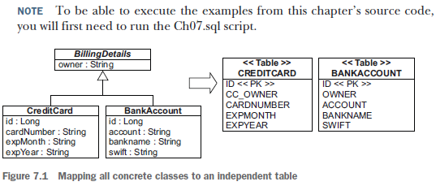
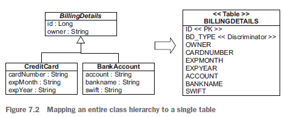
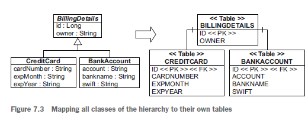
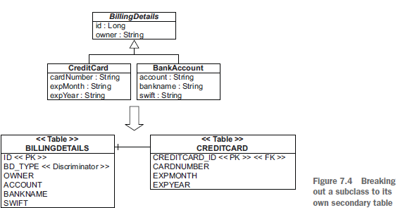
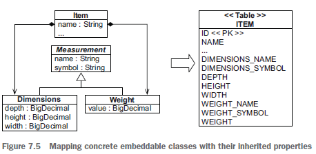
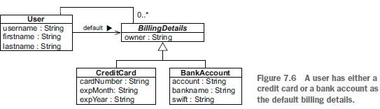

## Chapter 7 - Mapping inheritance

### Table of contents

### 7.1 Table per concrete class with implicit polymorphism

We could stick with the simplest approach suggested: use exactly
one table for each concrete class. We can map all the properties of a class, including
inherited properties, to columns of a table.



Relying on this implicit polymorphism, we’ll map concrete classes with @Entity, as
usual. By default, properties of the superclass are ignored and not persistent! We’ll
have to annotate the superclass with @MappedSuperclass to enable the embedding of
its properties in the concrete subclass tables.

We can declare the identifier property in the superclass, with a shared column name
and generator strategy for all subclasses, or we can repeat it inside
each concrete class.

```java
@MappedSuperclass
public abstract class BillingDetails {
    @Id
    @GeneratedValue(generator = "ID_GENERATOR")
    private Long id;
    @NotNull
    private String owner;
    // . . .
}

@Entity
@AttributeOverride(
        name = "owner",
        column = @Column(name = "CC_OWNER", nullable = false))
public class CreditCard extends BillingDetails {
    @NotNull
    private String cardNumber;
    @NotNull
    private String expMonth;
    @NotNull
    private String expYear;
    // . . .
}

@Entity
public class BankAccount extends BillingDetails {
    @NotNull
    private String account;
    @NotNull
    private String bankname;
    @NotNull
    private String swift;
    // . . .
}
```

```java
@NoRepositoryBean // this prevents its instantiation as a Spring Data IPA repository
public interface BillingDetailsRepository<T extends BillingDetails, ID> extends JpaRepository<T, ID> {
    List<T> findByOwner(String owner);
}
```

BillingDetailsRepository:
- is annotated with BillingDetailsRepository because there will be no BILLINGDETAILS table.
- intends to be extended by the repository interfaces to deal with CreditCard and BankAccount subclasses.
- it contains findByOwner method (the owner field from BillingDetails will be included in both CREDITCARD and BANK_ACCOUNT tables)


We’ll now create two more Spring Data repository interfaces.

```java
public interface BankAccountRepository extends BillingDetailsRepository<BankAccount, Long> {
    List<BankAccount> findBySwift(String swift);
}

public interface CreditCardRepository extends BillingDetailsRepository<CreditCard, Long> {
    List<CreditCard> findByExpYear(String expYear);
}
```

The main problem with implicit inheritance mapping is that it doesn’t support
polymorphic associations very well **(1)**. In the database, we usually represent associations
as foreign key relationships. In the schema from figure 7.1, if the subclasses are all
mapped to different tables, a polymorphic association to their superclass (the abstract
BillingDetails) can’t be represented as a simple foreign key relationship. We can’t
have another entity mapped with a foreign key “referencing BILLINGDETAILS”—there
is no such table. This would be problematic in the domain model because Billing-
Details is associated with User; both the CREDITCARD and BANKACCOUNT tables would
need a foreign key reference to the USERS table. None of these problems can be easily
resolved, so we should consider an alternative mapping strategy.

Polymorphic queries that return instances of all classes that match the interface of
the queried class are also problematic **(2)**. Hibernate must execute a query against the
superclass as several SQL SELECTs — one for each concrete subclass. The JPA query
_select bd from BillingDetails bd_ requires two SQL statements:

```sql
select
    ID, OWNER, ACCOUNT, BANKNAME, SWIFT
from
    BANKACCOUNT
select
    ID, CC_OWNER, CARDNUMBER, EXPMONTH, EXPYEAR
from
    CREDITCARD
```

Hibernate or Spring Data JPA using Hibernate uses a separate SQL query for each
concrete subclass. On the other hand, queries against the concrete classes are trivial
and perform well — Hibernate uses only one of the statements.
A further conceptual problem with this mapping strategy is that several different
columns of different tables share exactly the same semantics **(3)**. This makes schema evolution
more complex. For example, renaming or changing the type of a superclass
property results in changes to multiple columns in multiple tables. Many of the standard
refactoring operations offered by your IDE would require manual adjustments,
because the automatic procedures usually don’t count for things like @AttributeOverride 
or @AttributeOverrides. It is much more difficult to implement database
integrity constraints that apply to all subclasses.
We recommend this approach only for the top level of your class hierarchy, where
polymorphism isn’t usually required and when modification of the superclass in the
future is unlikely. This may work for particular domain models that you face in your
real-life applications, but it isn’t a good fit for the CaveatEmptor domain model, where
queries and other entities refer to BillingDetails. We’ll look for other alternatives.
With the help of the SQL UNION operation, we can eliminate most of the concerns
with polymorphic queries and associations.


### 7.2 Table per concrete class with unions

```java
@Entity
@Inheritance(strategy = InheritanceType.TABLE_PER_CLASS)
public abstract class BillingDetails {
    @Id
    @GeneratedValue(generator = "ID_GENERATOR")
    private Long id;
    @NotNull
    private String owner;
    // . . .
}
```

The database identifier and its mapping have to be present in the superclass to share
it in all subclasses and their tables. This is no longer optional, as it was for the previous
mapping strategy.

```java
@Entity
@AttributeOverride(
name = "owner",
column = @Column(name = "CC_OWNER", nullable = false))
public class CreditCard extends BillingDetails {
    @NotNull
    private String cardNumber;
    @NotNull
    private String expMonth;
    @NotNull
    private String expYear;
    // . . .
}

@Entity
public class BankAccount extends BillingDetails {
    @NotNull
    private String account;
    @NotNull
    private String bankName;
    @NotNull
    private String swift;
    // . . .
}
```

We’ll have to change the BillingDetailsRepository interface and remove the
@NoRepositoryBean annotation. This change, together with the fact that the
BillingDetails class is now annotated as @Entity, will allow this repository to interact
with the database.

```java
public interface BillingDetailsRepository<T extends BillingDetails, ID> extends JpaRepository<T, ID> {
    List<T> findByOwner(String owner);
}
```

Keep in mind that the SQL schema still isn’t aware of the inheritance; the tables look
exactly alike, as shown in figure 7.1.

If BillingDetails were concrete, we’d need an additional table to hold instances.
Keep in mind that there is still no relationship between the database tables, except for
the fact that they have some (many) similar columns.
The advantages of this mapping strategy are clearer if we examine polymorphic
queries.
We can use the Spring Data JPA BillingDetailsRepository interface to query the
database, like this:
```java
billingDetailsRepository.findAll();
```

Or from JPA or Hibernate, we can execute the following query:
```sql
select bd from BillingDetails bd
```

Both approaches will generate the following SQL statement:

```sql
select
    ID, OWNER, EXPMONTH, EXPYEAR, CARDNUMBER,
    ACCOUNT, BANKNAME, SWIFT, CLAZZ_
from
    ( select
        ID, OWNER, EXPMONTH, EXPYEAR, CARDNUMBER,
        null as ACCOUNT,
        null as BANKNAME,
        null as SWIFT,
        1 as CLAZZ_
    from
        CREDITCARD
    union all
    select
        id, OWNER,
        null as EXPMONTH,
        null as EXPYEAR,
        null as CARDNUMBER,
        ACCOUNT, BANKNAME, SWIFT,
        2 as CLAZZ_
    from
        BANKACCOUNT
) as BILLINGDETAILS
```

This SELECT uses a FROM-clause subquery to retrieve all instances of BillingDetails
from all concrete class tables. The tables are combined with a UNION operator, and a
literal (in this case, 1 and 2) is inserted into the intermediate result; Hibernate reads
this to instantiate the correct class given the data from a particular row. A union
requires that the queries that are combined project over the same columns, so you
have to pad and fill nonexistent columns with NULL. You may wonder whether this
query will really perform better than two separate statements. Here you can let the
database optimizer find the best execution plan to combine rows from several tables
instead of merging two result sets in memory as Hibernate’s polymorphic loader
engine would do.
An important advantage is the ability to handle polymorphic associations; for
example, an association mapping from User to BillingDetails will now be possible.
Hibernate can use a UNION query to simulate a single table as the target of the association
mapping.
So far, the inheritance-mapping strategies we’ve examined don’t require extra consideration
of the SQL schema. This situation changes with the next strategy.


### 7.3 Table per class hierarchy 



The value of an extra type discriminator
column or formula identifies the concrete subclass represented by a particular
row.

This mapping strategy is a winner in terms of both performance and simplicity. It’s the
best-performing way to represent polymorphism—both polymorphic and nonpolymorphic
queries perform well, and it’s even easy to write queries by hand. Ad hoc
reporting is possible without complex joins or unions. Schema evolution is straightforward.
There is one major problem: data integrity. We must declare columns for properties
declared by subclasses to be nullable. If the subclasses each define several non-nullable
properties, the loss of NOT NULL constraints may be a serious problem from the point of
view of data correctness.
Imagine that an expiration date for credit cards is required,
but the database schema can’t enforce this rule because all columns of the table can be
NULL. A simple application programming error can lead to invalid data.

Another important concern is normalization. We’ve created functional dependencies
between non-key columns, violating the third normal form. As always, denormalization
for performance reasons can be misleading because it sacrifices long-term stability, maintainability,
and the integrity of data for immediate gains that may also be achieved by
proper optimization of the SQL execution plans.

```java
@Entity
@Inheritance(strategy = InheritanceType.SINGLE_TABLE)
@DiscriminatorColumn(name = "BD_TYPE")
public abstract class BillingDetails {
    @Id
    @GeneratedValue(generator = "ID_GENERATOR")
    private Long id;
    @NotNull
    @Column(nullable = false)
    private String owner;
    // . . .
}
```

The root class of the inheritance hierarchy, BillingDetails, is mapped to the
BILLINGDETAILS table automatically. Shared properties of the superclass can be NOT
NULL in the schema; every subclass instance must have a value. An implementation
quirk of Hibernate requires that we declare nullability with @Column because Hibernate
ignores Bean Validation’s @NotNull when it generates the database schema.

If we don’t specify a discriminator column in the superclass, its name defaults to
DTYPE, and the values are strings.

```java
@Entity
@DiscriminatorValue("CC")
public class CreditCard extends BillingDetails {
    @NotNull
    private String cardNumber;
    @NotNull
    private String expMonth;
    @NotNull
    private String expYear;
    // . . .
}
```

```sql
BillingDetailsRepository
billingDetailsRepository.findAll();
or
select bd from BillingDetails bd

=>

select
    ID, OWNER, EXPMONTH, EXPYEAR, CARDNUMBER,
    ACCOUNT, BANKNAME, SWIFT, BD_TYPE
from
    BILLINGDETAILS
        
------------------------------------------------------------
        
CreditCardRepository
creditCardRepository.findAll();
or 
select cc from CreditCard cc
=>
select
    ID, OWNER, EXPMONTH, EXPYEAR, CARDNUMBER
from
    BILLINGDETAILS
where
    BD_TYPE='CC'
```

Sometimes, especially in legacy schemas, we don’t have the freedom to include an extra
discriminator column in the entity tables. In this case, we can apply an expression
to calculate a discriminator value for each row. Formulas for discrimination aren’t
part of the JPA specification, but Hibernate has an extension annotation,
@DiscriminatorFormula.

```java
@Entity
@Inheritance(strategy = InheritanceType.SINGLE_TABLE)
@org.hibernate.annotations.DiscriminatorFormula(
"case when CARDNUMBER is not null then 'CC' else 'BA' end"
)
public abstract class BillingDetails {
    // . . .
}
```

The disadvantages of the table-per-class hierarchy strategy may be too serious for
your design—denormalized schemas can become a major burden in the long term,
and your DBA may not like it at all.

### 7.4 Table per subclass with joins

The fourth option is to represent inheritance relationships as SQL foreign key associations.
Every class or subclass that declares persistent properties—including abstract
classes and even interfaces—has its own table.

Unlike the table-per-concrete-class strategy we mapped first, the table of a concrete
@Entity here contains columns only for each non-inherited property declared by the
subclass itself, along with a primary key that is also a foreign key of the superclass
table.



If we make an instance of the CreditCard subclass persistent, Hibernate inserts two
rows: The values of properties declared by the BillingDetails superclass are stored
in a new row of the BILLINGDETAILS table. Only the values of properties declared by
the subclass are stored in a new row of the CREDITCARD table. The primary key shared
by the two rows links them together. Later, the subclass instance can be retrieved from
the database by joining the subclass table with the superclass table.

The primary advantage of this strategy is that it normalizes the SQL schema.
Schema evolution and integrity-constraint definition are straightforward. A foreign
key referencing the table of a particular subclass may represent a polymorphic association
to that particular subclass. We’ll use the JOINED inheritance strategy to create a
table-per-subclass hierarchy mapping.

```java
@Entity
@Inheritance(strategy = InheritanceType.JOINED)
public abstract class BillingDetails {
    @Id
    @GeneratedValue(generator = "ID_GENERATOR")
    private Long id;
    @NotNull
    private String owner;
    // . . .
}
```

In subclasses, we don’t need to specify the join column if the primary key column
of the subclass table has (or is supposed to have) the same name as the primary key
column of the superclass table.

```java
@Entity
public class BankAccount extends BillingDetails {
    @NotNull
    private String account;
    @NotNull
    private String bankname;
    @NotNull
    private String swift;
    // . . .
}
```

This entity has no identifier property; it automatically inherits the ID property and column
from the superclass, and Hibernate knows how to join the tables if we want to
retrieve instances of BankAccount.
Of course, we could specify the column name explicitly, using the @PrimaryKey-
JoinColumn annotation, as shown in the following listing.

```java
@Entity
@PrimaryKeyJoinColumn(name = "CREDITCARD_ID")
public class CreditCard extends BillingDetails {
    @NotNull
    private String cardNumber;
    @NotNull
    private String expMonth;
    @NotNull
    private String expYear;
    // . . .
}
```

The primary key columns of the BANKACCOUNT and CREDITCARD tables each also have a
foreign key constraint referencing the primary key of the BILLINGDETAILS table.

```sql
BillingDetailsRepository
billingDetailsRepository.findAll();
or
select bd from BillingDetails bd
=>
select
    BD.ID, BD.OWNER,
    CC.EXPMONTH, CC.EXPYEAR, CC.CARDNUMBER,
    BA.ACCOUNT, BA.BANKNAME, BA.SWIFT,
    case
        when CC.CREDITCARD_ID is not null then 1
        when BA.ID is not null then 2
        when BD.ID is not null then 0
    end
from
    BILLINGDETAILS BD
    left outer join CREDITCARD CC on BD.ID=CC.CREDITCARD_ID
    left outer join BANKACCOUNT BA on BD.ID=BA.ID         


------------------------------
CreditCardRepository
creditCardRepository.findAll();
or
select cc from CreditCard cc
=>
select
    CREDITCARD_ID, OWNER, EXPMONTH, EXPYEAR, CARDNUMBER
from
    CREDITCARD
    inner join BILLINGDETAILS on CREDITCARD_ID=ID        
```

### 7.5 Mixing inheritance strategies



We’ll map the superclass BillingDetails with InheritanceType.SINGLE_TABLE, as
we did before. Then we’ll map the CreditCard subclass we want to break out of the
single table to a secondary table.

```java
@Entity
@DiscriminatorValue("CC")
@SecondaryTable(
    name = "CREDITCARD",
    pkJoinColumns = @PrimaryKeyJoinColumn(name = "CREDITCARD_ID")
)
public class CreditCard extends BillingDetails {
    @NotNull
    @Column(table = "CREDITCARD", nullable = false)
    private String cardNumber;
    @Column(table = "CREDITCARD", nullable = false)
    private String expMonth;
    @Column(table = "CREDITCARD", nullable = false)
    private String expYear;
    // . . .
}
```

The @SecondaryTable and @Column annotations group some properties and tell Hibernate
to get them from a secondary table. We map all the properties that we moved into
the secondary table with the name of that secondary table. This is done with the table
parameter of @Column, which we haven’t shown before. This mapping has many uses,
and you’ll see it again later in this book. In this example, it separates the CreditCard
properties from the single table strategy into the CREDITCARD table. This would be a
viable solution if we wanted to add a new class to extend BillingDetails; Paypal
for example.

The CREDITCARD_ID column of this table is also the primary key, and it has a foreign
key constraint referencing the ID of the single hierarchy table. If we don’t specify
a primary key join column for the secondary table, the name of the primary key of the
single inheritance table is used—in this case, ID.

Remember that InheritanceType.SINGLE_TABLE enforces all columns of subclasses
to be nullable. One of the benefits of this mapping is that we can now declare
columns of the CREDITCARD table as NOT NULL, guaranteeing data integrity.

At runtime, Hibernate executes an outer join to fetch BillingDetails and all subclass
instances polymorphically:

```sql
select
    ID, OWNER, ACCOUNT, BANKNAME, SWIFT,
    EXPMONTH, EXPYEAR, CARDNUMBER,
    BD_TYPE
from
    BILLINGDETAILS
    left outer join CREDITCARD on ID=CREDITCARD_ID
```

### 7.6 Inheritance of embeddable classes

As a Hibernate extension, we can map
an embeddable class that inherits some persistent properties from a superclass (or
interface). Let’s consider two new attributes of an auction item: dimensions and weight.

```java
@MappedSuperclass
public abstract class Measurement {
    @NotNull
    private String name;
    @NotNull
    private String symbol;
    // . . .
}

@Embeddable
@AttributeOverride(name = "name",
        column = @Column(name = "DIMENSIONS_NAME"))
@AttributeOverride(name = "symbol",
        column = @Column(name = "DIMENSIONS_SYMBOL"))
public class Dimensions extends Measurement {
    @NotNull
    private BigDecimal depth;
    @NotNull
    private BigDecimal height;
    @NotNull
    private BigDecimal width;
    // . . .
}

@Embeddable
@AttributeOverride(name = "name",
        column = @Column(name = "WEIGHT_NAME"))
@AttributeOverride(name = "symbol",
        column = @Column(name = "WEIGHT_SYMBOL"))
public class Weight extends Measurement {
    @NotNull
    @Column(name = "WEIGHT")
    private BigDecimal value;
    // . . .
}

@Entity
public class Item {
    private Dimensions dimensions;
    private Weight weight;
    // . . .
}
```



A pitfall to watch out for is embedding a property of an abstract superclass type
(like Measurement) in an entity (like Item). This can never work; the JPA provider
doesn’t know how to store and load Measurement instances polymorphically. It doesn’t
have the information necessary to decide whether the values in the database are
Dimensions or Weight instances because there is no discriminator. This means
although we can have an @Embeddable class inherit some persistent properties from a
@MappedSuperclass, the reference to an instance isn’t polymorphic—it always names
a concrete class.

### 7.7 Choosing a strategy

- If you don’t require polymorphic associations or queries, lean toward table-perconcrete
  class—in other words, if you never or rarely _select bd from Billing-
  Details bd_, and you have no class that has an association to BillingDetails.
  An explicit UNION-based mapping with InheritanceType.TABLE_PER_CLASS
  should be preferred because (optimized) polymorphic queries and associations
  will be possible later.
- If you do require polymorphic associations (an association to a superclass, and
  hence to all classes in the hierarchy with a dynamic resolution of the concrete
  class at runtime) or queries, and subclasses declare relatively few properties
  (particularly if the main difference between subclasses is in their behavior),
  lean toward InheritanceType.SINGLE_TABLE. This approach can be chosen if
  it involves setting a minimal number of columns as nullable. You’ll need to convince
  yourself (and the DBA) that a denormalized schema won’t create problems
  in the long run.
- If you do require polymorphic associations or queries, and subclasses declare
  many (non-optional) properties (subclasses differ mainly by the data they
  hold), lean toward InheritanceType.JOINED. Alternatively, depending on the
  width and depth of the inheritance hierarchy and the possible cost of joins
  versus unions, use InheritanceType.TABLE_PER_CLASS. This decision might
  require the evaluation of SQL execution plans with real data.


### 7.8 Polymorphic associations



### 7.8.1 Polymorphic many-to-one associations

```java
@Entity
@Table(name = "USERS")
public class User {
  @ManyToOne
  private BillingDetails defaultBilling;
  // . . .
}
```

The USERS table now has the join/foreign-key column DEFAULTBILLING_ID representing
this relationship. It’s a nullable column because a User might not have a default billing
method assigned. Because BillingDetails is abstract, the association must refer to
an instance of one of its subclasses—CreditCard or BankAccount—at runtime.

```java
CreditCard creditCard = new CreditCard(
"John Smith", "123456789", "10", "2030"
);
User john = new User("John Smith");
john.setDefaultBilling(creditCard);
creditCardRepository.save(creditCard);
userRepository.save(john);

List<User> users = userRepository.findAll();
users.get(0).getDefaultBilling().pay(123);
```

### 7.8.2 Polymorphic collections

```java
@Entity
@Table(name = "USERS")
public class User {
  @OneToMany(mappedBy = "user")
  private Set<BillingDetails> billingDetails = new HashSet<>();
  // . . .
}
```

Next, here’s the owning side of the relationship (declared with mappedBy in the previous
mapping). **By the owning side, we mean that side of the relationship that owns the
foreign key in the database**, which is BillingDetails in this example.

```java
@Entity
@Inheritance(strategy = InheritanceType.TABLE_PER_CLASS)
public abstract class BillingDetails {
  @ManyToOne
  private User user;
  // . . .
}
```

So far, there is nothing special about this association mapping. The BillingDetails
class hierarchy can be mapped with TABLE_PER_CLASS, SINGLE_TABLE, or a JOINED
inheritance type. Hibernate is smart enough to use the right SQL queries, with either
JOIN or UNION operators, when loading the collection elements.
There is one limitation, however: the BillingDetails class can’t be a @MappedSuperclass, as discussed in section 7.1. It has to be mapped with @Entity and
@Inheritance.

