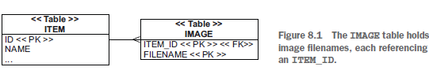

## Chapter 8 - Mapping collections and entity associations

### Table of contents

### 8.1 Sets, bags, lists and maps of value types

### 8.1.1 The database schema



### 8.1.2 Creating and mapping a collection property

Persistent collections are always optional.

A collection we could create is Item#images, referencing all images for a particular
item. We could create and map this collection property to do the following:
- Execute the SQL query SELECT * from IMAGE where ITEM_ID = ? automatically
when we call someItem.getImages(). As long as the domain model instances
are in a managed state (more on that later), we can read from the database on
demand while navigating the associations between the classes. We don’t have to
manually write and execute a query to load data. On the other hand, when we
start iterating the collection, the collection query is always “all images for this
item,” never “only images that match criteria XYZ.”
- Avoid saving each Image with entityManager.persist() or imageRepository
.save(). If we have a mapped collection, adding the Image to the collection
with someItem.getImages().add() will make it persistent automatically when
the Item is saved. This cascading persistence is convenient because we can save
instances without calling the repository or the EntityManager.
- Have a dependent lifecycle of Images. When an Item is deleted, Hibernate
deletes all attached Images with an extra SQL DELETE. We don’t have to worry
about the lifecycle of images and cleaning up orphans (assuming the database
foreign key constraint doesn’t ON DELETE CASCADE). The JPA provider handles
the composition lifecycle.

### 8.1.3 Selecting a collection interface

```java
Set<Image> images = new HashSet<Image>();
```

Without extending Hibernate, we can choose from the following collections:
- A java.util.Set property, initialized with a java.util.HashSet. The order of
elements isn’t preserved, and duplicate elements aren’t allowed. All JPA providers
support this type.
- A java.util.SortedSet property, initialized with a java.util.TreeSet. This
collection supports a stable order of elements: sorting occurs in memory after
Hibernate loads the data. This is a Hibernate-only extension; other JPA providers
may ignore the “sorted” aspect of the set.
- A java.util.List property, initialized with a java.util.ArrayList. Hibernate
preserves the position of each element with an additional index column in
the database table. All JPA providers support this type.
- A java.util.Collection property, initialized with a java.util.ArrayList.
This collection has bag semantics; duplicates are possible, but the order of elements
isn’t preserved. All JPA providers support this type.
- A java.util.Map property, initialized with a java.util.HashMap. The key and
value pairs of a map can be preserved in the database. All JPA providers support
this type.
- A java.util.SortedMap property, initialized with a java.util.TreeMap. It supports
a stable order of elements: sorting occurs in memory after Hibernate
loads the data. This is a Hibernate-only extension; other JPA providers may
ignore the “sorted” aspect of the map.

### 8.1.4 Mapping a set


