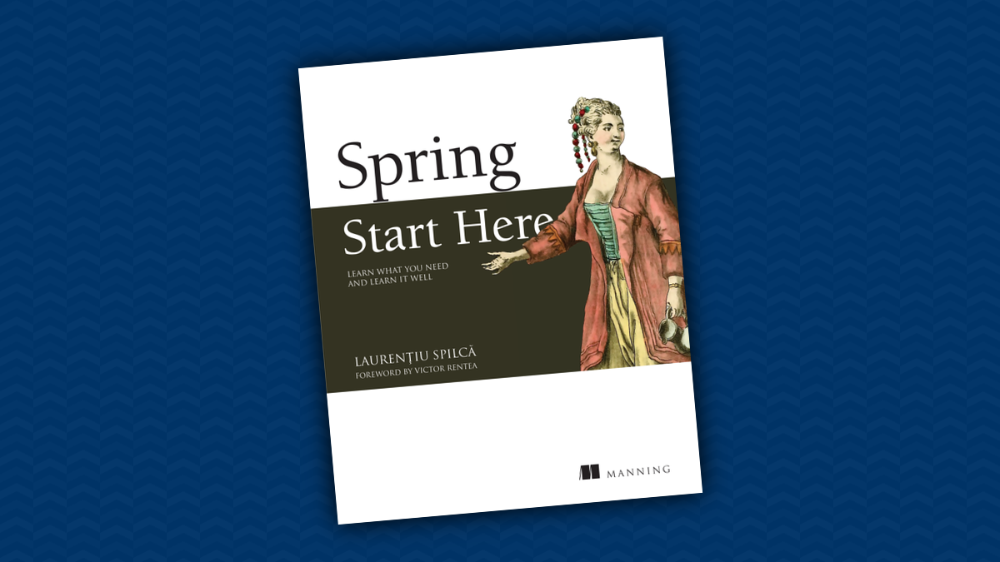

## Spring Start Here - Notes

### Overview

These notes have been compiled from the book [Spring Start Here](https://www.manning.com/books/spring-start-here) written by Laurentiu Spilca. The purpose of these notes is to provide a concise and organized summary of key concepts, tips, and insights covered in the book. If you're looking to quickly grasp essential information about Spring and its fundamentals, this compilation aims to serve as a helpful resource.

### Table of Contents

- [Chapter 2 The Spring Context: Defining beans](ch2%20-%20The%20spring%20context%20-%20Defining%20beans/README.md)
- [Chapter 3 The Spring Context: Wiring beans](ch3%20-%20The%20spring%20context%20-%20Wiring%20beans/README.md)
- [Chapter 4 The Spring Context: Using abstractions](ch4%20-%20The%20Spring%20Context%20-%20Using%20abstractions/README.md)
- [Chapter 5 The Spring Context: Bean scopes and life cycle](ch5%20-%20The%20Spring%20context%20-%20Bean%20scopes%20and%20life%20cycle/README.md)
- [Chapter 6 Using aspects with Spring AOP](ch6%20-%20Using%20aspects%20with%20Spring%20AOP)

For more in-depth understanding and detailed explanations, refer to the [Spring Start Here](https://www.manning.com/books/spring-start-here) book by Laurentiu Spilca. This compilation is meant to complement the book and should be used in conjunction with it for a comprehensive learning experience.

**Note**: These notes are a summary and should not replace the detailed content provided in the original book. It is recommended to refer to the book for a complete understanding of the topics discussed.