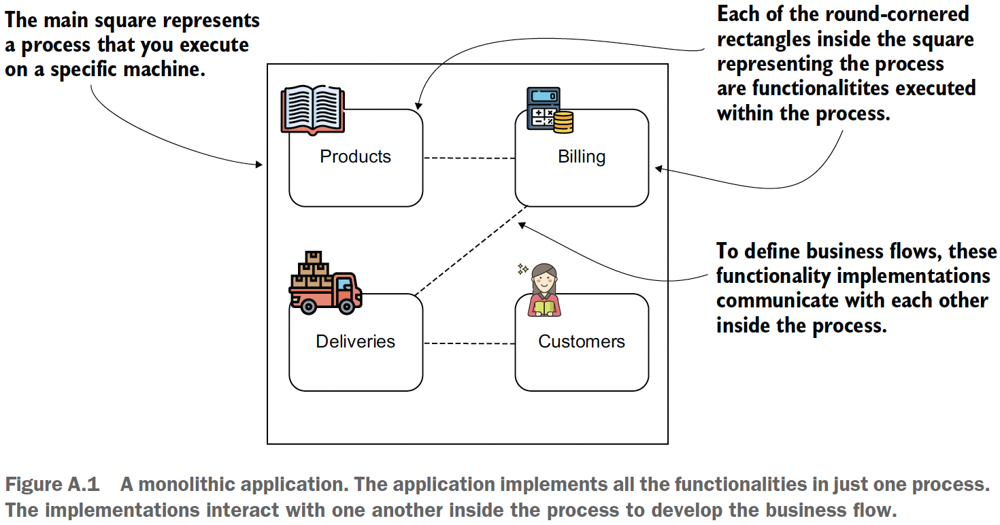
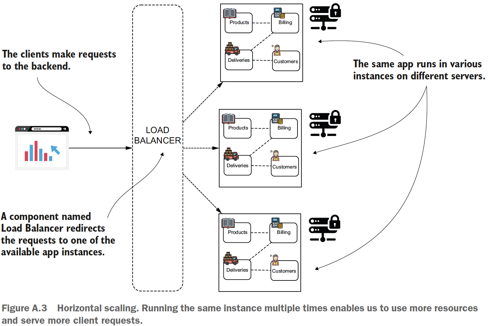
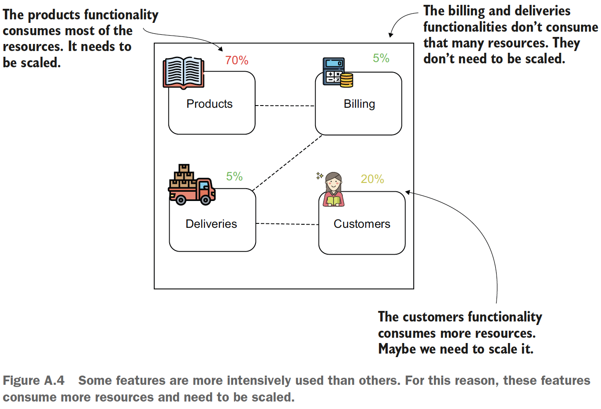
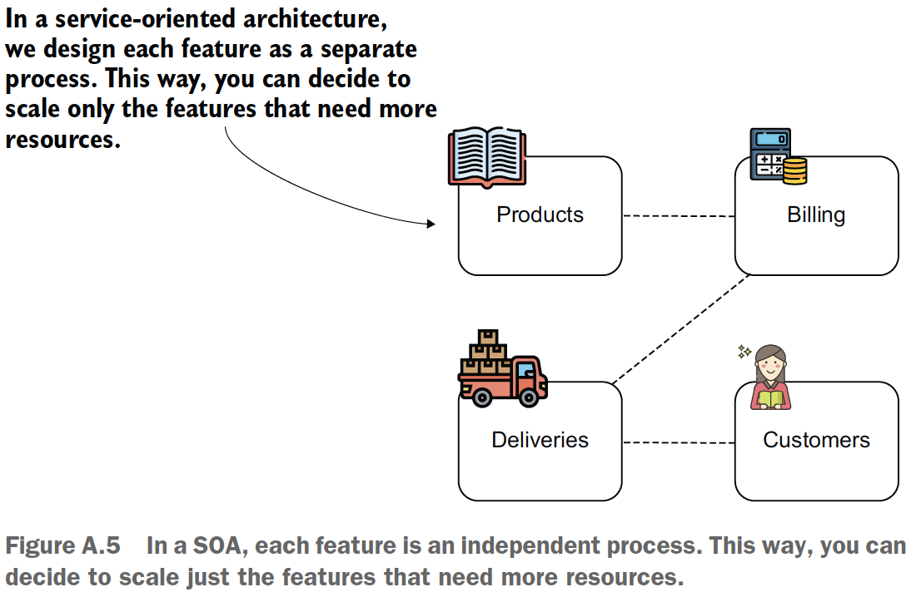
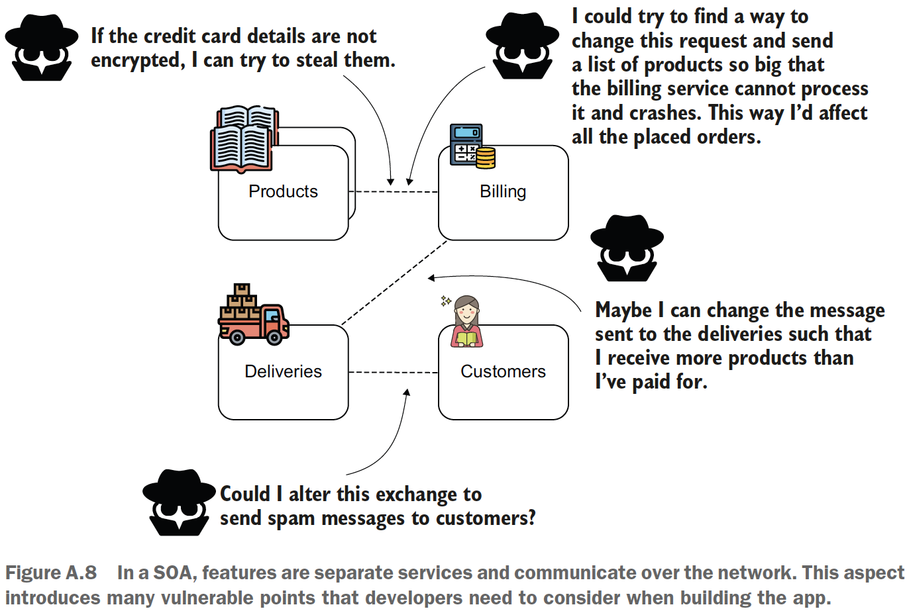
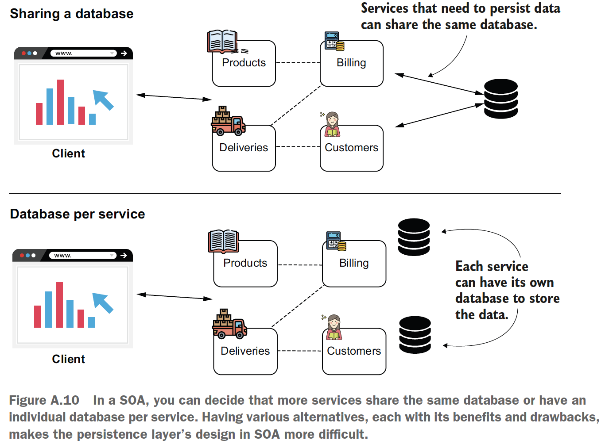

## appendix A - Architectural approaches

### Table of contents
- [The monolithic approach](#a1-the-monolithic-approach)
- [Using a service-oriented architecture](#a2-using-a-service-oriented-architecture)
  - [Complexity caused by communication among services](#a21-complexity-caused-by-communication-among-services)
  - [Complexity added to the security of the system](#a22-complexity-added-to-the-security-of-the-system)
  - [Complexity added to the security of the system](#a23-complexity-added-for-the-data-persistence)
  - [Complexity added in the deployment of the system](#a24-complexity-added-in-the-deployment-of-the-system)
- [From microservices to serverless](#a3-from-microservices-to-serverless) 
- [Further reading](#a4-further-reading)

### A.1 The monolithic approach

When developers refer to an app as being “monolithic” or “a monolith,” it
means that it consists of just one component you deploy and execute. This component
implements all its functionalities.

Example of a monolithic system:
\
(Credits: [Spring Start Here](https://www.manning.com/books/spring-start-here))

Horizontal scaled monolith:
\
(Credits: [Spring Start Here](https://www.manning.com/books/spring-start-here))

### A.2 Using a service-oriented architecture

We cannot decide that only a part of the app should be scaled with a monolithic
app. In our case, we either scale all four features or none of them. To manage the
resources better, we’d like to scale only the features that really need more resources
and avoid scaling the others.

\
(Credits: [Spring Start Here](https://www.manning.com/books/spring-start-here))

\
(Credits: [Spring Start Here](https://www.manning.com/books/spring-start-here))

With SOA we have better isolated responsibilities: dedicated apps result in keeping the implementations
decoupled and more cohesive => maintainability of the system and easier to manage teams working on specific services.

Here are some domains in which we encounter different issues when using SOAs:
1. Communication among the services
2. Security
3. Data persistence
4. Deployment

### A.2.1 Complexity caused by communication among services

Features now need to communicate via the network. One of the essential principles
you need to remember is that the network isn’t entirely reliable. Many fall into
the trap of forgetting to consider what happens if, at some point, the communication
between two components breaks. Unfortunately, unlike a monolithic approach, any
call between two components can fail at some point in a SOA. Depending on the app,
developers use different techniques or patterns to solve this issue, like repeating calls,
circuit breakers, or caches.

### A.2.2 Complexity added to the security of the system

\
(Credits: [Spring Start Here](https://www.manning.com/books/spring-start-here))

### A.2.3 Complexity added for the data persistence

\
(Credits: [Spring Start Here](https://www.manning.com/books/spring-start-here))

### A.2.4 Complexity added in the deployment of the system

Maybe the easiest challenge to observe is that we add a lot of complexity to the system’s
deployment. We also have more services now, but as you learned from the previous
paragraphs, you might have multiple databases as well. When you also consider
that securing the system will add even more configurations, you see how much more
complex the deployment of the system becomes.

### A.3 From microservices to serverless

Microservices are a particular implementation of the SOA. A microservice usually is designed with one
responsibility and has its own persistence capability (it doesn’t share databases).

Today, we deploy the apps in the cloud using virtual machines or containerized environments,
and these approaches generally implied the need for making apps smaller.
Of course, evolution came with another incertitude: how small should a service be?

The minimization of services went so far that today we can implement a short functionality
with only a few lines of code and deploy it in an environment. An event like
an HTTP request, a timer, or a message triggers this functionality and makes it execute.
We call these small implementations serverless functions. The term “serverless”
doesn’t imply that the function doesn’t execute on a server. But because everything
regarding the deployment is hidden and we only case for the code that implements
its logic and the events that trigger it, it merely looks like no server exists.

### A.4 Further reading

1. [Microservices in Action, by Morgan Bruce and Paulo A. Pereira (Manning, 2018)](https://www.manning.com/books/microservices-in-action)
2. [Microservices Patterns, by Chris Richardson (Manning, 2018)](https://www.manning.com/books/microservices-patterns)
3. [Spring Microservices in Action, by John Carnell and Illary Huaylupo Sánchez
   (Manning, 2020)](https://www.manning.com/books/spring-microservices-in-action-second-edition)
4. [Microservices Security in Action, by Prabath Siriwardena and Nuwan Dias (Manning
   2020)](https://www.manning.com/books/microservices-security-in-action)
5. [Monolith to Microservices, by Sam Newman (O’Reilly Media, 2020)](https://www.oreilly.com/library/view/monolith-to-microservices/9781492047834/)