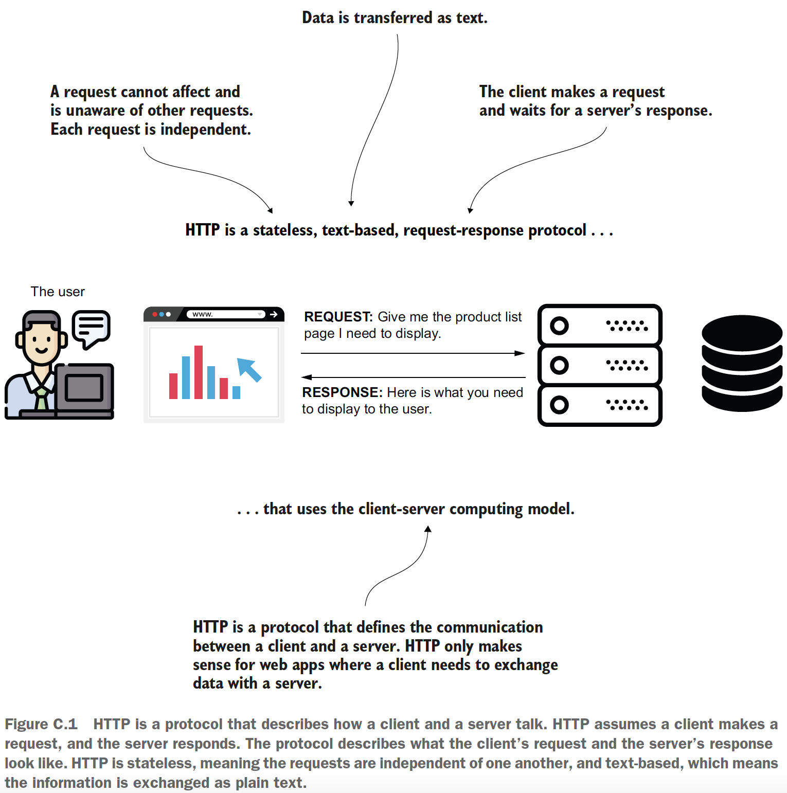

## appendix C - A quick introduction to HTTP

### Table of contents
- [What is HTTP?](#c1-what-is-http)
- [The HTTP request as a language between client and server](#c2-the-http-request-as-a-language-between-client-and-server)
- [The HTTP response: The way the server responds](#c3-the-http-response-the-way-the-server-responds)
- [The HTTP session](#c4-the-http-session)

### C.1 What is HTTP?

**HTTP** Stateless, text-based, request-response protocol that uses the client-server
computing model.

\
(Credits: [Spring Start Here](https://www.manning.com/books/spring-start-here))

### C.2 The HTTP request as a language between client and server

The HTTP request has a simple format. The things you have to take into consideration
are the following:
1. _The request URI_: path to resource
2. _The request method_: A verb that the client uses to indicate what action it will do
   with the requested resource. E.g.: GET, POST, PUT, DELETE, etc.
3. _The request parameters_ (optional): Data in small quantity (maybe 10 to 50 characters) the client sends to the
   server with the request. The request parameters (also referred to as query parameters)
   are sent in the URI by appending a query expression.
4. _The request headers_ (optional): Data in small quantity sent in the request header.
   Unlike request parameters, these values are not visible in the URI.
5. _The request body_ (optional): A larger quantity of data the client sends to the
   server in the request. When the client needs to send data composed of some
   hundreds of characters, it can use the HTTP body.

**NOTE** A uniform resource identifier (URI) includes a uniform resource locator
(URL) and a path. We can say the formula is URI = URL + path. But in
many cases, you’ll find people confusing the URI with the URL or considering
them to be the same thing. You need to remember that the URL identifies
the server and the application. When you add a path to a specific resource of
that application, it becomes a URI.

URI: http://<server_location>:<application_port>/<resource_path> = URL + <resource_path>

Less often encountered, but often enough to be relevant are the following HTTP
methods:
- _OPTIONS_: Tells the server to return a list of parameters it supports for request.
For example, the client can ask which HTTP methods the server supports. The
most encountered functionality that uses the OPTIONS method is cross-origin
resource sharing (CORS) related to security implementations. 
- _PATCH_: May be used if only part of the data representing a specific resource
on the backend is changed. 

### C.3 The HTTP response: The way the server responds

In response to a client’s request, the server sends the following:
- _The response status_: An integer between 100 and 599 that defines a short representation
of the request’s result.
- _Response headers_ (optional): Similar to request parameters, they represent key-value
pair data. They are designed for sending a small amount of data (10 to 50
characters) from server to client in response to a client’s request.
- _The response body_ (optional): A way for the server to send a larger quantity (e.g.,
the server needs to send some hundreds of characters or entire files) of data
back to the client.

### C.4 The HTTP session

- a mechanism that allows a server to store
  data between multiple request-response interactions with the same client.

One way to implement such behavior is using the HTTP session. The backend
assigns a unique identifier named “session ID” to a client and then associates it with a
place in the app’s memory. Each request the client sends after being assigned the session
ID needs to contain the session ID in a request header. This way, the backend app
knows to associate the specific session requests.\
The HTTP session usually ends after a time if the client doesn’t send more
requests. You can configure this time, usually both in the servlet container and the
app. It shouldn’t be more than maybe a few hours. If the session lives too long, the
server will spend a lot of memory. For most apps, a session ends after less than one
hour if the client doesn’t send more requests.\
If the client sends another request after the session ended, the server will start a
new session for that client.