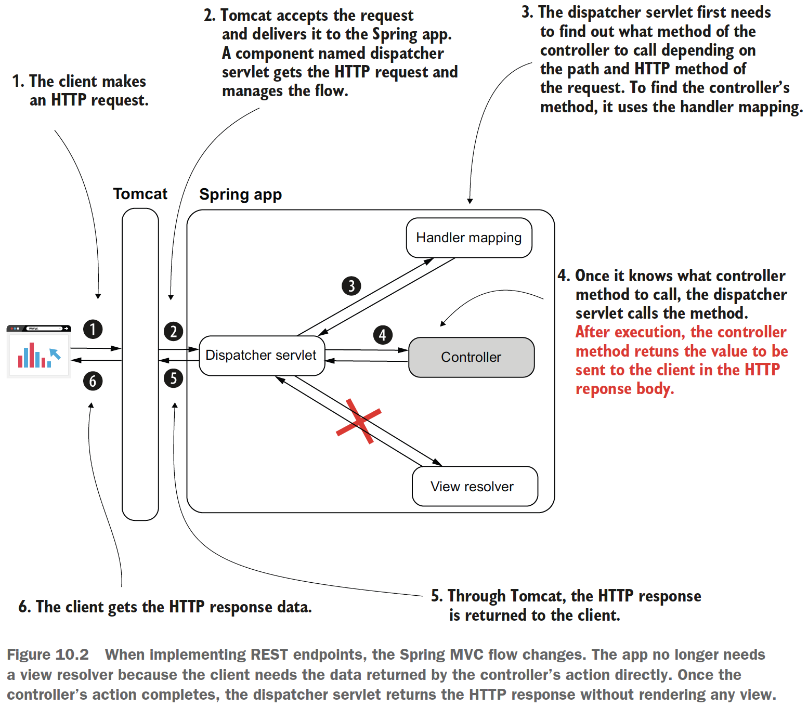
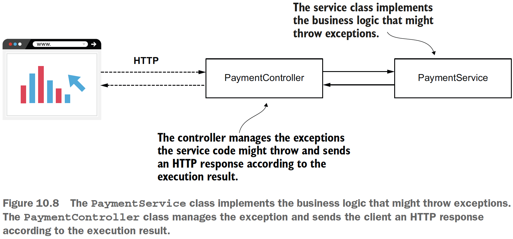
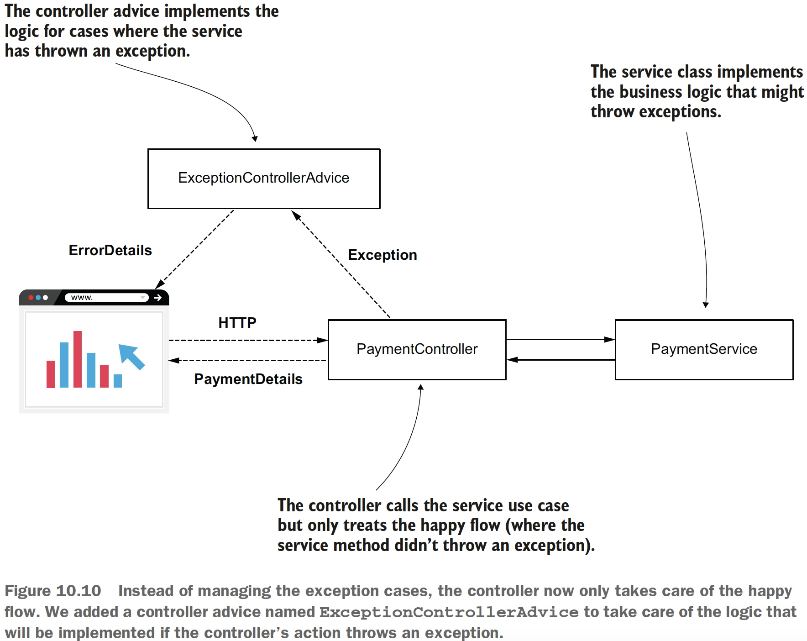

## Chapter 10 Implementing REST services

### Table of contents
- [Using REST services to exchange data between apps](#101-using-rest-services-to-exchange-data-between-apps)
- [Implementing a REST endpoint](#102-implementing-a-rest-endpoint)
- [Managing the HTTP response](#103-managing-the-http-response)
  - [Sending objects as a response body](#1031-sending-objects-as-a-response-body)
  - [Setting the response status and headers](#1032-setting-the-response-status-and-headers)
  - [Managing exceptions at the endpoint level](#1033-managing-exceptions-at-the-endpoint-level)
- [Using a request body to get data from the client](#104-using-a-request-body-to-get-data-from-the-client)

### 10.1 Using REST services to exchange data between apps

\
(Credits: [Spring Start Here](https://www.manning.com/books/spring-start-here))

Issues the REST endpoint might bring:
- If the controller’s action takes a long time to complete, the HTTP call to the
endpoint might time out and break the communication.
- Sending a large quantity of data in one call (through the HTTP request) might
cause the call to time out and break the communication. Sending more than a
few megabytes through a REST call usually isn’t the right choice.
- Too many concurrent calls on an endpoint exposed by a backend component
might put too much pressure on the app and cause it to fail.
- The network supports the HTTP calls, and the network is never 100% reliable.
There’s always a chance a REST endpoint call might fail because of the network.

Questions to ask:
- What should happen if a call fails and how it might affect the app?
- The data could be affected in any way if a call fails?
- Could the way you designed your app lead to data inconsistencies if an endpoint call fails? 
- In case the app needs to display an error to the user, how would you do that?

Recommended reading: [API Design Patterns (Manning, 2021)](https://www.manning.com/books/api-design-patterns)

### 10.2 Implementing a REST endpoint

The _@ResponseBody_ annotation tells the dispatcher servlet that the controller’s action
doesn’t return a view name but the data sent directly in the HTTP response.

Code: [sq-c10-ex1 HelloController](sq-c10-ex1/src/main/java/com/ro/controllers/HelloController.java).

---

Spring offers
the _@RestController_ annotation, a combination of _@Controller_ and _@ResponseBody_.
You use _@RestController_ to instruct Spring that all the controller’s actions are REST
endpoints. This way, you avoid repeating the _@ResponseBody_ annotation.

Code: [sq-c10-ex2 HelloRestControler](sq-c10-ex2/src/main/java/com/ro/controllers/HelloRestController.java).

### 10.3 Managing the HTTP response

The HTTP response holds data as the following:
- **Response headers**: Short pieces of data in the response (usually not more than a
few words long)
- **The response body**: A larger amount of data the backend needs to send in the
response
- **The response status**: A short representation of the request’s result

### 10.3.1 Sending objects as a response body

Code: [sq-c10-ex3 CountryController](sq-c10-ex3/src/main/java/com/ro/controllers/CountryController.java).

### 10.3.2 Setting the response status and headers

Example of standard HTTP statuses:

- _200 OK_ if no exception was thrown on the server side while processing the
request.
- _404 Not Found_ if the requested resource doesn’t exist.
- _400 Bad Request_ if a part of the request could not be matched with the way the
server expected the data.
- _500 Error_ on server if an exception was thrown on the server side for any reason
while processing the request. Usually, for this kind of exception, the client can’t
do anything, and it’s expected someone should solve the problem on the
backend.

Code for custom status: [sq-c10-ex4 CountryController](sq-c10-ex4/src/main/java/com/ro/controllers/CountryController.java).

### 10.3.3 Managing exceptions at the endpoint level

**First approach:** 

\
(Credits: [Spring Start Here](https://www.manning.com/books/spring-start-here))


```java
@PostMapping("/payment")
public ResponseEntity<?> makePayment() {
    try {
        PaymentDetails paymentDetails = paymentService.processPayment();

        return ResponseEntity
                .status(HttpStatus.ACCEPTED)
                .body(paymentDetails);
    } catch (NotEnoughMoneyException e) {
        ErrorDetails errorDetails = new ErrorDetails();
        errorDetails.setMessage("Not enough money to make the payment");
        return ResponseEntity
                .badRequest()
                .body(errorDetails);
    }
}
```

Check code on: [sq-c10-ex5](sq-c10-ex5/src/main/java/com/ro)

**Second approach:**

In a more complex application, you would find it more comfortable
to separate the responsibility of exception management.

- (1): sometimes the same exception has to be managed for multiple endpoints, and we
don’t want to introduce duplicated code.
- (2): it’s more comfortable to know you
find the exception logic all in one place when you need to understand how a specific
case works.

Solution: **REST controller advice**, an aspect that
intercepts exceptions thrown by controllers’ actions and applies custom logic you
define according to the intercepted exception.

\
(Credits: [Spring Start Here](https://www.manning.com/books/spring-start-here))

Check code on: [sq-c10-ex6](sq-c10-ex6/src/main/java/com/ro)

### 10.4 Using a request body to get data from the client

Check code on: [sq-c10-ex7](sq-c10-ex7/src/main/java/com/ro)

```java
@PostMapping("/payment")
public ResponseEntity<PaymentDetails> makePayment(@RequestBody PaymentDetails paymentDetails) {
    logger.info("Received payment: " + paymentDetails.getAmount());

    return ResponseEntity
            .status(HttpStatus.ACCEPTED)
            .body(paymentDetails);
}
```