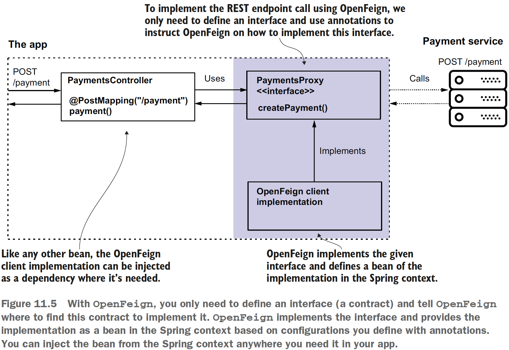
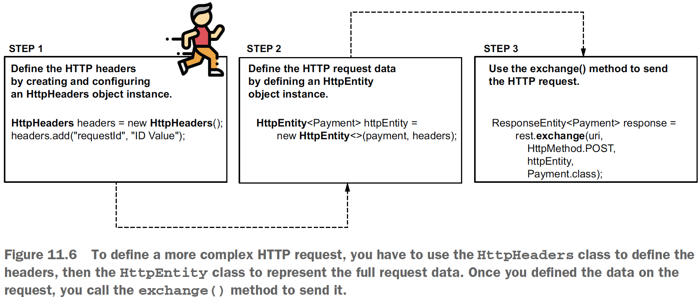
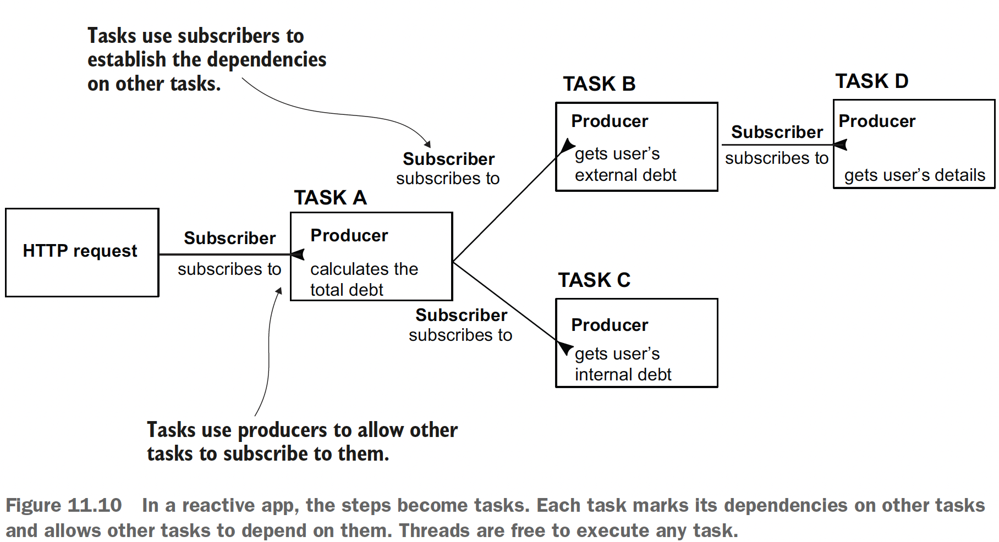
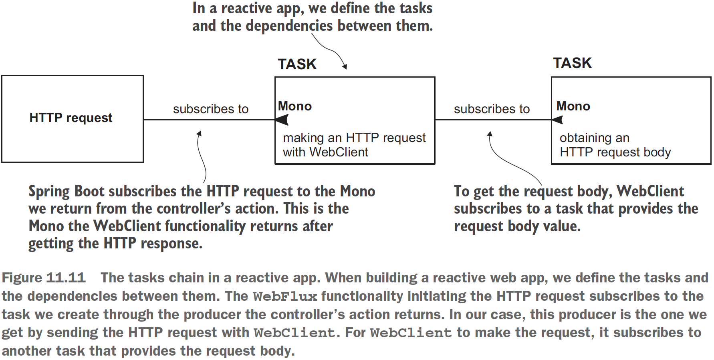

## Chapter 11 Consuming REST endpoints

### Table of contents
- [Calling REST endpoint using Spring Cloud OpenFeign](#111-calling-rest-endpoint-using-spring-cloud-openfeign)
- [Calling REST endpoints using RestTemplate](#112-calling-rest-endpoints-using-resttemplate)
- [Calling REST endpoints using WebClient](#113-calling-rest-endpoints-using-webclient)

**!** For testing start first the [payments service](sq-c11-payments/src/main/java/com/ro). This is available for all clients. **!**

### 11.1 Calling REST endpoint using Spring Cloud OpenFeign

\
(Credits: [Spring Start Here](https://www.manning.com/books/spring-start-here))

**NOTE** OpenFeign needs to know where to find the interfaces defining the client contracts.
We use the _@EnableFeignClients_ annotation on a configuration class to
enable the OpenFeign functionality and tell OpenFeign where to search for the client
contracts.

Check the code on: Code: [sq-c11-ex1](sq-c11-ex1/src/main/java/com/ro).

### 11.2 Calling REST endpoints using RestTemplate

RestTemplate does not have any problems, and it's not a bad tool. It is deprecated starting with Spring 5.0 because developers wanted to be able to
benefit from different things that aren’t easy to implement with RestTemplate, such
as the following:
- Calling the endpoints both synchronously and asynchronously
- Writing less code and treating fewer exceptions (eliminate boilerplate code)
- Retrying call executions and implementing fallback operations (logic performed
when the app can’t execute a specific REST call for any reason)

\
(Credits: [Spring Start Here](https://www.manning.com/books/spring-start-here))

Check the code on: Code: [sq-c11-ex2](sq-c11-ex2/src/main/java/com/ro).

### 11.3 Calling REST endpoints using WebClient

_WebClient_ is a tool used in different apps and is built on a methodology we call a _reactive approach_.

Recommended reading for the reactive approach: [Chapters 12&13 Spring in Action, 6th ed., by Craig Walls (Manning 2021)](https://www.manning.com/books/spring-in-action-sixth-edition)

**NOTE** If you decide not to implement a reactive app, use _OpenFeign_ to implement
the REST client capabilities. If you implement a reactive app, you
should use a proper reactive tool: _WebClient_.

The reactive model:

\
(Credits: [Spring Start Here](https://www.manning.com/books/spring-start-here))

The reactive design of our [example app](sq-c11-ex3/src/main/java/com/ro) ([PaymentProxy class](sq-c11-ex3/src/main/java/com/ro/clients/proxy/PaymentProxy.java))
\
(Credits: [Spring Start Here](https://www.manning.com/books/spring-start-here))

