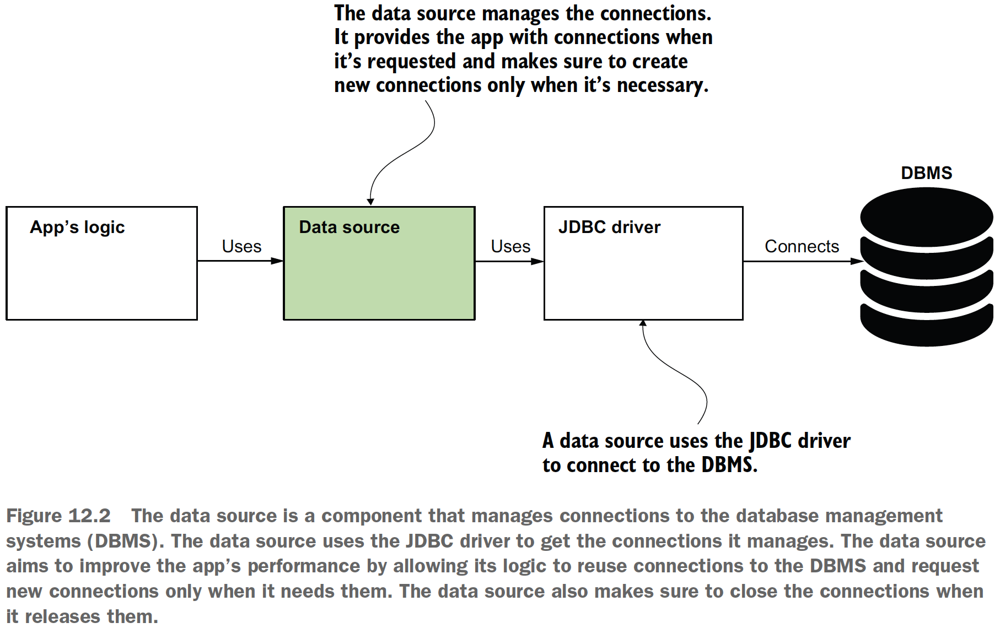

## Chapter 12 Using data sources in Spring apps

### Table of contents
- [What a data source is](#121-what-a-data-source-is)
- [Using JdbcTemplate to work with persisted data](#122-using-jdbctemplate-to-work-with-persisted-data)
- [Customizing the configuration of the data source](#123-customizing-the-configuration-of-the-data-source)
  - [Defining the data source in the application properties file](#1231-defining-the-data-source-in-the-application-properties-file)
  - [Using a custom DataSource bean](#1232-using-a-custom-datasource-bean)

### 12.1 What a data source is

\
(Credits: [Spring Start Here](https://www.manning.com/books/spring-start-here))

**NOTE** For Java apps, you have multiple choices for data source implementations, but the
most commonly used today is the HikariCP (Hikari connection pool) data source.
The convention configuration of Spring Boot also considers HikariCP the default data
source implementation.

### 12.2 Using JdbcTemplate to work with persisted data

_JdbcTemplate_ is the simplest of the tools Spring offers for using a relational database,
but it’s an excellent choice for small apps as it doesn’t force you to use any other
specific persistence framework. _JdbcTemplate_ is the best Spring choice to implement
a persistence layer when you don’t want your app to have any other dependency.

Check the example app: [sq-c12-ex1](sq-c12-ex1/src/main/java/com/ro).

**NOTE** When you want to store a floating-point value accurately and make
sure you don’t lose decimal precision when executing various operations with
the values, use _BigDecimal_ and not _double_ or _float_.

### 12.3 Customizing the configuration of the data source

### 12.3.1 Defining the data source in the application properties file

Check [sq-c12-ex2 - application.yml](sq-c12-ex2/src/main/resources/application.yml).

### 12.3.2 Using a custom DataSource bean

Some scenarios in which you need to define the
bean yourself are as follows:
- You need to use a specific DataSource implementation based on a condition
you can only get at runtime.
- Your app connects to more than one database, so you have to create multiple
data sources and distinguish them using qualifiers.
- You have to configure specific parameters of the DataSource object in certain
conditions your app has only at runtime. For example, depending on the environment
where you start the app, you want to have more or fewer connections
in the connection pool for performance optimizations.
- Your app uses Spring framework but not Spring Boot.

Check [sq-c12-ex3 - application.yml](sq-c12-ex3/src/main/resources/application.yml) and [sq-c12-ex3 - ProjectConfig class](sq-c12-ex3/src/main/java/com/ro/config/ProjectConfig.java). 

**NOTE** You can create multiple data source objects, each with their own _JdbcTemplate_
object associated if you want your app to connect to multiple databases. In such
a scenario, you’d need to use the _@Qualifier_ annotation to distinguish
between objects of the same type in the application context.
