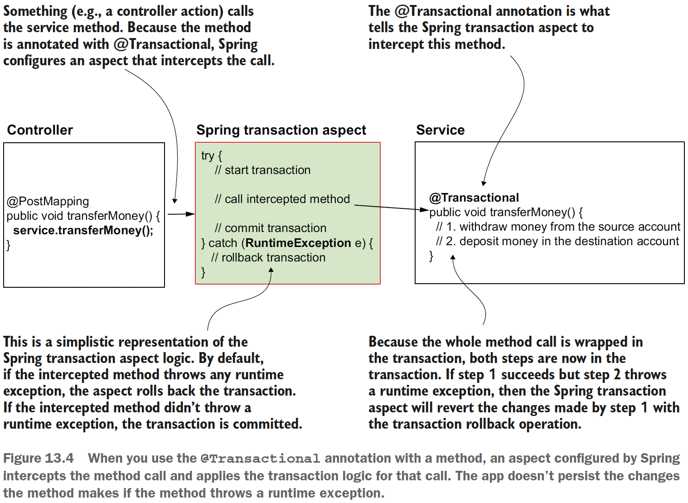
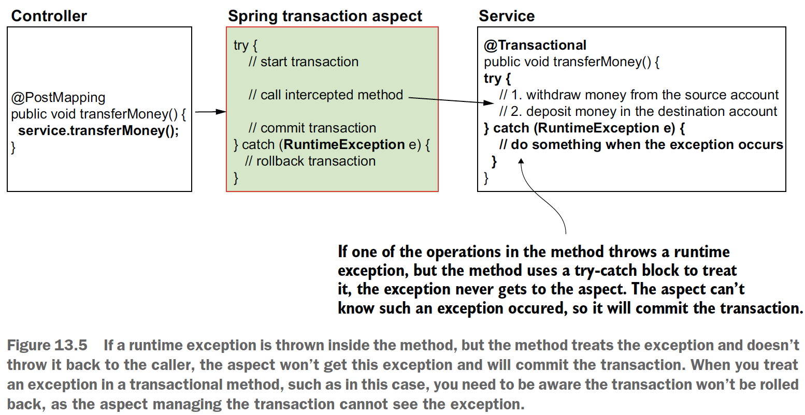
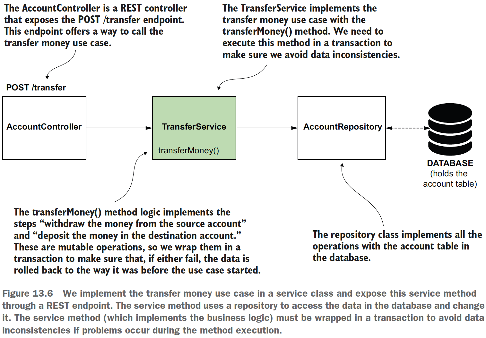

## Chapter 13 Using transactions in Spring apps

### Table of contents
- [Transactions](#131-transactions)
- [How transactions work in Spring](#132-how-transactions-work-in-spring)
- [Using transactions in Spring apps](#133-using-transactions-in-spring-apps)

### 13.1 Transactions

A _transaction_ is a defined set of mutable operations
(operations that change data) that can either correctly execute them altogether
or not at all. We refer to this as _atomicity_. Transactions are essential in apps because
they ensure the data remains consistent if any step of the use case fails when the app
already changed data.

**COMMIT** The successful end of a transaction when the app stores all the
changes made by the transaction's mutable operations.

**ROLLBACK** The transaction ends with rollback when the app restores the
data to the way it looked at the beginning of the transaction to avoid data
inconsistencies.

### 13.2 How transactions work in Spring

A Spring AOP aspect lies behind the scenes of a transaction. To mark a method we want Spring to wrap in a transaction, we use an annotation
named _@Transactional_. Behind the scenes, Spring configures an aspect (you
don’t implement this aspect yourself; Spring provides it) and applies the transaction
logic for the operations executed by that method.

\
(Credits: [Spring Start Here](https://www.manning.com/books/spring-start-here))

\
(Credits: [Spring Start Here](https://www.manning.com/books/spring-start-here))

**What about checked exceptions in transactions?**\
Do they also cause a transaction rollback if a
method throws them? By default, no!\
Spring’s default behavior is only to roll back a
transaction when it encounters a runtime exception. This is how you’ll find transactions
used in almost all real-world scenarios.

When you work with a checked exception, you have to add the “throws” clause in the
method signature; otherwise, your code won’t compile, **so you always know when
your logic could throw such an exception.** **For this reason, a situation represented
with a checked exception is not an issue that could cause data inconsistency**, but is
instead a controlled scenario that should be managed by the logic the developer
implements.

If, however, you’d like Spring to also roll back transactions for checked exceptions,
you can alter Spring’s default behavior. The _@Transactional_ annotation has attributes for defining which exceptions you
want Spring to roll back the transactions for.
However, the author recommends you always keep your application simple and, unless needed,
rely on the framework’s default behavior.

### 13.3 Using transactions in Spring apps

Example app class design:

\
(Credits: [Spring Start Here](https://www.manning.com/books/spring-start-here))

Check the example app: [sq-c13-ex1](sq-c13-ex1/src/main/java/com/ro).

[sq-c13-ex1 TransferService class](sq-c13-ex1/src/main/java/com/ro/services/TransferService.java)
```java
@Service
@RequiredArgsConstructor
public class TransferService {
    private final AccountRepository accountRepository;
    
    @Transactional
    public void transferMoney(long idSender, long idReceiver, BigDecimal amount) {
        Account sender = accountRepository.findAccountById(idSender);
        Account receiver = accountRepository.findAccountById(idReceiver);
        
        BigDecimal senderNewAmount = sender.getAmount().subtract(amount);
        BigDecimal receiverNewAmount = receiver.getAmount().add(amount);
        
        accountRepository.changeAmount(idSender, senderNewAmount);
        accountRepository.changeAmount(idReceiver, receiverNewAmount);
    }
}
```

**NOTE** 
The _@Transactional_ annotation can also be applied directly to the class. If used on
the class (as presented in the next code snippet), the annotation applies to all the class
methods. Often in real-world apps you will find the _@Transactional_ annotation used
on the class, because the methods of a service class define use cases and, in general,
all the use cases need to be transactional. To avoid repeating the annotation on each
method, it’s easier just to mark the class once. When using _@Transactional_ on both
the class and the method, the method level’s configuration overrides the one on the class:

```java
@Service
@Transactional
public class TransferService {
    // Omitted code
    public void transferMoney(long idSender, long idReceiver, BigDecimal amount) {
        // Omitted code
    }
}
```

[sq-c13-ex2](sq-c13-ex2/src/main/java/com/ro) shows how the data is rolled back in case of a RuntimeException.

```java
@Transactional
public void transferMoney(long idSender, long idReceiver, BigDecimal amount) {
    Account sender = accountRepository.findAccountById(idSender);
    Account receiver = accountRepository.findAccountById(idReceiver);

    BigDecimal senderNewAmount = sender.getAmount().subtract(amount);
    BigDecimal receiverNewAmount = receiver.getAmount().add(amount);

    accountRepository.changeAmount(idSender, senderNewAmount);
    accountRepository.changeAmount(idReceiver, receiverNewAmount);

    throw new RuntimeException("Oh no! Something went wrong!");
}
```

After updating the two accounts, the method throws a runtime exception. The transaction
hasn’t ended. The Spring transaction aspects gets the runtime exception and rolls back
the transaction. The app restores the data to how it was at the beginning of the transaction.