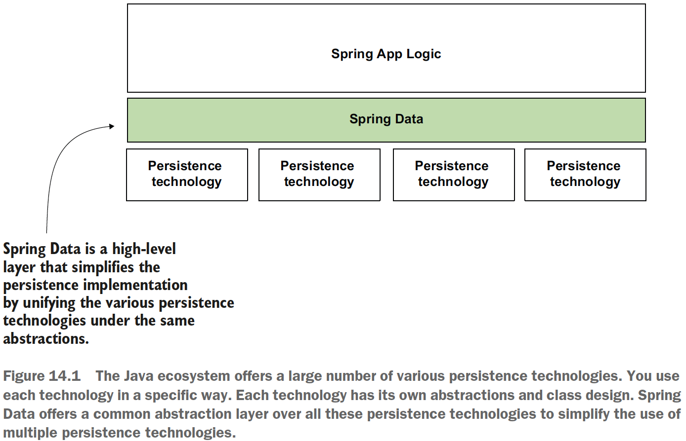
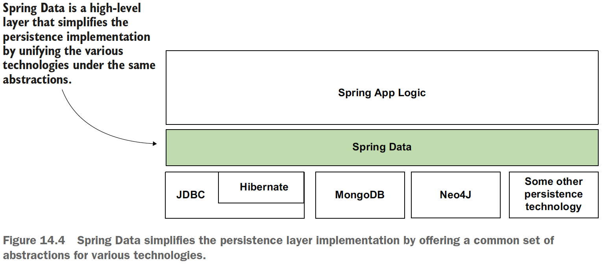
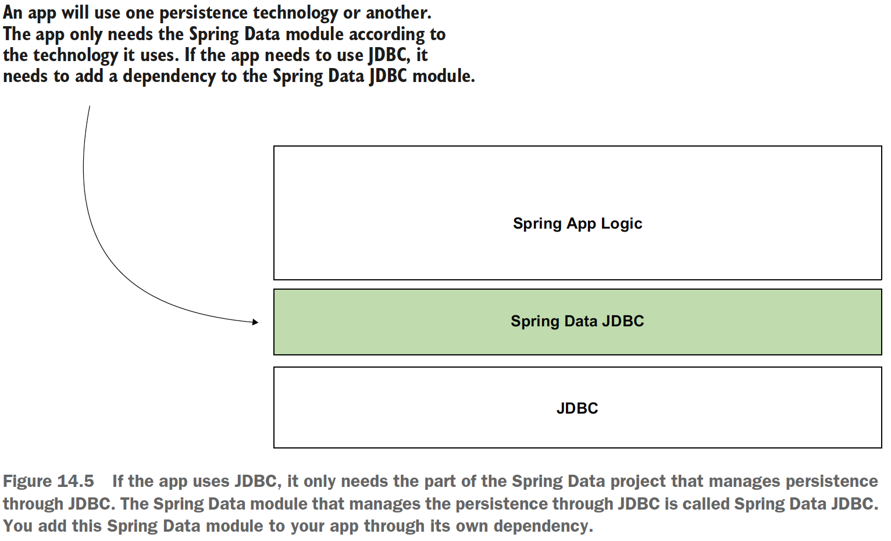
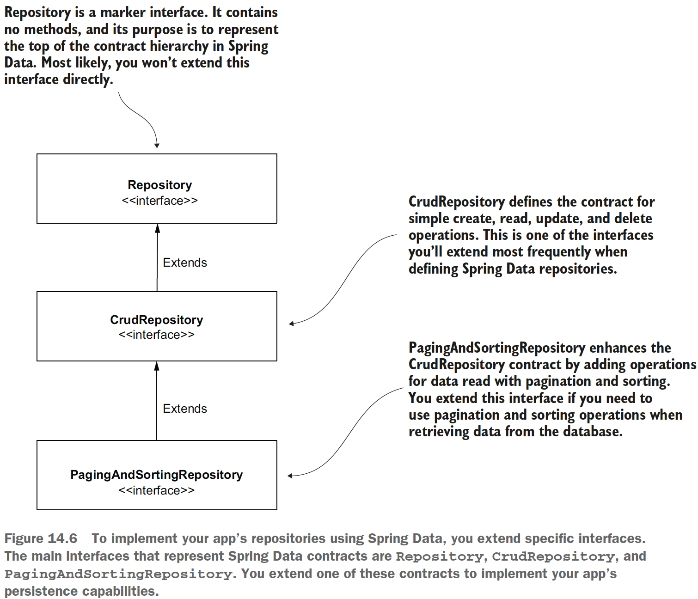
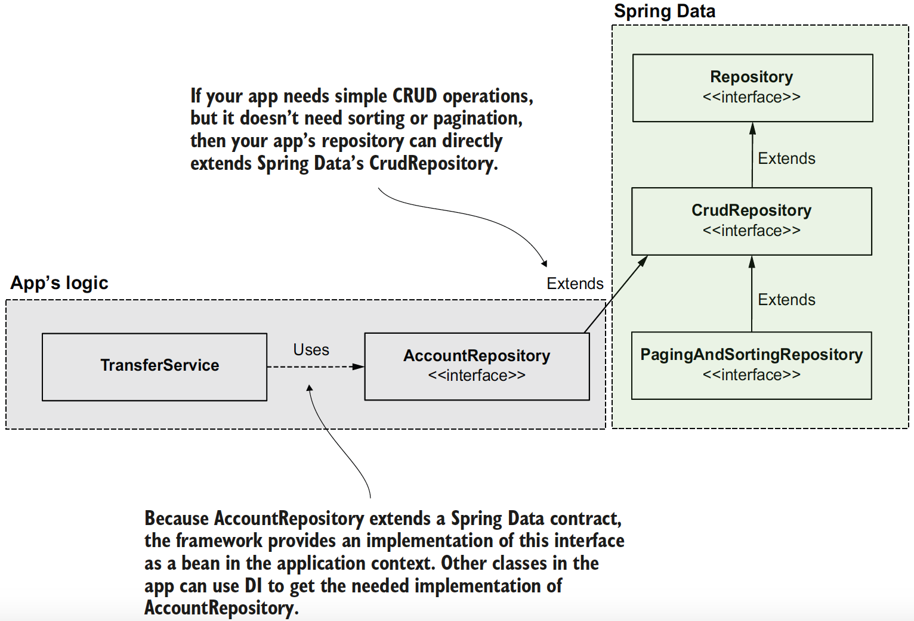
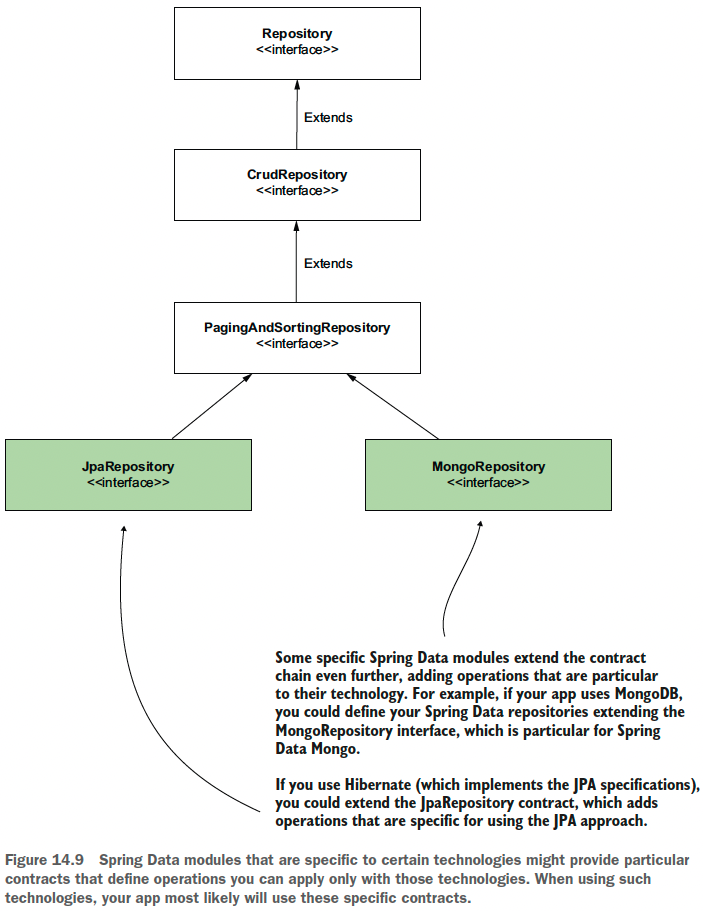
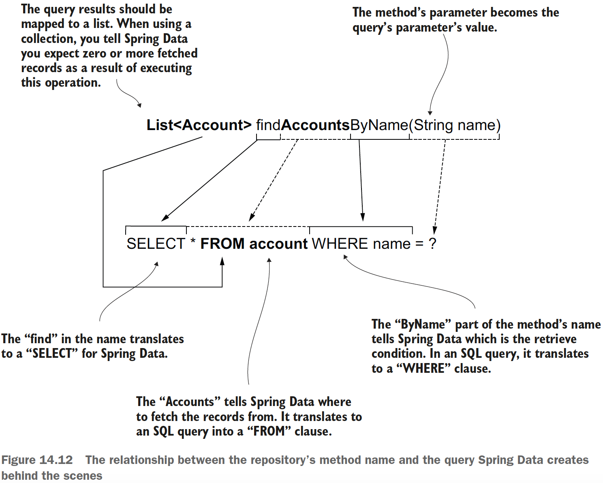

## Chapter 14 Implementing data persistence with Spring Data

### Table of contents
- [What Spring Data is](#141-what-spring-data-is)
- [How Spring Data works](#142-how-spring-data-works)
- [Using Spring Data JDBC](#143-using-spring-data-jdbc)

### 14.1 What Spring Data is

\
(Credits: [Spring Start Here](https://www.manning.com/books/spring-start-here))

\
(Credits: [Spring Start Here](https://www.manning.com/books/spring-start-here))

\
(Credits: [Spring Start Here](https://www.manning.com/books/spring-start-here))

### 14.2 How Spring Data works

\
(Credits: [Spring Start Here](https://www.manning.com/books/spring-start-here))

\
(Credits: [Spring Start Here](https://www.manning.com/books/spring-start-here))

\
(Credits: [Spring Start Here](https://www.manning.com/books/spring-start-here))

Some Spring Data modules might provide specific contracts to the technology they
represent. For example, using Spring Data JPA, you also can extend the _JpaRepository_ interface directly. The _JpaRepository_ interface is a
contract more particular than PagingAndSortingRepository. This contract adds
operations applicable only when using specific technologies like Hibernate that
implement the Jakarta Persistence API (JPA) specification.

\
(Credits: [Spring Start Here](https://www.manning.com/books/spring-start-here))

### 14.3 Using Spring Data JDBC

For several operations it provides, such as retrieving data from the database,
Spring Data needs to know which field maps the table’s primary key. You use the @Id
annotation, as shown in the next code snippet, to mark the primary key.

```java
public class Account {
    @Id //We annotate the attribute that model the primary key with the @Id annotation
    private long id;
    private String name;
    private BigDecimal amount;
}
```

**NOTE** All the Spring Data interfaces have
two generic types you need to provide:
1. The model class (sometimes named entity) for which you write the repository
2. The primary key field type

```java
@Repository
public interface AccountRepository extends CrudRepository<Account, Long> { }
```

How you can create custom queries (other than simple CRUDs) with Spring Data?
\
(Credits: [Spring Start Here](https://www.manning.com/books/spring-start-here))

The main disadvantages of relying on the method’s name are as follows:
- If the operation requires a more complex query, the method’s name would be
too large and difficult to read.
- If a developer refactors the method’s name by mistake, they might affect the
app’s behavior without realizing it (unfortunately, not all apps are roughly
tested, and we need to consider this).
- Unless you have an IDE that offers you hints while writing the method’s name,
you need to learn the Spring Data’s naming rules. Since you already know SQL,
learning a set of rules applicable only for Spring Data is not advantageous.
- Performance is affected because Spring Data also has to translate the method
name into a query, so the app will initialize slower (the app translates the
method names into queries when the app boots).

It's recommended to explicitly specify the query instead of relying on Spring Data to translate the method’s name.

The simplest way to avoid these problems is using the _@Query_ annotation to specify the
SQL query that the app will run when you call that method. When you annotate the
method _@Query_, it’s no longer relevant how you name that method. Spring Data will
use the query you provide instead of translating the method’s name into a query. The
behavior also becomes more performant.

```java
@Repository
public interface AccountRepository extends CrudRepository<Account, Long> {
    @Query("select * from account where name = :name")
    List<Account> findAccountsByName(String name);
}
```

You use the _@Query_ annotation in the same way to define any query. However, when
your query changes data, you also need to annotate the method with the _@Modifying_
annotation. If you use UPDATE, INSERT, or DELETE, you also need to annotate the
method with _@Modifying_.

Check the example app: [sq-c14-ex1](sq-c14-ex1/src/main/java/com/ro).