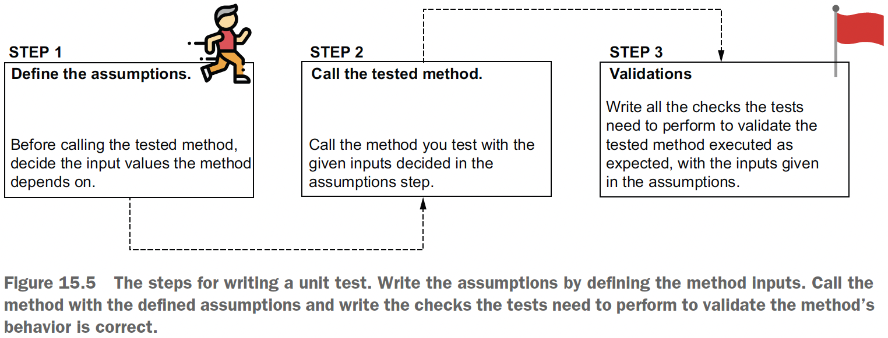

## Chapter 15 Testing your Spring app

### Table of contents
- [Writing correctly implemented tests](#151-writing-correctly-implemented-tests)
- [Implementing tests in Spring apps](#152-implementing-tests-in-spring-apps)
  - [Implementing unit tests](#1521-implementing-unit-tests)
  - [Implementing integration tests](#1522-implementing-integration-tests)

We’ll classify the tests into two categories:
- _Unit tests_: Focus only on an isolated piece of logic
- _Integration tests_: Focus on validating that multiple components correctly
interact with each other

Recommended reading: [JUnit in Action (Manning 2020) by Catalin Tudose](https://www.manning.com/books/junit-in-action-third-edition)

### 15.1 Writing correctly implemented tests

A test class should focus only on a particular method whose logic you test. Even
simple logic generates various scenarios. For each scenario, you’ll write a method in
the test class that validates that specific case.

The test scenario implementation is strongly related to how the app should work,
but technically, the idea is the same in any app: you identify the test scenarios, and you
write a test method for each.

We say that the app’s testability decreases when you fail to separate the different
responsibilities into small and easy-to-read methods.

### 15.2 Implementing tests in Spring apps

- _Writing unit tests to validate a method’s logic_. The unit tests are short, fast to execute,
and focus on only one flow. These tests are a way to focus on validating a
small piece of logic by eliminating all the dependencies.
- _Writing Spring integration tests to validate a method’s logic and its integration with specific
capabilities the framework provides_. These tests help you make sure your app’s
capabilities still work when you upgrade dependencies.

### 15.2.1 Implementing unit tests

Unit tests eliminate all the dependencies of the capability they test, covering
only a specific, isolated piece of logic.

Usually, the most obvious scenarios and the first we write tests for are the _happy flows_:
an execution that encountered no exceptions or errors.

\
(Credits: [Spring Start Here](https://www.manning.com/books/spring-start-here))

How to control dependencies (e.g. a repository which gives us a findById() method)?  
For these types of dependencies, we use _mocks_: a fake object whose behaviour we can control.

Check the code on: [sq-c15-ex1](sq-c15-ex1/src/test/java/com/ro).

```java
@Test
@DisplayName("Test the amount is transferred from one account to another if no exception occurs")
public void moneyTransferHappyFlow() {
    //assumptions - given
    AccountRepository accountRepository = mock(AccountRepository.class);

    TransferService transferService = new TransferService(accountRepository);

    long idSender = 1L;
    Account sender = new Account();
    sender.setId(idSender);
    sender.setAmount(new BigDecimal(1000));

    long idReceiver = 2L;
    Account destination = new Account();
    destination.setId(idReceiver);
    destination.setAmount(new BigDecimal(1000));

    when(accountRepository.findById(sender.getId())).thenReturn(Optional.of(sender));
    when(accountRepository.findById(destination.getId())).thenReturn(Optional.of(destination));

    //call - when
    transferService.transferMoney(
            sender.getId(),
            destination.getId(),
            new BigDecimal(100)
    );

    //verify that the changeAmount() method in the AccountRepository was called with the expected parameters
    //validations - then
    verify(accountRepository).changeAmount(idSender, new BigDecimal(900));
    verify(accountRepository).changeAmount(idReceiver, new BigDecimal(1100));
}
```
---
Writing a test for an exception flow

Remember that happy flows are not the only ones you need to test. You also want to
know that the method executes in the desired way when it encounters an exception.
Such a flow is called an _exception flow_.

Check the code on: [sq-c15-ex1 TransferServiceTestExtendWithMockito](sq-c15-ex1/src/test/java/com/ro/services/TransferServiceTestExtendWithMockito.java).

```java
@Test
public void moneyTransferDestinationAccountNotFoundFlow() {
    long idSender = 1L;
    Account sender = new Account();
    sender.setId(idSender);
    sender.setAmount(new BigDecimal(1000));

    long idReceiver = 2L;

    when(accountRepository.findById(sender.getId())).thenReturn(Optional.of(sender));

    //we control the mock AccountRepository to return an empty Optional when the findById() method is called for the destination account
    when(accountRepository.findById(idReceiver)).thenReturn(Optional.empty());

    //we assert that the method throws an AccountNotFoundException in the given scenario
    assertThrows(AccountNotFoundException.class, () -> transferService.transferMoney(idSender, idReceiver, new BigDecimal(100)));

    //we use the verify() method with the never() conditional to assert that the changeAmount() method hasn't been called
    verify(accountRepository, never()).changeAmount(anyLong(), any());
}
```
---
Testing the value a method returns

Check the code on: [sq-c15-ex2 LoginControllerTest](sq-c15-ex2/src/test/java/com/ro/controllers/LoginControllerTest.java).

### 15.2.2 Implementing integration tests

What kind of integrations can we test? We have a few possibilities:
- _Integration between two (or more) objects of your app._ Testing that the objects interact
correctly helps you identify problems in how they collaborate if you change one
of them.
- _Integration of an object of your app with some capability the framework enhances it with_.
Testing how an object interacts with some capability the framework provides
helps you identify issues that can occur when you upgrade the framework to a
new version. The integration test helps you immediately identify if something
changed in the framework and the capability the object relies on doesn’t work
the same way.
- _Integration of the app with its persistence layer (the database)_. Testing how the repository
works with the database ensures you quickly identify problems that might
occur when upgrading or changing a dependency that helps your app work
with persisted data (such as the JDBC driver).


With a Spring app, you’ll generally use integration tests to verify that your app’s behavior
correctly interacts with the capabilities Spring provides. We name such a test a
“Spring integration test.” Unlike a unit test, an integration test enables Spring to create
the beans and configure the context (just as it does when running the app).

Check the code on: [sq-c15-ex1 TransferServiceSpringIntegrationTests](sq-c15-ex1/src/test/java/com/ro/services/TransferServiceSpringIntegrationTests.java).

However, even if it looks very
similar to a unit test, Spring now knows the tested object and manages it as it would in
a running app. For example, if we upgraded the Spring version and, for some reason,
the dependency injection no longer worked, the test would fail even if we didn’t change
anything in the tested object. The same applies to any capability Spring offers to the
tested method: transactionality, security, caching, and so on. You would be able to test
your method’s integration to any of these capabilities the method uses in your app.

**NOTE** In a real-world app, **use unit tests to validate components’ behavior**
and the **Spring integration tests to validate the necessary integration scenarios**.
Even if a Spring integration test could be used to validate the component’s
behavior (implement all the test scenarios for the method’s logic), it’s
not a good idea to use integration tests for this purpose. **Integration tests take
a longer time to execute because they have to configure the Spring context.
Every method call also triggers several Spring mechanisms Spring needs,
depending on what capabilities it offers to that specific method. It doesn’t
make sense to spend time and resources to execute these for every scenario of
your app’s logic.** To save time, the best approach is to **rely on unit tests to validate
your apps’ components’ logic** and **use the integration tests only to validate
how they integrate with the framework.**