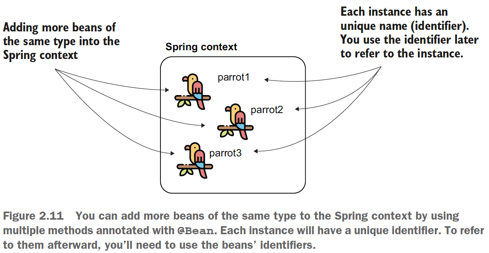

## Chapter 2 The Spring Context: Defining beans

You can add beans in the context in the following ways:
- Using the @Bean annotation
- Using stereotype annotations
- Programmatically

### 2.2.1 Using the @Bean annotation to add beans into the Spring context


<b>NOTE</b>: A configuration class is a special class in Spring applications that we use
to instruct Spring to do specific actions. For example, we can tell Spring to create
beans or to enable certain functionalities.

<b>NOTE</b>: The method’s name (annotated with @Bean) also
becomes the bean’s name (as in Figure 2.9, the bean’s name is now “parrot”). By convention, you can use nouns, and most often they have the same name as the class.

##### How to add more beans of the same type?


Also you can change the name of a bean like this:
- @Bean(name = "miki")
- @Bean(value = "miki")
- @Bean("miki")

Check [ProjectConfig.class from sq-c2-ex3](sq-c2-ex3/src/main/java/com/ro/config/ProjectConfig.java) to see the code.

#### Defining a bean as primary
When you have multiple beans of the same kind in the Spring context you can make
one of them <i>primary</i>. You mark the bean you want to be primary using the
**@Primary** annotation. A primary bean is the one Spring will choose if it has multiple options and
you don’t specify a name; the primary bean is simply Spring’s default choice. The next
code snippet shows you what the
method annotated as primary looks like:
```java
@Bean
@Primary
Parrot parrot2() {
    var p = new Parrot();
    p.setName("Miki");
    return p;
}
```
Of course, you can only define one bean of a type as primary.

### 2.2.2 Using stereotype annotations to add beans to the Spring context

With stereotype annotations (e.g. @Component), you add the annotation above the class for which you
need to have an instance in the Spring context. When the app creates the Spring context, Spring
creates an instance of the class you marked as a component and adds that instance to
its context. We’ll still have a configuration class when we use this approach to tell
Spring where to look for the classes annotated with stereotype annotations.


Check [sq-c2-ex6](sq-c2-ex6/src/main/java/com/ro) to see the code.

Advantages and disadvantages: comparing the two ways of adding beans to the Spring context, which tells you when you would use either of them

| Using the @Bean annotation                                                                                                    | Using stereotype annotations                                                                       |
|-------------------------------------------------------------------------------------------------------------------------------|----------------------------------------------------------------------------------------------------|
| You have full control over the instance creation and configuration <br/>in the body of the @Bean method                       | You only have control over the instance after the framework creates it                             |
| With this methods multiple instances of the same type can <br>be added to the context                                         | Only one instance of the class can be added to the context                                         |
| You can add any object instance to the Spring context (String, Integer,<br> 3rd part class). You don't need to own the class. | You can use stereotype annotations only to create beans of the classes <br>your applications owns. |
| You need to write a separate method for each bean (adds <br>boilerplate code). We prefer @Bean as a 2nd option to stereotype. | This method does not add boilerplate code to your app.                                             |


What if we want to execute some instructions right
after Spring creates the bean (from stereotype annotations)? We can use the @PostConstruct annotation.

```java
@Component
public class Carrot {
    private String color;
    
    @PostConstruct
    public void init() {
        this.color = "orange";
    }
    
    //getters and setters
}
```

Check [sq-c2-ex6/Main class](sq-c2-ex6/src/main/java/com/ro/Main.java) to see the output: Parrot -> getName() returns null vs Carrot -> getColor() returns orange).

### 2.2.3 Programmatically adding beans to the Spring context

- starting with Spring 5
- it enables you to add new instances in the context directly by calling a method of the context instance.


```java
<T> void registerBean(
    String beanName, //bean name that you want to register or null
    Class<T> beanClass, //the class that define the bean; e.g. Parrot.class
    Supplier<T> supplier, // this supplier needs to return the value of the instance you add to the context
    BeanDefinitionCustomizer... customizers); //an interface you implement to configure different characteristics of the bean; e.g. making it primary
```
Code example on [sq-c2-ex8 Main class](sq-c2-ex8/src/main/java/com/ro/Main.java)