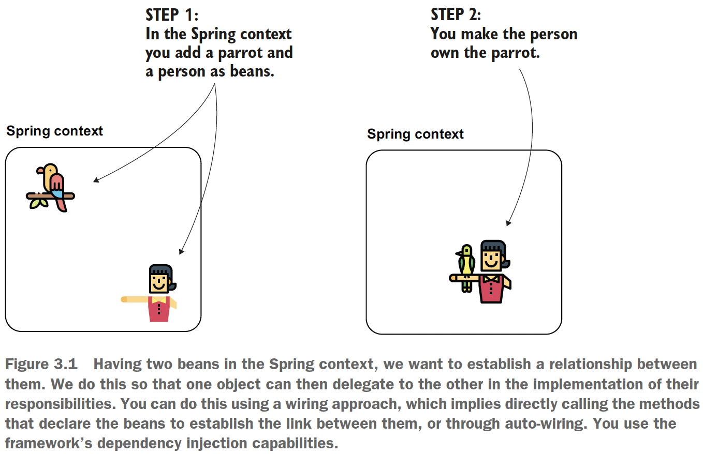
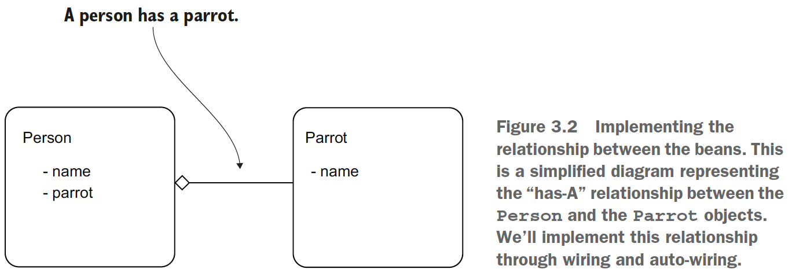
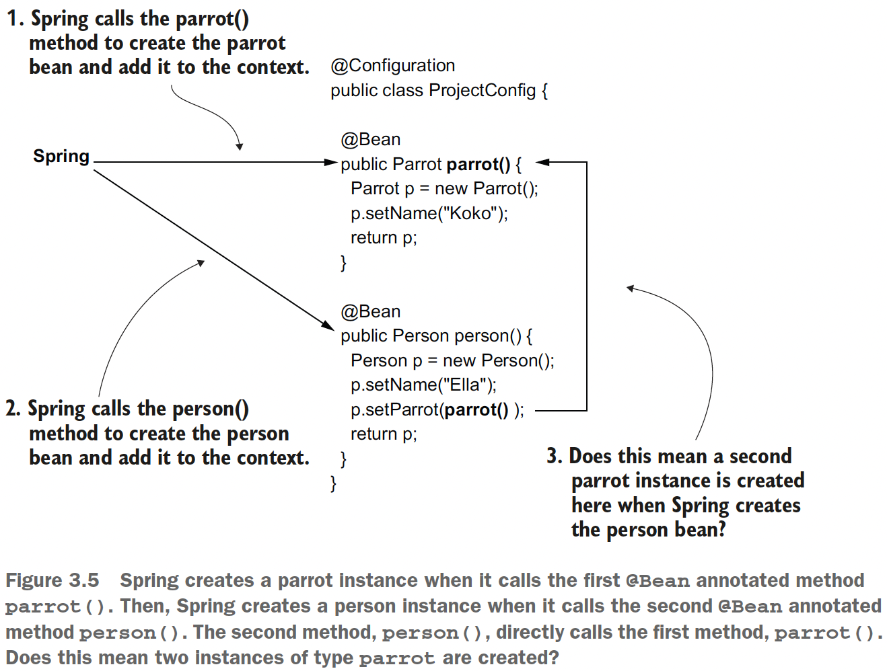
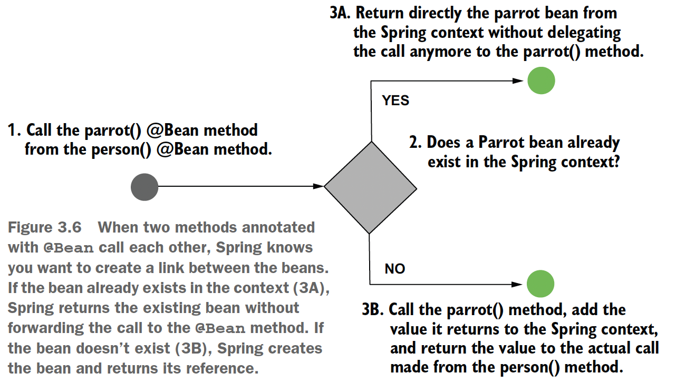
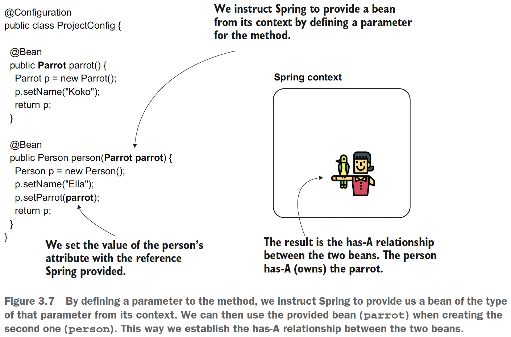
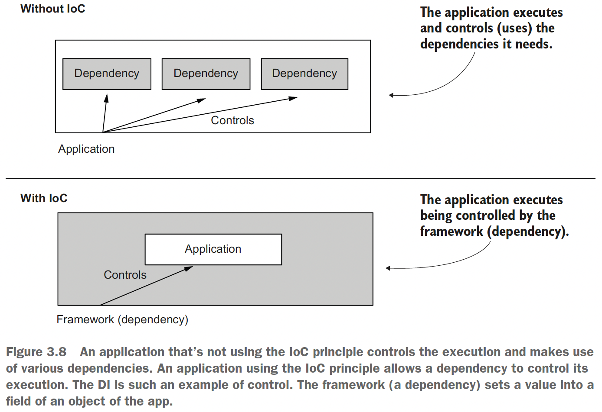

## Chapter 3 The Spring Context: Wiring beans

### 3.1. Implementing relationships among beans defined in the configuration file

Here we discuss two ways you can establish the relationships among beans:
- Link the beans by directly calling the methods that create them (which we’ll
call _wiring_).
- Enable Spring to provide us a value using a method parameter (which we’ll call
_auto-wiring_).





### 3.1.1 Wiring the beans using a direct method call between the @Bean methods

Check the code on [ProjectConfig](sq-c3-ex2/src/main/java/org/example/config/ProjectConfig.java) and [Main class](sq-c3-ex2/src/main/java/org/example/Main.java).

```java
@Bean
public Person person() {
    Person p = new Person();
    p.setName("Ella");
    p.setParrot(parrot());
    return p;
}
```

and the output is:

```java
Person{name='Ella', parrot=Parrot{name='Koko'}}
Parrot{name='Koko'}
```





### 3.1.1 Wiring the beans using the @Bean annotated method's parameters



Here DI (dependency injection) is used. As its name suggests, DI is a technique involving
the framework setting a value into a specific field or parameter. In our case, Spring
sets a particular value into the parameter of the **person()** method when calling it and
resolves a dependency of this method. DI is an application of the IoC principle, and
IoC implies that the framework controls the application at execution.



Check the code on [ProjectConfig](sq-c3-ex3/src/main/java/org/example/config/ProjectConfig.java) and [Main class](sq-c3-ex3/src/main/java/org/example/Main.java).

### 3.2. Using the @Autowired annotation to inject beans

