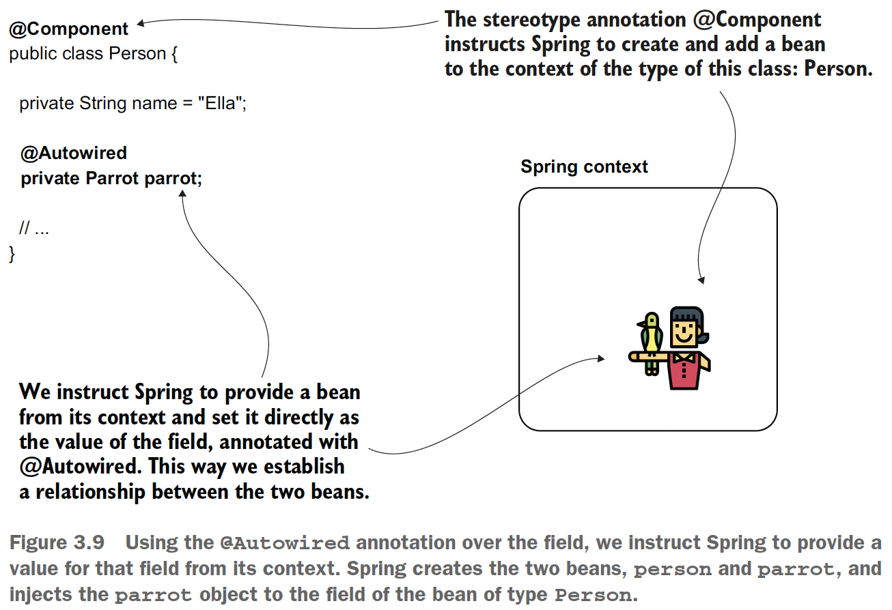
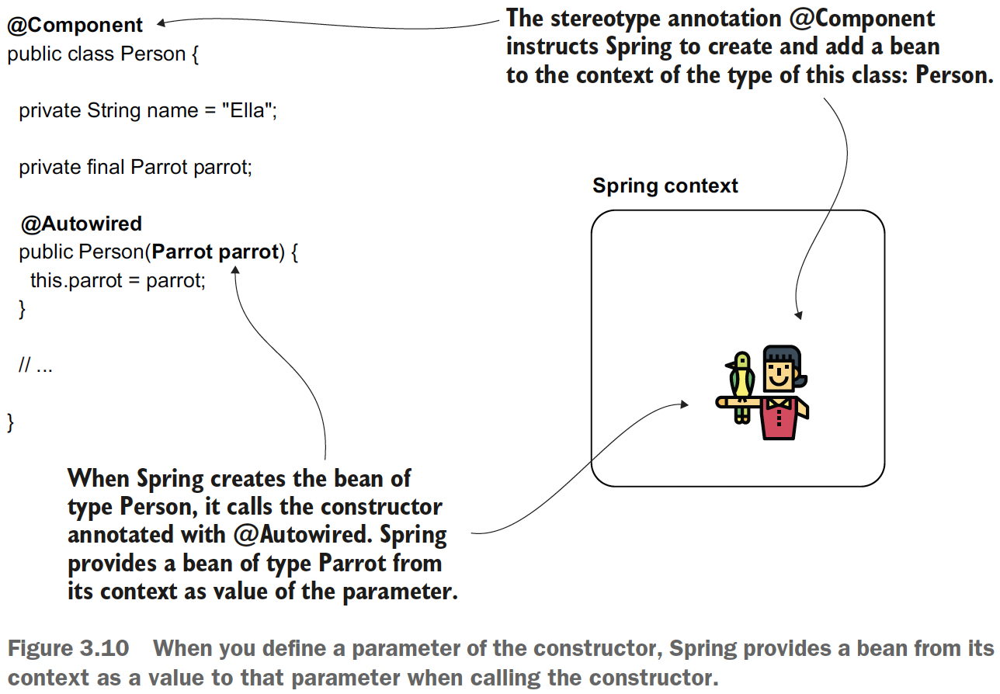
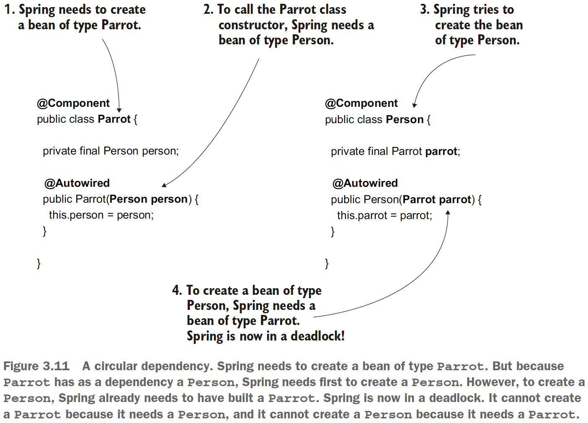

## Chapter 3 The Spring Context: Wiring beans

### Table of contents
- [Implementing relationships among beans defined in the configuration file](#31-implementing-relationships-among-beans-defined-in-the-configuration-file)
  - [Wiring the beans using a direct method call between the @Bean methods](#311-wiring-the-beans-using-a-direct-method-call-between-the-bean-methods)
  - [Wiring the beans using the @Bean annotated method's parameters](#312-wiring-the-beans-using-the-bean-annotated-methods-parameters)
- [Using the @Autowired annotation to inject beans](#32-using-the-autowired-annotation-to-inject-beans)
  - [Using @Autowired to inject the values through the class fields](#321-using-autowired-to-inject-the-values-through-the-class-fields)
  - [Using the @Autowired to inject the values through the constructor](#322-using-the-autowired-to-inject-the-values-through-the-constructor)
  - [Using dependency injection through the setter](#323-using-dependency-injection-through-the-setter)
- [Dealing with circular dependencies](#33-dealing-with-circular-dependencies)
- [Choosing from multiple beans in the Spring context](#34-choosing-from-multiple-beans-in-the-spring-context)

### 3.1 Implementing relationships among beans defined in the configuration file

Here we discuss two ways you can establish the relationships among beans:
- Link the beans by directly calling the methods that create them (which we’ll
call _wiring_).
- Enable Spring to provide us a value using a method parameter (which we’ll call
_auto-wiring_).


### 3.1.1 Wiring the beans using a direct method call between the @Bean methods

Check the code on [ProjectConfig](sq-c3-ex2/src/main/java/com/ro/config/ProjectConfig.java) and [Main class](sq-c3-ex2/src/main/java/com/ro/Main.java).

```java
@Bean
public Person person() {
    Person p = new Person();
    p.setName("Ella");
    p.setParrot(parrot());
    return p;
}
```

and the output is:

```java
Person{name='Ella', parrot=Parrot{name='Koko'}}
Parrot{name='Koko'}
```


### 3.1.2 Wiring the beans using the @Bean annotated method's parameters


Here DI (dependency injection) is used. As its name suggests, DI is a technique involving
the framework setting a value into a specific field or parameter. In our case, Spring
sets a particular value into the parameter of the **person()** method when calling it and
resolves a dependency of this method. DI is an application of the IoC principle, and
IoC implies that the framework controls the application at execution.


Check the code on [ProjectConfig](sq-c3-ex3/src/main/java/com/ro/config/ProjectConfig.java) and [Main class](sq-c3-ex3/src/main/java/com/ro/Main.java).

### 3.2 Using the @Autowired annotation to inject beans

There are three ways we can use the @Autowired annotation:
- Injecting the value in the field of the class, which you usually find in examples
and proofs of concept
- Injecting the value through the constructor parameters of the class approach
that you’ll use most often in real-world scenarios
- Injecting the value through the setter, which you’ll rarely use in productionready
code

### 3.2.1 Using @Autowired to inject the values through the class fields



Check the code on [sq-c3-ex4](sq-c3-ex4/src/main/java/com/ro)

For knowing why this method is not generally recommended I propose reading [Why Is Field Injection Not Recommended?](https://www.baeldung.com/java-spring-field-injection-cons)
- Null-Safety
- Immutability (cannot declare final fields)
- Design problems: Single Responsibility Principle and Circular Dependencies
- Testing problems: Injecting mocks by reflection

### 3.2.2 Using the @Autowired to inject the values through the constructor

- This approach is the one used most often in production code.
- It enables you to define the fields as final, ensuring no one can change their value after Spring initializes them.
- The possibility to set the values when calling the constructor also helps you when writing specific unit tests where you don’t want to rely
  on Spring making the field injection for you.



Check the code on [sq-c3-ex5](sq-c3-ex5/src/main/java/com/ro)

**NOTE** Starting with Spring version 4.3, when you only have one constructor
in the class, you can omit writing the _@Autowired_ annotation.

### 3.2.3 Using dependency injection through the setter

This approach has more disadvantages than advantages: 
- it’s more challenging to read
- it doesn’t allow you to make the field final
- it doesn’t help you in making the testing easier

Check the code on [sq-c3-ex6](sq-c3-ex6/src/main/java/com/ro)

```java
@Component
public class Person {
    private String name = "Ella";

    private Parrot parrot;

    @Autowired
    public void setParrot(Parrot parrot) {
        this.parrot = parrot;
    }
}
```

### 3.3 Dealing with circular dependencies



A circular dependency is easy to avoid. You just need to make sure you don’t define
objects whose creation depends on the other.

### 3.4 Choosing from multiple beans in the Spring context

Depending on your implementation, you have the following cases:

The identifier of the parameter doesn’t match any of the bean names from the
context. Then you have the following options:
   - You marked one of the beans as primary (_@Primary_). In this case, Spring will select the primary bean
   for injection.
   - You can explicitly select a specific bean using _@Qualifier_ ([sq-c3-ex8 ProjectConfig class](sq-c3-ex8/src/main/java/com/ro/config/ProjectConfig.java) or [sq-c3-ex9 Person class](sq-c3-ex9/src/main/java/com/ro/model/Person.java)).
   - If none of the beans is primary and you don’t use _@Qualifier_, the app will
   fail with an exception, complaining that the context contains more beans of
   the same type and Spring doesn’t know which one to choose.

