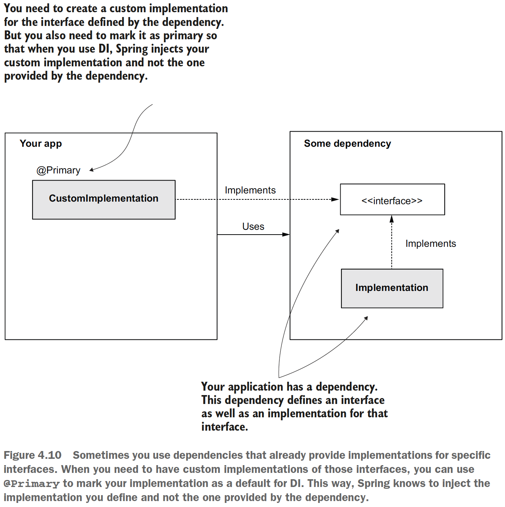
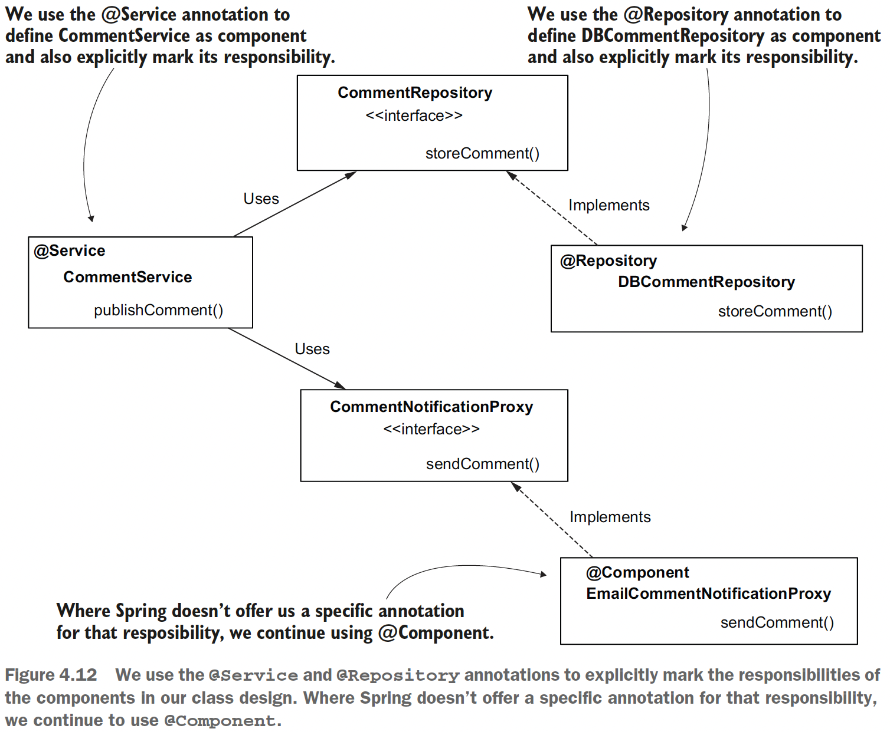

## Chapter 4 The Spring Context: Using abstractions

### 4.1 Using interfaces to define contracts

Check [sq-c4-ex1](sq-c4-ex1/src/main/java/com/ro) to see the code.

### 4.2 Using dependency injection with abstractions

Moving the above classes to Spring.

### 4.2.1 Deciding which objects should be part of the Spring context

For our scenario, the only Spring feature we use is the **DI**. In this case, we need to add the object to the Spring context if it
either **has a dependency we need to inject from the context** or **if it’s a dependency**
itself. Looking at our implementation, you’ll observe that the only object that doesn’t
have a dependency and is also not a dependency itself is _Comment_.

But why not add the _Comment_ instances as well?\
Adding objects to the Spring context without needing the
framework to manage them **adds unnecessary complexity to your app**, making the app
both more challenging to maintain and less performant. When you add an object to
the Spring context, you allow the framework to manage it with some specific functionality
the framework provides. If you add the object to be managed by Spring without
getting any benefit from the framework, you just over-engineer your implementation.

**NOTE** We use stereotype annotations for the classes that Spring needs to create instances and add
these instances to its context. It doesn’t make sense to add stereotype annotations on
interfaces or abstract classes because these cannot be instantiated. Syntactically, you
can do this, but it is not useful.

Check [sq-c4-ex2](sq-c4-ex2/src/main/java/com/ro) to see the code.

### 4.2.2 Choosing what to auto-wire from multiple implementations of an abstraction

In chapter 3, you learned that if more than one bean of the same type exists in the
Spring context, you need to tell Spring which of these beans to inject. You also
learned the following approaches:
- Using the _@Primary_ annotation to mark one of the beans for implementation as
  the default
- Using the _@Qualifier_ annotation to name a bean and then refer to it by its
  name for DI

**When to use _@Primary_?** (e.g. custom implementation of an external dependency)

Check [sq-c4-ex3 CommentPushNotificationProxy class](sq-c4-ex3/src/main/java/com/ro/proxy/impl/CommentPushNotificationProxy.java) to see the code.

**Naming implementation for dependency injection with _@Qualifier_**

Check [sq-c4-ex4 proxy](sq-c4-ex4/src/main/java/com/ro/proxy/impl) and [sq-c4-ex4 CommentService class](sq-c4-ex4/src/main/java/com/ro/service/CommentService.java) to see the code.

### 4.3 Focusing on object responsibilities with stereotype annotations

The **services** are the objects with the responsibility of implementing the **use cases**,
while **repositories** are the objects managing the **data persistence**. Because these responsibilities
are so common in projects, and they are important in the class design, having
a distinctive way of marking them helps the developer better understand the app design.

Spring offers us the @Service annotation to mark a component that takes the
responsibility of a service and the @Repository annotation to mark a component that
implements a repository responsibility. All three (@Component, @Service,
and @Repository) are stereotype annotations and instruct Spring to create and add an
instance of the annotated class to its context.

Check [sq-c4-ex5 CommentService class](sq-c4-ex5/src/main/java/com/ro/service/CommentService.java) and [sq-c4-ex5 DBCommentRepository class](sq-c4-ex5/src/main/java/com/ro/repository/impl/DBCommentRepository.java) to see the code.
