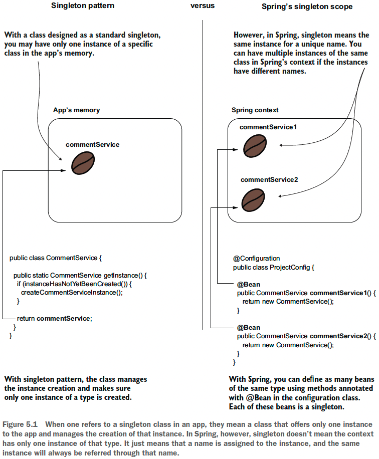
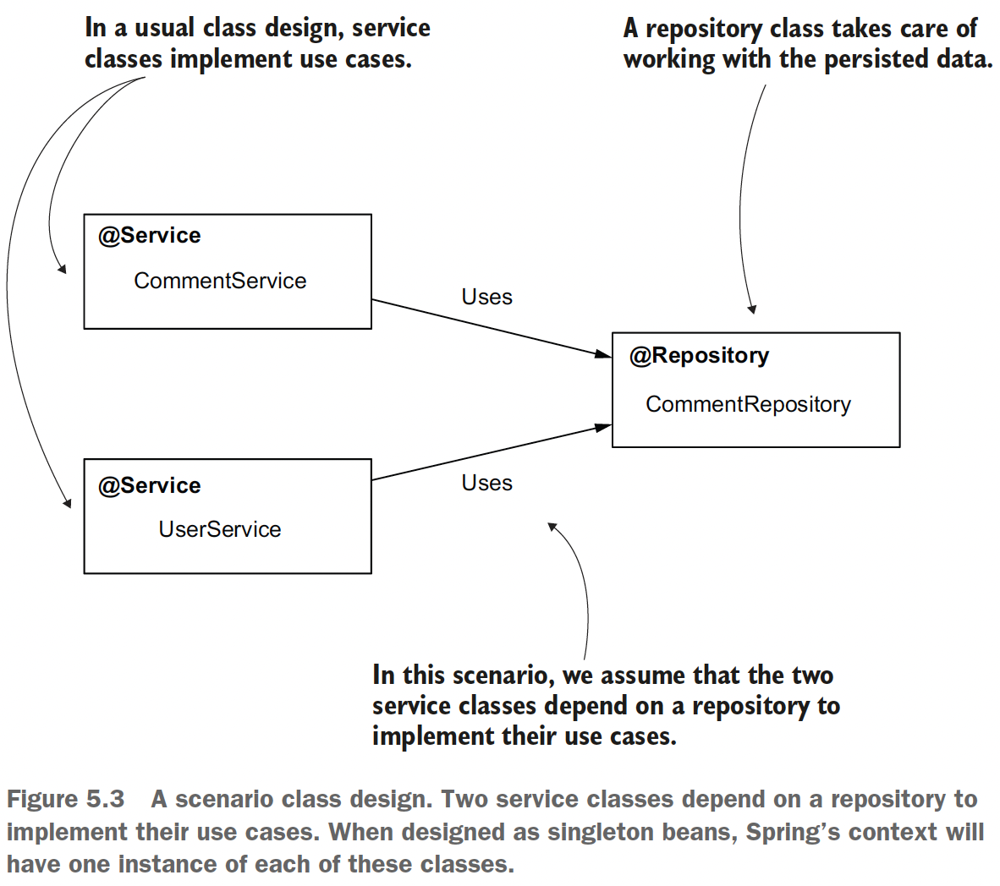
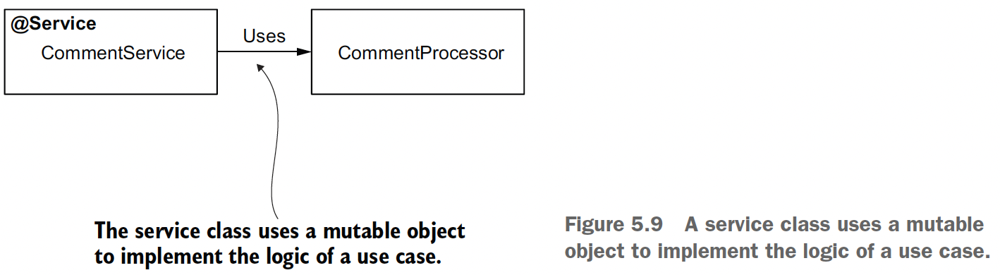
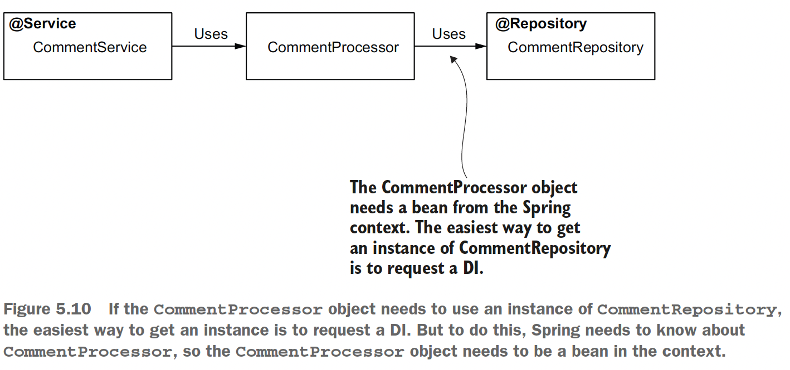

## Chapter 5 The Spring Context: Bean scopes and life cycle

### Table of contents
- [Using the singleton bean scope](#51-using-the-singleton-bean-scope)
  - [How singleton beans work](#511-how-singleton-beans-work)
  - [Singleton beans in real-world scenarios](#512-singleton-beans-in-real-world-scenarios)
  - [Using eager and lazy instantiation](#513-using-eager-and-lazy-instantiation)
- [Using the prototype bean scope](#52-using-the-prototype-bean-scope)
  - [How prototype beans work](#521-how-prototype-beans-work)
  - [Prototype beans in real-world scenarios](#522-prototype-beans-in-real-world-scenarios)
  - [A quick comparison between singleton and prototype bean scopes](#table-51-a-quick-comparison-between-singleton-and-prototype-bean-scopes)

Spring has multiple different approaches for creating beans and managing their
life cycle, and in the Spring world we name these approaches _scopes_. In this chapter, we
discuss two scopes you’ll often find in Spring apps: _singleton_ and _prototype_.

### 5.1 Using the singleton bean scope

The singleton bean scope defines Spring’s default approach for managing the beans
in its context. It is also the bean scope you’ll most encounter in production apps.

### 5.1.1 How singleton beans work



**Declaring single-scoped bean with _@Bean_**

Check the code on [ProjectConfig](sq-c5-ex1/src/main/java/com/ro/config/ProjectConfig.java) and [Main class](sq-c5-ex1/src/main/java/com/ro/Main.java).

**Declaring singleton beans using stereotype annotations**

Spring’s behavior for singleton beans isn’t any different when
using stereotype annotations than when you declared them with the @Bean annotation.



Check the code on [sq-c5-ex2](sq-c5-ex2/src/main/java/com/ro) and see how Spring injected the same instance of CommentRepository on both services.

### 5.1.2 Singleton beans in real-world scenarios

Because the singleton bean scope assumes that multiple components of the app
can share an object instance, **the most important thing to consider is that these beans
must be immutable**. Most often, a real-world app executes actions on multiple threads
(e.g., any web app). In such a scenario, multiple threads share the same object
instance. If these threads change the instance, you encounter a race-condition scenario.

If you want mutable singleton beans (whose attributes change), you need to make
these beans concurrent by yourself (mainly by employing thread synchronization). **But
singleton beans aren’t designed to be synchronized. They’re commonly used to define
an app’s backbone class design and delegate responsibilities one to another.** Technically,
synchronization is possible, but it’s not a good practice. Synchronizing the thread on a concurrent instance can dramatically affect the app’s performance. In most cases,
you will find other means to solve the same problem and avoid thread concurrency.

**Using beans boils down to three points:**
- Make an object bean in the Spring context only if you need Spring to manage it
so that the framework can augment that bean with a specific capability. If the
object doesn’t need any capability offered by the framework, you don’t need to
make it a bean.
- If you need to make an object bean in the Spring context, it should be singleton
only if it’s immutable. Avoid designing mutable singleton beans.
- If a bean needs to be mutable, an option could be to use the prototype scope.

### 5.1.3 Using eager and lazy instantiation

Spring creates all singleton beans **when it initializes the context**. This is
Spring’s default behavior, which is also called _eager instantiation_ (this is what we used so far).

With _lazy instantiation_, Spring doesn’t create the singleton instances when it creates the context. Instead, it creates
each instance the first time someone refers to the bean.

```java
@Service
@Lazy //this bean will be created when it's first referred, not when the context is created
public class CommentService {
  public CommentService() {
    System.out.println("CommentService instance created!");
  }
}

public class Main {
  public static void main(String[] args) {
    var c = new AnnotationConfigApplicationContext(ProjectConfig.class);
    System.out.println("Before retrieving the CommentService");

    /*
      At this line, where Spring needs to provide a reference 
      to the CommentService bean, Spring also creates the instance
    */
    var service = c.getBean(CommentService.class); 
    System.out.println("After retrieving the CommentService");
  }
}

    /*
      The output looks like this:
      Before retrieving the CommentService
      CommentService instance created!
      After retrieving the CommentService
    */
```

When should you use _eager_ instantiation and when should you use _lazy_?

**Eager**:
- **Comfortable approach**: when one instance delegates to another, the 2nd bean already exists in any situation.
- **Safer than lazy**: we can observe when starting the app if something is wrong with the creation of a bean.
- Used as a **default approach**.

**Lazy**:
- The framework checks if the bean exists and eventually create it. _Eager_ spares these checks, so the performance is better when the framework needs to delegate actions.
- An issue with a bean will be observed only when the app is already executing and it reaches the point that the bean needs to be created.
- Used for example on a monolithic app that has multiple parts not used by a client, so instantiating all the beans would unnecessarily occupy a lot of memory. In this case the beans can be lazily instantiated so that the app would create only the necessary instances.

### 5.2 Using the prototype bean scope

### 5.2.1 How prototype beans work

The idea is straightforward: Every time you request a reference to a prototype-scoped bean, Spring creates a new object
instance.

Check the code on [sq-c5-ex3](sq-c5-ex3/src/main/java/com/ro) and see how Spring created different instances of CommentService on _getBean()_.

With prototype beans we no longer have concurrency problems because each thread that requests the bean gets a different instance, so defining mutable prototype beans is not a problem.

### 5.2.2 Prototype beans in real-world scenarios

These type of beans are mostly used when you need mutating objects.

Let's look at the following example:



The _CommentProcessor_ object stores the comment to be processed as an attribute, and its methods change this attribute.



In this case the _CommentProcessor_ it's a prototype-scoped bean.

**NOTE** Don’t make the mistake of injecting the _CommentProcessor_ directly in the _CommentService_ bean. The _CommentService_ bean is a singleton, which means that Spring creates
only an instance of this class. As a consequence, Spring will also inject the
dependencies of this class just once when it creates the CommentService bean itself. In
this case, you’ll end up with only an instance of the _CommentProcessor_. Each call of
the _sendComment()_ method will use this unique instance, so with multiple threads
you’ll run into the same race condition issues as with a singleton bean.

For our case, the _CommentProcessor_ bean was retrieved from the context on every _sendComment()_ call by using an injected _ApplicationContext_.

```java
@Service
public class CommentService {

    @Autowired
    private ApplicationContext context;

    public void sendComment(Comment comment) {
        System.out.println("Context in commentService: " + context);
        CommentProcessor commentProcessor = context.getBean(CommentProcessor.class);

        commentProcessor.setComment(comment);
        commentProcessor.processComment();
        commentProcessor.validateComment();
        commentProcessor.sendComment();
    }
    //...
}
```
Check the code on [sq-c5-ex4](sq-c5-ex4/src/main/java/com/ro).


### Table 5.1 A quick comparison between singleton and prototype bean scopes

| Singleton                                                                                           | Prototype                                                                                             |
|-----------------------------------------------------------------------------------------------------|-------------------------------------------------------------------------------------------------------|
| The framework associates a name with an actual object instance.                                     | A name is associated with a type.                                                                     |
| Every time you refer to a bean name you’ll get the same object instance.                            | Every time you refer to a bean name, you get a new instance.                                          |
| You can configure Spring to create the instances when the context is loaded or when first referred. | The framework always creates the object instances for the prototype scope when you refer to the bean. |
| Singleton is the default bean scope in Spring.                                                      | You need to explicitly mark a bean as a prototype.                                                    |
| It’s not recommended that a singleton bean to have mutable attributes.                              | A prototype bean can have mutable attributes.                                                         |
