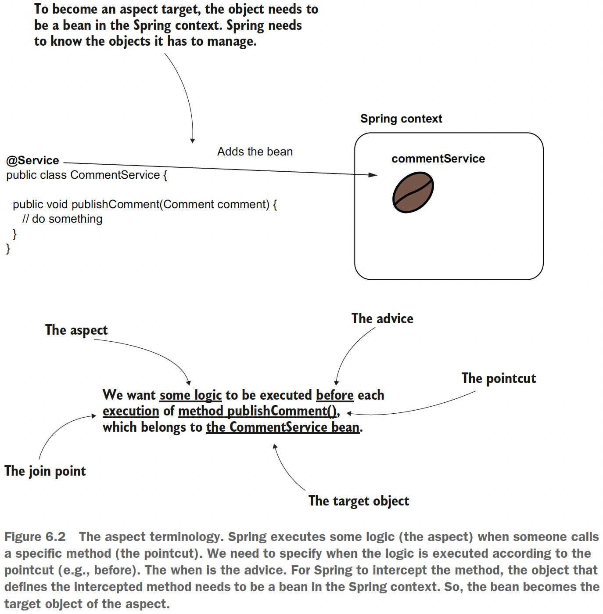
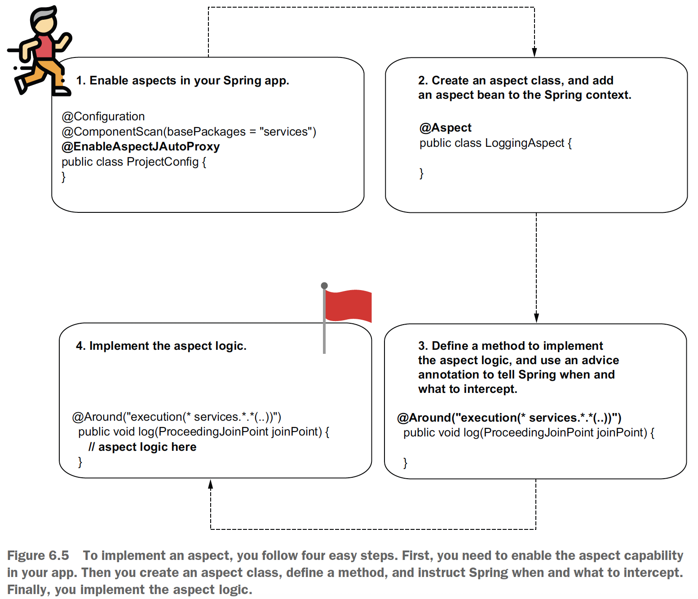
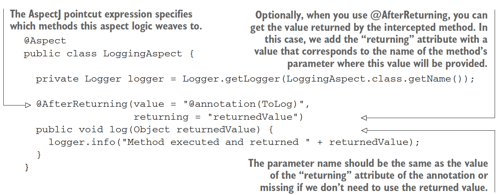

## Chapter 6 Using aspects with Spring AOP

Aspects are **a way the framework intercepts method calls and possibly alters the execution
of methods**. You can affect the execution of specific method calls you select.
This technique **helps you extract part of the logic belonging to the executing method**.
In certain scenarios, **decoupling a part of the code helps make that method easier to
understand**. It allows the developer to focus only on the relevant details discussed
when reading the method logic.

Another important reason for learning aspects is that Spring uses them in implementing
a lot of the crucial capabilities it offers (e.g. _transactionality_, _security configurations_).

### 6.1 How aspects work in Spring

An aspect is simply a piece of logic the framework executes when you call specific
methods of your choice. When designing an aspect, you define the following:
- **What code you want Spring to execute when you call specific methods**. This is
named an **_aspect_**.
- **When the app should execute this logic of the aspect** (e.g., before or after the
method call, instead of the method call). This is named the **_advice_**.
- **Which methods the framework needs to intercept and execute the aspect for
them**. This is named a **_pointcut_**.

With aspects terminology, you’ll also find the concept of a **_join point_**, which defines the
event that triggers the execution of an aspect. **But with Spring, this event is always a
method call.**

As in the case of the DI, to use aspects you need the framework
to manage the objects for which you want to apply aspects.

**The bean that declares the method intercepted by an aspect** is named the **_target object_**.

\
(Credits: [Spring Start Here](https://www.manning.com/books/spring-start-here))

But how does Spring intercept each method call and apply the aspect logic?

Spring **won’t directly give you an instance reference for the bean** when you request it from the context. Instead, **Spring
gives you an object that calls the aspect logic** instead of the actual method. We say that
**Spring gives you a _proxy_ object** instead of the real bean. You will now receive the proxy
instead of the bean anytime you get the bean from the context, either if you directly
use the _getBean()_ method of the context or if you use DI. This approach is named _weaving_. So, when we define an aspect for a method,
the call goes through the _proxy object_. The _proxy object_ applies the logic defined by the aspect and then delegates the call to the real method.

### 6.2 Implementing aspects with Spring AOP

Suppose you have an application that implements multiple use cases in its service
classes. Some new regulations require your app to store the time it started and ended
for each use case execution. In your team, you decided to take responsibility for
implementing a functionality to log all the events where a use case begins and ends.

### 6.2.1 Implementing a simple aspect

\
(Credits: [Spring Start Here](https://www.manning.com/books/spring-start-here))

**NOTE** The _@Aspect_ annotation isn’t a stereotype annotation. Using @Aspect, you
tell Spring that the class implements the definition of an aspect, but Spring won’t also
create a bean for this class. You need to use _@Bean_ or a stereotype annotation to create a 
bean for your class and allow Spring to manage it in this way.

Check the code on [sq-c6-ex1](sq-c6-ex1/src/main/java/com/ro) to see how the presented use case was implemented as a first version.

```java
@Component
@Aspect
public class LoggingAspect {
    private final Logger logger = Logger.getLogger(LoggingAspect.class.getName());
    @Around("execution(* com.ro.service.*.*(..))") //defines which are the intercepted methods
    public void log(ProceedingJoinPoint joinPoint) throws Throwable {
        logger.info("Method will execute");
        joinPoint.proceed(); //delegates to the actual intercepted method
        logger.info("Method executed");
    }
}
```
For AspectJ pointcut language (the parameter of _@Around_) refer to the [documentation: Declaring Advice](https://docs.spring.io/spring-framework/reference/core/aop/ataspectj/advice.html).
For our case the expression means Spring intercepts any method
defined in a class that is in the com.ro.service package, regardless of the method’s return
type, the class it belongs to, the name of the method, or the parameters the method
receives.

The ProceedingJoinPoint parameter represents the intercepted method. The main thing you
do with this parameter is tell the aspect when it should delegate further to the actual
method.

The result on the [Main](sq-c6-ex1/src/main/java/com/ro/Main.java) looks like this:
```java
Feb 09, 2024 11:04:53 PM com.ro.aspects.logging.LoggingAspect log
INFO: Method will execute
Feb 09, 2024 11:04:53 PM com.ro.service.CommentService publishComment
INFO: Publishing comment: Demo comment
Feb 09, 2024 11:04:53 PM com.ro.aspects.logging.LoggingAspect log
INFO: Method executed
```

With aspects, you can even implement logic where the actual method isn’t called anymore. For
example, an aspect that applies some authorization rules decides whether to delegate
further to a method the app protects. If the authorization rules aren’t fulfilled, the
aspect doesn’t delegate to the intercepted method it protects.

### 6.2.2 Altering the intercepted method's parameters and the returned value

Check the code on [sq-c6-ex2](sq-c6-ex2/src/main/java/com/ro).

```java
@Component
@Aspect
public class LoggingAspect {
    private final Logger logger = Logger.getLogger(LoggingAspect.class.getName());
    @Around("execution(* com.ro.service.*.*(..))") 
    public Object log(ProceedingJoinPoint joinPoint) throws Throwable {
        String methodName = joinPoint.getSignature().getName();
        Object[] arguments = joinPoint.getArgs();
        
        logger.info("Method " + methodName + " with parameter " + Arrays.asList(arguments) + " will execute");
        
        Object returnedByMethod = joinPoint.proceed();

        logger.info("Method executed and returned " + returnedByMethod);
        return returnedByMethod;
    }
}
```

**NOTE** For the _main()_ method, it looks like it directly calls the _publishComment()_
method of the _CommentService_ bean. The caller isn't aware that an aspect intercepted the call.

The aspects can alter the execution of the intercepted method even by:
1. Changing the value of the parameters sent to the method
2. Changing the returned value received by the caller
3. Throwing an exception to the caller or catching and treating an exception
thrown by the intercepted method

Check the code on [sq-c6-ex3 LoggingAspect class](sq-c6-ex3/src/main/java/com/ro/aspects/logging/LoggingAspect.java) to see an example for points 1 & 2.

**NOTE** When you alter the logic through an aspect, you make a part of the logic transparent. 
Make sure you don’t hide things that aren’t obvious. The whole idea of decoupling a part of the logic is to
avoid duplicating code and hide what’s irrelevant, so a developer can easily focus on
the business logic code.

### 6.2.3 Intercepting annotated methods

You can use annotations to mark the methods you want an aspect to intercept with a comfortable syntax that allows you also
to avoid writing complex AspectJ pointcut expressions.

Now we want to define a custom annotation and log only the
execution of the methods we mark using the custom annotation. 
To achieve this objective, you need to do the following:
1. Define a custom annotation, and make it accessible at runtime. We’ll call this
annotation @ToLog.
2. Use a different AspectJ pointcut expression for the aspect method to tell the
aspect to intercept the methods annotated with the custom annotation.

```java
@Retention(RetentionPolicy.RUNTIME)
@Target(ElementType.METHOD)
public @interface ToLog {
}

@Component
@Aspect
public class LoggingAspect {
    private final Logger logger = Logger.getLogger(LoggingAspect.class.getName());
    @Around("@annotation(ToLog))")
    public Object log(ProceedingJoinPoint joinPoint) throws Throwable {
        //aspect logic here
    }
}
```

**NOTE** The definition of the retention policy with _@Retention(RetentionPolicy.RUNTIME)_ is critical.
By default, in Java annotations cannot be intercepted at runtime. You need to
explicitly specify that someone can intercept annotations by setting the retention policy
to _RUNTIME_.

Check the code on [sq-c6-ex4](sq-c6-ex4/src/main/java/com/ro).

### 6.2.4 Other advice annotations you can use

- _@Before_: Calls the method defining the aspect logic before the execution of
the intercepted method.
- _@AfterReturning_: Calls the method defining the aspect logic after the
method successfully returns, and provides the returned value as a parameter to
the aspect method. The aspect method isn’t called if the intercepted method
throws an exception.
- _@AfterThrowing_: Calls the method defining the aspect logic if the intercepted
method throws an exception, and provides the exception instance as a parameter
to the aspect method.
- _@After_: Calls the method defining the aspect logic only after the intercepted
method execution, whether the method successfully returned or threw an
exception.

For these advices, the aspect methods don’t receive the _ProceedingJoinPoint_ parameter, and they cannot
decide when to delegate to the intercepted method. This event already happens
based on the annotation’s purpose (for example, for @Before, the intercepted method
call will always happen after the aspect logic execution).

Let's look at an example with _@AfterReturning_:

\
(Credits: [Spring Start Here](https://www.manning.com/books/spring-start-here))

### 6.3 The aspect execution chain


