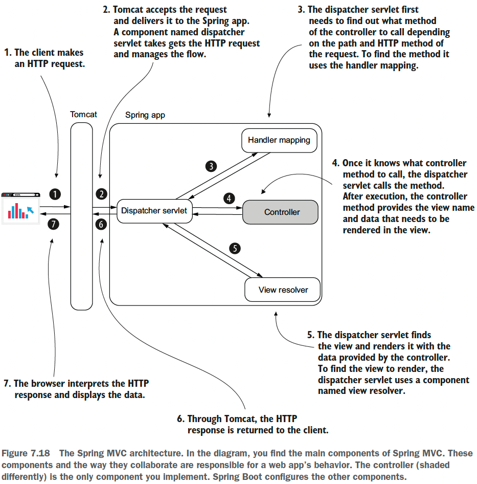

## Chapter 7 Understanding Spring Boot and Spring MVC

### Table of contents
- [Different fashions of implementing a web app with Spring](#712-different-fashions-of-implementing-a-web-app-with-spring)
- [Using a servlet container in web app development](#713-using-a-servlet-container-in-web-app-development)
- [The magic of Spring Boot](#72-the-magic-of-spring-boot)
  - [Using dependency starters to simplify the dependency management](#722-using-dependency-starters-to-simplify-the-dependency-management)
  - [Using autoconfiguration by convention based on dependencies](#723-using-autoconfiguration-by-convention-based-on-dependencies)
- [Implementing a web app with Spring MVC](#73-implementing-a-web-app-with-spring-mvc)

### 7.1.2 Different fashions of implementing a web app with Spring

We classify the approaches of creating a web app as the following:
1. **Apps where the backend provides the fully prepared view in response to a client’s request.**
The browser directly interprets the data received from the backend and displays
this information to the user in these apps. 
2. **Apps using frontend-backend separation.** For these apps, the backend only serves raw
data. The browser doesn’t display the data in the backend’s response directly.
The browser runs a separate frontend app that gets the backend responses, processes
the data, and instructs the browser what to display. 

### 7.1.3 Using a servlet container in web app development

A _servlet container_ (sometimes referred to as a web server) is a translator of the HTTP
messages for your Java app. This way, your Java app doesn’t need to take care of implementing
the communication layer.

\
(Credits: [Spring Start Here](https://www.manning.com/books/spring-start-here))

But if this is everything a servlet container does, why name it “servlet” container?
What is a servlet? **A servlet is nothing more than a Java object that directly interacts
with the servlet container.** When the servlet container gets an HTTP request, it calls a
servlet object’s method and provides the request as a parameter. The same method
also gets a parameter representing the HTTP response used by the servlet to set the
response sent back to the client that made the request.

\
(Credits: [Spring Start Here](https://www.manning.com/books/spring-start-here))

\
(Credits: [Spring Start Here](https://www.manning.com/books/spring-start-here))

### 7.2 The magic of Spring Boot

To create a Spring web app, we need to configure a servlet container, create a servlet
instance, and then make sure we correctly configure this servlet instance such that
Tomcat calls it for any client request. This approach is old, and now we don't have to do it like this
because we have Spring Boot - one of the most appreciated projects in the Spring ecosystem.

Spring Boot helps you to create Spring apps more efficiently and focus on the business code
you write by eliminating a huge part of the code you used to write for configurations.

The most critical Spring Boot features:
- **Simplified project creation**: You can use a project initialization service to get an
empty but configured skeleton app. Use [start.spring.io](https://start.spring.io) to create this skeleton app. 
This app contains the following:
  - The Spring app main class
  - The Spring Boot POM parent (One of the essential things this parent does is provide you with compatible versions for
    the dependencies you’ll add to your project.)
  - The dependencies (e.g. Spring Web related dependencies)
  - The Spring Boot Maven plugin (This plugin is responsible
    for adding part of the default configurations you’ll observe in your project)
  - The properties file
- **Dependency starters**: Spring Boot groups certain dependencies used for a specific
purpose with dependency starters. You don’t need to figure out all the
must-have dependencies you need to add to your project for one particular purpose
nor which versions you should use for compatibility.
- **Autoconfiguration based on dependencies**: Based on the dependencies you added
to your project, Spring Boot defines some default configurations. Instead of
writing all the configurations yourself, you only need to change the ones provided
by Spring Boot that don’t match what you need. Changing the configs
likely requires less code (if any).

**Recommended Spring Boot readings**:
- [Craig Walls’s Spring Boot in Action (Manning, 2015)](https://www.manning.com/books/spring-boot-in-action)
- [Mark Heckler’s Spring Boot: Up and Running (O’Reilly Media, 2021)](https://www.oreilly.com/library/view/spring-boot-up/9781492076971/)

### 7.2.2 Using dependency starters to simplify the dependency management

A dependency starter is a group of dependencies you add to configure your app
for a specific purpose.

```java
<dependency>
  <groupId>org.springframework.boot</groupId>
  <artifactId>spring-boot-starter-web</artifactId>
</dependency>
```

With dependency starters, we don’t request dependencies directly. We request
capabilities. You add a dependency starter for a particular capability you
need, say web functionalities, a database, or security. Spring Boot makes sure to add
the right dependencies to your app with the proper compatible version for your
requested capability. We can say that dependency starters are capability-oriented
groups of compatible dependencies.

### 7.2.3 Using autoconfiguration by convention based on dependencies

Based on the dependencies you added, Spring Boot realizes what you expect from
your app and provides you some default configurations. Spring Boot gives you the
configurations, which are generally used for the capabilities you requested when adding
the dependencies.\
For example, Spring knows when you added the web dependency you need for a
servlet container and configures you a Tomcat instance because, in most cases, developers
use this implementation. For Spring Boot, Tomcat is the convention for a servlet
container.\
The convention represents the most-used way to configure the app for a specific
purpose. Spring Boot configures the app by convention such that you now only need
to change those places where your app needs a more particular configuration. With
this approach, you’ll write less code for configuration (if any).

### 7.3 Implementing a web app with Spring MVC

Check the code on [sq-c7-ex1](sq-c7-ex1/src/main/java/com/ro).

\
(Credits: [Spring Start Here](https://www.manning.com/books/spring-start-here))
