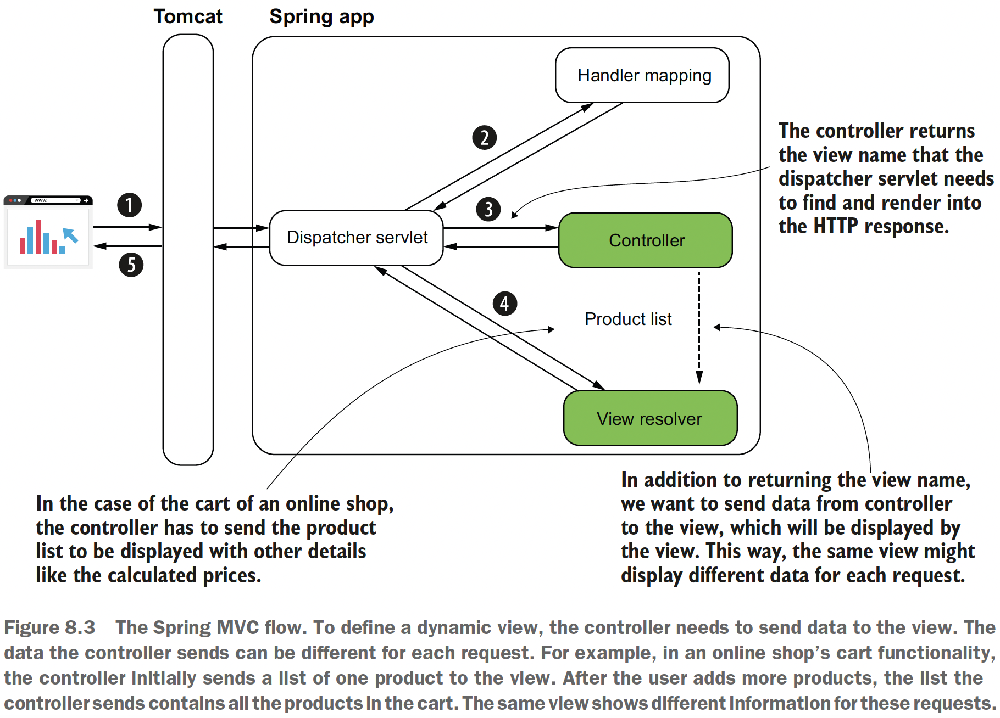
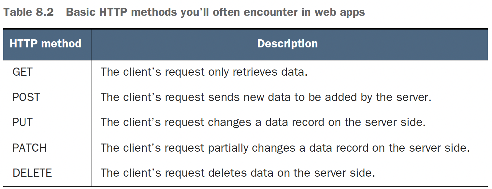

## Chapter 8 Implementing web apps with Spring Boot and Spring MVC

### Table of contents
- [Implementing web apps with a dynamic view](#81-implementing-web-apps-with-a-dynamic-view)
  - [Getting data on the HTTP request](#811-getting-data-on-the-http-request)
  - [Using request parameters to send data from client to server](#812-using-request-parameters-to-send-data-from-client-to-server)
  - [Using path variables to send data from client to server](#813-using-path-variables-to-send-data-from-client-to-server)
- [Using GET and POST HTTP methods](#82-using-get-and-post-http-methods)

### 8.1 Implementing web apps with a dynamic view

\
(Credits: [Spring Start Here](https://www.manning.com/books/spring-start-here))

For implementing this example we’ll use a template engine named Thymeleaf. The
template engine is a dependency that allows us to easily send data from the controller
to the view and display this data in a specific way.

We add the following dependency to our _pom.xml_.
```java
<dependency>
    <groupId>org.springframework.boot</groupId>
    <artifactId>spring-boot-starter-thymeleaf</artifactId>
</dependency>
```

Check the code on [sq-c8-ex1](sq-c8-ex1/src/main/java/com/ro).

This is how the homepage controller looks:
```java
@Controller
public class MainController {

    @RequestMapping("/home")
    public String home(Model page) { //The action method defines a parameter of type Model 
                                     //that stores the data the controller sends to the view.           
        page.addAttribute("username", "Katy"); //we add the data we want
        page.addAttribute("color", "red");     //the controller to send to the view
        return "homepage.html";
    }
}
```

### 8.1.1 Getting data on the HTTP request

In most cases, to send data through the HTTP request you use one of the following ways:
- An HTTP request parameter represents a simple way to send values from client to
server in a key-value(s) pair format. To send HTTP request parameters, you
append them to the URI in a request query expression. They are also called query
parameters. You should use this approach only for sending a small quantity of data.
- An HTTP request header is similar to the request parameters in that the request
headers are sent through the HTTP header. The big difference is that they
don’t appear in the URI, but you still cannot send large quantities of data using
HTTP headers.
- A path variable sends data through the request path itself. It is the same as for the
request parameter approach: you use a path variable to send a small quantity of
data. But we should use path variables when the value you send is mandatory.
- The HTTP request body is mainly used to send a larger quantity of data (formatted
as a string, but sometimes even binary data such as a file).

### 8.1.2 Using request parameters to send data from client to server

You use request parameters in the following scenarios:
- The quantity of data you send is not large. You set the request parameters using
query variables (as shown in this section’s example). This approach limits you
to about 2,000 characters.
- You need to send optional data. A request parameter is a clean way to deal with a
value the client might not send. The server can expect to not get a value for specific
request parameters.

An often-encountered use case for request parameters used is defining some search
and filtering criteria.

Check the code on [sq-c8-ex2](sq-c8-ex2/src/main/java/com/ro).

```java
@Controller
public class MainController {

    @RequestMapping("/home")
    public String home(@RequestParam(required = false) String color,
                       @RequestParam(required = false) String name,
                       Model page) {
        page.addAttribute("username", name);
        page.addAttribute("color", color);
        return "homepage.html";
    }
}
```

URL: http://localhost:8080/home?color=blue&name=Stefan

**NOTE** It is recommended that you avoid a large number
  of parameters. If you need to use more than three,
  it's recommended to use the request body.

### 8.1.3 Using path variables to send data from client to server

e.g. URL: http://localhost:8080/home/blue

- You shouldn’t use path variables for optional values. This method it's recommended only for mandatory parameters.
- Always avoid sending more than three path variables. It’s even better if you keep a maximum of two.
- Easier to read than a query expression. For a publicly exposed website, it’s also easier for search engines (e.g., Google) to index the
pages. This advantage might make the website easier to find through a search engine.

Check the code on [sq-c8-ex3](sq-c8-ex3/src/main/java/com/ro).

### 8.2 Using GET and POST HTTP methods

\
(Credits: [Spring Start Here](https://www.manning.com/books/spring-start-here))

Check the code on [sq-c8-ex4](sq-c8-ex4/src/main/java/com/ro).\
A GET was used for retrieving a list of products and a POST was used for adding a product to the list.

**NOTE** Through a browser’s HTML form process directly, you can use only HTTP GET
and HTTP POST. To use other HTTP methods such as DELETE or PUT, you
need to implement the call using a client language such as JavaScript.