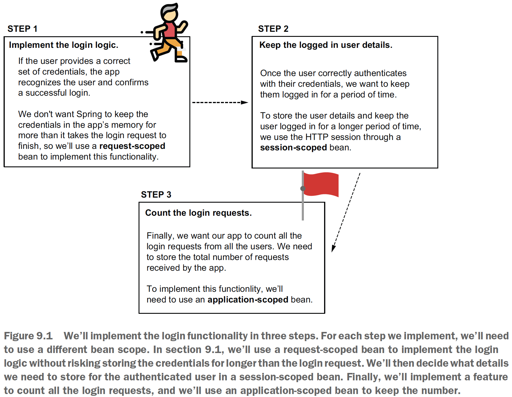
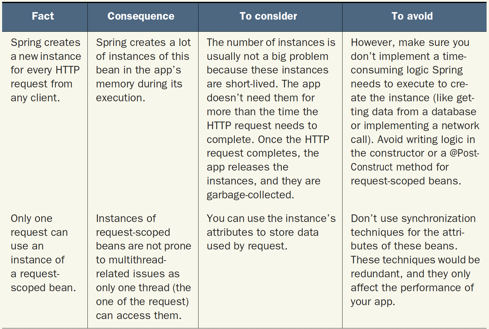
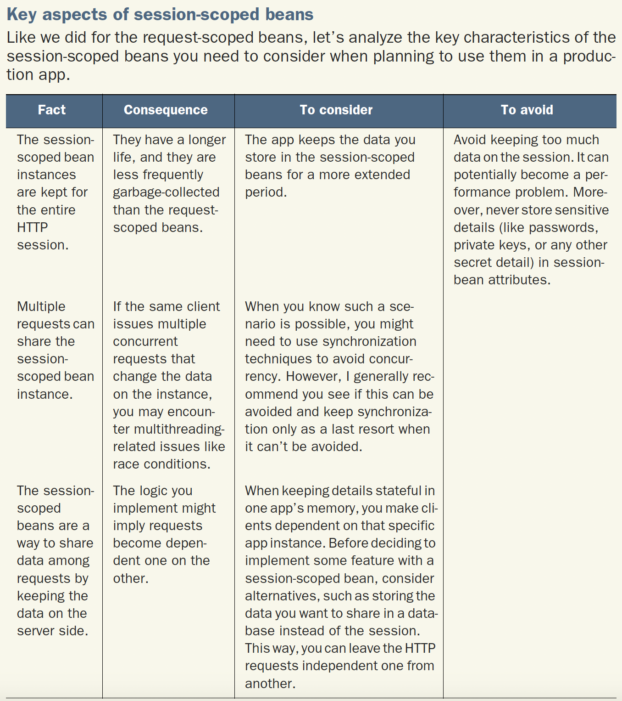
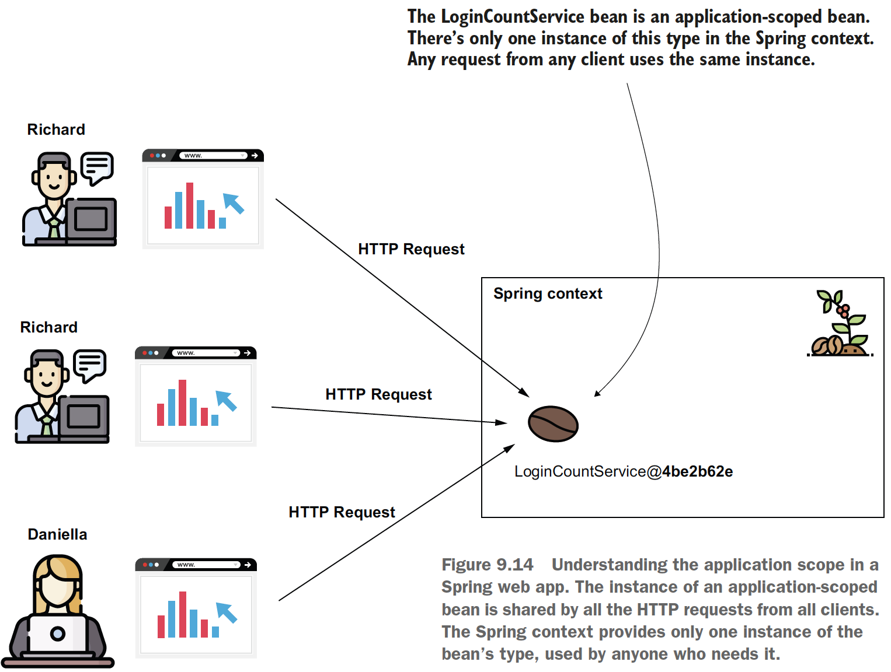

## Chapter 9 Using the Spring web scopes

### Table of contents
- [Using the request scope in a Spring web app](#91-using-the-request-scope-in-a-spring-web-app)
- [Using the session scope in a Spring web app](#92-using-the-session-scope-in-a-spring-web-app)
- [Using the application scope in a Spring web app](#93-using-the-application-scope-in-a-spring-web-app)

Web scopes:
- **Request scope**: Spring creates an instance of the bean class for every HTTP
request. The instance exists only for that specific HTTP request.
- **Session scope**: Spring creates an instance and keeps the instance in the server’s
memory for the full HTTP session. Spring links the instance in the context with
the client’s session.
- **Application scope**: The instance is unique in the app’s context, and it’s available
while the app is running.

Example app implemented in this chapter:
\
(Credits: [Spring Start Here](https://www.manning.com/books/spring-start-here))[Figure 9.1]

### 9.1 Using the request scope in a Spring web app

Key aspects of request-scoped beans\
\
(Credits: [Spring Start Here](https://www.manning.com/books/spring-start-here))

Recommended reading:
- [Spring Security in Action (Manning, 2020)](https://www.manning.com/books/spring-security-in-action)

Step 1 [Figure 9.1] implementation:\
Check the code on [sq-c9-ex1](sq-c9-ex1/src/main/java/com/ro).\
**NOTE** We don’t need to change the scope for [LoginController](sq-c9-ex1/src/main/java/com/ro/controllers/LoginController.java) as
long as it doesn’t store any detail in its attributes.

The [LoginProcessor](sq-c9-ex1/src/main/java/com/ro/processor/LoginProcessor.java) is request-scoped.

### 9.2 Using the session scope in a Spring web app
When you enter a web app and log in,
you expect to then surf through that app’s pages, and the app still remembers you’ve logged in.
A session-scoped bean is an object managed by Spring, for which Spring
creates an instance and links it to the HTTP session.

**NOTE** A session-scoped bean allows us to store data shared
by multiple requests of the same client.

A couple of features you can implement using session-scoped beans include the
following examples:
- A login—Keeps details of the authenticated user while they visit different parts
of your app and send multiple requests
- An online shopping cart—Users visit multiple places in your app, searching for
products they add to the cart. The cart remembers all the products the client
added.

\
(Credits: [Spring Start Here](https://www.manning.com/books/spring-start-here))

Step 2 [Figure 9.1] implementation:\
In this step we display a page that
only logged-in users can access. Once a user logs in, the app redirects them to this
page, which displays a welcome message containing the logged-in username and
offers the user the option to log out by clicking a link.

Check the code on [sq-c9-ex2](sq-c9-ex2/src/main/java/com/ro).

### 9.3 Using the application scope in a Spring web app

\
(Credits: [Spring Start Here](https://www.manning.com/books/spring-start-here))

The application scope is close to how a singleton works. The difference is that you
can’t have more instances of the same type in the context and that we always use the
HTTP requests as a reference point when discussing the life cycle of web scopes
(including the application scope). We face the same concurrency problems we discussed
in chapter 5 for the singleton beans for application-scoped beans: it’s better to
have immutable attributes for the singleton beans. The same advice is applicable to an
application-scoped bean. But if you make the attributes immutable, then you can
directly use a singleton bean instead.

The author recommends developers to avoid using application-scoped beans. On his opinion it's
better to directly use a persistence layer, such as a database. With application-scoped bean instances being shared by all the web app requests, any write
operation usually needs synchronization, creating bottlenecks and dramatically affecting the app’s performance. Moreover, these beans live in your app’s memory
as long as the app itself, so they can’t be garbage-collected.

Step 3 [Figure 9.1] implementation:\
Check the code on [sq-c9-ex3](sq-c9-ex3/src/main/java/com/ro).

**NOTE** Both session- and application-scoped beans imply making requests less independent.
We say the application manages the state the requests need (or that
the app is stateful). A stateful app implies different architectural problems that
are best to avoid.
